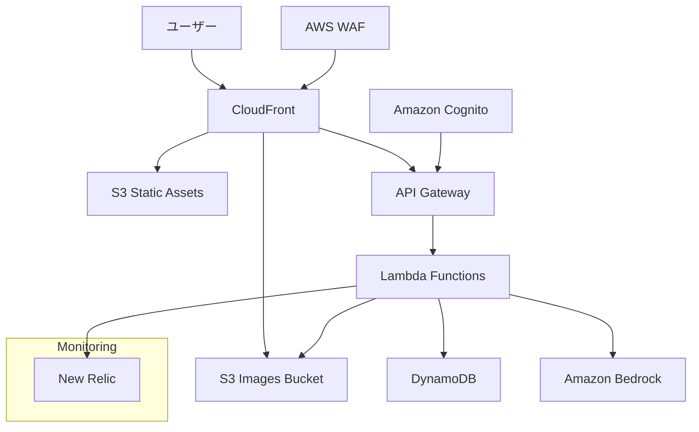

# 設計書

## 概要

「ほめびより」は、育児中の親をAIが優しく褒めてくれるWebアプリケーションです。統合チャット機能を中心とした設計で、ユーザーがAIロールと今日の気分を選択してからチャット体験を通じて支援を受ける仕組みです。Next.jsとFastAPIを使用したモダンなWebアプリケーションとして設計し、AWSクラウドインフラストラクチャ上で運用します。コスト最適化を重視したスモールスタート構成を採用します。

## アーキテクチャ

### システム全体構成



### 技術スタック

**フロントエンド**
- Next.js 14 (App Router、SSG/ISRモード)
- TypeScript
- Tailwind CSS
- React Hook Form (フォーム管理)
- Framer Motion (アニメーション)
- AWS Amplify Auth (認証クライアント)

**バックエンド**
- AWS Lambda (Python 3.11+)
- FastAPI (Lambda用に最適化)
- LangChain (Bedrock統合・チャット履歴管理)
- Pydantic (データバリデーション)
- Boto3 (AWS SDK)
- Mangum (FastAPI-Lambda アダプター)

**インフラストラクチャ**
- AWS Lambda (サーバーレス実行環境)
- Amazon API Gateway (RESTful API)
- Amazon DynamoDB (NoSQLデータベース)
- Amazon S3 (静的ホスティング、画像ストレージ)
- Amazon Cognito (認証・認可)
- Amazon Bedrock (AI/LLMサービス)
- AWS CloudFront (CDN)
- AWS WAF (Webアプリケーションファイアウォール)
- Terraform (Infrastructure as Code)
- New Relic (監視・パフォーマンス分析)

## コンポーネントと インターフェース

### フロントエンドコンポーネント構成（改善版）

**フロントエンド構成の問題点:**
1. **過度な分離**: tree専用ページが不要（chatページ内で統合表示）
2. **重複コンポーネント**: TreeGrowthIndicatorとTreeVisualizationの責務重複
3. **設定の分散**: AIロール設定が複数箇所に分散
4. **共通化不足**: AIロール関連の処理が各コンポーネントに散在

**改善されたコンポーネント構成**

```
src/
├── app/                   # Next.jsのApp Routerによるページ構成
│   ├── (auth)/            # 認証関連のルートグループ
│   │   ├── login/         # ログインページ
│   │   └── register/      # アカウント登録ページ
│   ├── /                  # トップページ（AIロール選択、今日の気分選択）
│   ├── chat/              # 統合体験ページ（チャット + 木の成長UI）
│   ├── profile/           # プロフィール・設定統合ページ
│   └── layout.tsx         # 共通レイアウト
├── components/            # 再利用可能なコンポーネント
│   ├── ui/                # 基本UIコンポーネント（Design System）
│   │   ├── primitives/    # 基本要素
│   │   │   ├── Button.tsx
│   │   │   ├── Input.tsx
│   │   │   ├── Select.tsx
│   │   │   ├── Modal.tsx
│   │   │   └── Card.tsx
│   │   ├── composite/     # 複合コンポーネント
│   │   │   ├── AiCharacterCard.tsx    # AIキャラクター表示統一
│   │   │   ├── EmotionPanel.tsx       # 感情アイコン + 気分切り替え統合
│   │   │   ├── MessageBubble.tsx      # メッセージ表示（AI・ユーザー統一）
│   │   │   └── ProgressIndicator.tsx  # 成長・進捗表示統一
│   │   └── feedback/      # フィードバック要素
│   │       ├── LoadingSpinner.tsx
│   │       ├── ToastNotification.tsx
│   │       └── AnimatedReaction.tsx
│   ├── features/          # 機能別コンポーネント（ビジネスロジック含む）
│   │   ├── ai-interaction/ # AI関連機能統合
│   │   │   ├── AiRoleProvider.tsx     # AIロール状態管理
│   │   │   ├── AiCharacterSelector.tsx # キャラクター選択
│   │   │   ├── MoodSelector.tsx       # 気分選択
│   │   │   └── AiResponseHandler.tsx  # AI応答処理統合
│   │   ├── chat/          # チャット機能
│   │   │   ├── ChatContainer.tsx      # チャットメインコンテナ
│   │   │   ├── ChatHistory.tsx        # 履歴表示
│   │   │   ├── ChatInput.tsx          # 入力エリア
│   │   │   └── ChatBackground.tsx     # 背景木表示制御
│   │   ├── tree/          # 木の成長可視化
│   │   │   ├── TreeCanvas.tsx         # 木の描画統合
│   │   │   ├── FruitManager.tsx       # 実の管理・表示
│   │   │   ├── EnvironmentEffects.tsx # 季節・時間演出統合
│   │   │   └── GrowthAnimator.tsx     # 成長アニメーション
│   │   ├── profile/       # プロフィール管理
│   │   │   ├── UserSettings.tsx       # ユーザー設定統合
│   │   │   ├── ChildrenManager.tsx    # 子供情報管理
│   │   │   └── PreferencesPanel.tsx   # 褒めレベル等設定
│   │   └── auth/          # 認証機能
│   │       ├── LoginForm.tsx
│   │       ├── AuthProvider.tsx
│   │       └── ProtectedRoute.tsx
│   └── layout/            # レイアウト関連
│       ├── Header.tsx
│       ├── Navigation.tsx
│       └── Footer.tsx
├── lib/                   # ユーティリティ・サービス（統合改善）
│   ├── api/               # API関連統合
│   │   ├── client.ts          # 統一APIクライアント
│   │   ├── endpoints.ts       # エンドポイント定義
│   │   ├── types.ts           # APIレスポンス型
│   │   └── hooks/             # API呼び出しフック
│   │       ├── useChat.ts
│   │       ├── useTree.ts
│   │       ├── useAuth.ts
│   │       └── useProfile.ts
│   ├── ai/                # AI機能統合
│   │   ├── character-system.ts    # AIキャラクター管理統合
│   │   ├── mood-controller.ts     # 気分制御統合
│   │   └── response-processor.ts  # AI応答処理
│   ├── tree/              # 木の成長ロジック統合
│   │   ├── growth-engine.ts       # 成長計算統合
│   │   ├── visualization.ts       # 可視化ロジック
│   │   └── fruit-system.ts        # 実生成・管理
│   ├── storage/           # ストレージ抽象化
│   │   ├── local-storage.ts
│   │   ├── session-storage.ts
│   │   └── cache-manager.ts
│   └── utils/             # ユーティリティ統合
│       ├── date.ts
│       ├── animation.ts
│       ├── formatting.ts
│       └── validation.ts
└── types/                 # TypeScript型定義（統合整理）
    ├── api.ts             # API関連型統合
    ├── ai.ts              # AI機能関連型
    ├── tree.ts            # 木・成長関連型
    ├── user.ts            # ユーザー関連型
    └── common.ts          # 共通型定義
```

**改善点:**
1. **ページ統合**: `/tree`を削除し、`/chat`で統合体験を提供
2. **Design System化**: ui/primitives、ui/compositeで再利用性向上
3. **機能中心設計**: features配下でビジネスロジックを機能別に統合
4. **AI機能統合**: ai-interaction配下でAI関連処理を統一管理
5. **API抽象化**: lib/api配下でAPI処理とフックを統合管理

### バックエンドAPI構成（改善版）

**問題点の分析と改善案**

**現在の構成の問題点:**
1. **過度な分割**: settings-serviceの分離は不要（user-serviceと統合可能）
2. **責務の重複**: tree-service内の感情検出がchat-serviceと重複
3. **AI機能の分散**: AI関連機能がchat-service、tree-serviceに分散
4. **データ整合性**: chat→tree間のデータ連携で整合性リスク

**改善されたLambda構成（FastAPI + LangChain）**

```
app/
├── handler.py             # Lambda エントリーポイント（Mangum使用）
├── main.py               # FastAPI アプリケーション
├── routers/              # API エンドポイント
│   ├── __init__.py
│   ├── chat.py           # チャット機能API
│   ├── tree.py           # 木の成長管理API
│   ├── user.py           # ユーザー管理API
│   └── health.py         # ヘルスチェック
├── models/               # Pydantic データモデル
│   ├── __init__.py
│   ├── chat.py           # チャット関連モデル
│   ├── tree.py           # 木の成長関連モデル
│   ├── user.py           # ユーザー関連モデル
│   └── base.py           # ベースモデル
├── services/             # ビジネスロジック
│   ├── __init__.py
│   ├── chat_service.py   # チャット機能（LangChain統合）
│   ├── tree_service.py   # 木の成長管理
│   ├── emotion_service.py # 感情検出（LangChain使用）
│   ├── ai_service.py     # AI機能統合（LangChain Bedrock）
│   └── user_service.py   # ユーザー管理
├── langchain_integration/  # LangChain 統合レイヤー
│   ├── __init__.py
│   ├── bedrock_llm.py    # Bedrock LLM ラッパー
│   ├── chat_memory.py    # チャット履歴管理（DynamoDB）
│   ├── prompt_templates.py # プロンプトテンプレート
│   ├── chains/           # LangChain チェーン
│   │   ├── __init__.py
│   │   ├── chat_chain.py  # チャット応答チェーン
│   │   ├── emotion_chain.py # 感情検出チェーン
│   │   └── fruit_chain.py  # 実生成チェーン
│   └── memory/           # メモリ管理
│       ├── __init__.py
│       ├── dynamodb_memory.py # DynamoDB チャット履歴
│       └── session_manager.py # セッション管理
├── repositories/         # データアクセス層
│   ├── __init__.py
│   ├── chat_repository.py
│   ├── tree_repository.py
│   ├── user_repository.py
│   └── base_repository.py
├── core/                 # コア設定・依存性注入
│   ├── __init__.py
│   ├── config.py         # 設定管理
│   ├── dependencies.py   # FastAPI 依存性注入
│   ├── security.py       # 認証・認可
│   └── database.py       # DynamoDB 接続
├── utils/                # ユーティリティ
│   ├── __init__.py
│   ├── validators.py
│   ├── formatters.py
│   ├── exceptions.py
│   └── constants.py
└── requirements.txt      # 全依存関係（LangChain含む）
```

**FastAPI + LangChain による統合アーキテクチャ**

| コンポーネント | 責務 | 主要技術 | メリット |
|---------|------|---------|----------|
| **FastAPI App** | API エンドポイント | FastAPI, Pydantic | 高速、型安全、自動ドキュメント生成 |
| **LangChain Integration** | AI機能・チャット履歴管理 | LangChain, Bedrock | 強力なAI機能、柔軟なメモリ管理 |
| **Repository Layer** | データアクセス | DynamoDB, Boto3 | データ整合性、テスタビリティ |
| **Service Layer** | ビジネスロジック | Python | 保守性、拡張性 |

**LangChain統合による利点:**
1. **チャット履歴管理**: DynamoDB ベースの永続化メモリで会話文脈を保持
2. **AI機能強化**: プロンプトテンプレート、チェーン機能で複雑なAI処理を実現
3. **スケーラビリティ**: LangChain の豊富な機能でAI機能を段階的に拡張可能
4. **保守性**: 統一されたフレームワークでAI関連コードの保守が容易

**認証・認可設計の最適化**

auth-serviceを削除し、API Gateway + Amazon Cognitoの組み合わせで認証認可を完結させる設計。

### API エンドポイント設計

**FastAPI統合エンドポイント**

```
API Gateway (Cognito Authorizer)
└── /*  → homebiyori-api Lambda (FastAPI)
    ├── /api/chat/*     # チャット機能
    ├── /api/tree/*     # 木の成長管理
    ├── /api/users/*    # ユーザー管理
    ├── /health         # ヘルスチェック
    └── /docs           # FastAPI自動ドキュメント

# 認証はAPI Gateway + Cognitoで完結
# - JWT検証はAPI Gateway Cognito Authorizerが自動処理
# - FastAPIでは認証済みユーザー情報を依存性注入で取得
```

**チャット機能エンドポイント（LangChain統合）**
- `POST /api/chat/sessions` - チャットセッション開始（AIロール・気分設定）
- `POST /api/chat/sessions/{session_id}/messages` - メッセージ送信（LangChainチェーン使用）
- `PUT /api/chat/sessions/{session_id}/mood` - チャット途中での気分変更
- `GET /api/chat/sessions/{session_id}/history` - チャット履歴取得（DynamoDB Memory使用）
- `POST /api/chat/sessions/{session_id}/emotions` - 感情アイコン専用送信
- `DELETE /api/chat/sessions/{session_id}` - セッション終了

**木の成長管理エンドポイント**
- `GET /api/tree/status` - 木の現在状態取得
- `GET /api/tree/fruits` - 実の一覧取得
- `POST /api/tree/fruits/{fruit_id}/interactions` - 実タップ時の褒めメッセージ取得
- `GET /api/tree/growth-history` - 成長履歴取得

**ユーザー管理エンドポイント**
- `GET /api/users/profile` - ユーザー設定取得
- `PUT /api/users/profile` - プロフィール更新
- `PUT /api/users/ai-preferences` - AIロール・褒めレベル変更
- `DELETE /api/users/account` - アカウント削除

## データモデル

### DynamoDB テーブル設計

**Users テーブル**
```json
{
  "PK": "USER#user_id",
  "SK": "PROFILE",
  "user_id": "string",
  "email": "string",
  "name": "string",
  "ai_role": "tama|madoka|hidejii",
  "praise_level": "light|standard|deep",
  "created_at": "timestamp",
  "updated_at": "timestamp"
}
```

**注意: 個人情報保護の観点から、子供の個人情報（名前、生年月日等）は収集・保存しません。**

**Chat テーブル（LangChain統合チャット機能）**
```json
{
  "PK": "USER#user_id",
  "SK": "CHAT#timestamp",
  "chat_id": "string",
  "user_id": "string",
  "session_id": "string",
  "ai_role": "tama|madoka|hide",
  "current_mood": "praise|listen",
  "message_type": "text|emotion|system",
  "user_message": "string",
  "ai_response": "string",
  "emotion_icon": "string",
  "character_count": "number",
  "emotion_detected": "boolean",
  "langchain_session_id": "string",
  "memory_key": "string",
  "created_at": "timestamp"
}
```

**Tree テーブル（木の成長・実の管理）**
```json
{
  "PK": "USER#user_id",
  "SK": "TREE#STATS",
  "user_id": "string",
  "total_characters": "number",
  "tree_level": "number",
  "total_fruits": "number",
  "fruits_by_role": {
    "tama": "number",
    "madoka": "number", 
    "hidejii": "number"
  },
  "last_fruit_date": "date",
  "updated_at": "timestamp"
}
```

**Fruits テーブル（実の個別管理）**
```json
{
  "PK": "USER#user_id",
  "SK": "FRUIT#date",
  "fruit_id": "string",
  "user_id": "string",
  "ai_role": "tama|madoka|hidejii",
  "theme_color": "pink|blue|orange",
  "creation_date": "date",
  "source_chat_id": "string",
  "is_glowing": "boolean",
  "created_at": "timestamp"
}
```

**チャットコンテンツ保存戦略**
- チャット内容はS3に保存し、DynamoDBには`content_s3_key`のみ保存
- S3キー例: `chats/{user_id}/{session_id}/{message_id}.txt`
- 将来的なストレージコスト増加を抑制
- DynamoDBは高速アクセスが必要なメタデータのみ保存

### S3 バケット構成

**チャットコンテンツバケット (homebiyori-chat-content)**
```
homebiyori-chat-content/
├── chats/
│   └── {user_id}/
│       └── {session_id}/
│           └── {message_id}.txt
```

**静的アセットバケット (homebiyori-static)**
```
homebiyori-static/
├── _next/
│   ├── static/
│   └── image/
├── images/
│   ├── ui/
│   ├── animations/
│   ├── trees/
│   ├── ai-roles/          # AIロール別アイコン・背景
│   └── emotions/          # 感情アイコン
└── fonts/
```

## AI機能設計

### AIロール設計（更新されたテーマカラー）

**たまさん（下町のベテランおばちゃん）**
- テーマカラー：**ピンク**
- 特徴：感情の受容力が圧倒的、初産・不安定なユーザーの心を溶かす力
- 対象：人情味と「大丈夫って言ってほしい人」に最適
- UI要素：ピンク系のグラデーション、温かみのあるアイコン

**まどか姉さん（バリキャリ共働きママ）**
- テーマカラー：**青**
- 特徴：論理的な共感＋自己効力感を高める褒め方
- 対象：忙しい人、自己評価が低いがんばり屋に響く
- 「実感のある褒め」のロールモデルとして有効
- UI要素：青系のグラデーション、シャープで洗練されたアイコン

**ヒデじい（元教師のやさしい詩人）**
- テーマカラー：**オレンジ**
- 特徴：夜に効く、静かな言葉の薬
- 対象：「行動」ではなく「姿勢」や「人生」に光を当てる
- 孤独感を和らげ、振り返る時間に寄り添う
- UI要素：オレンジ系のグラデーション、落ち着いた詩的なアイコン

### 今日の気分による制御

**褒めてほしい気分の場合:**
- 常に育児だけでなく「人間としての努力」にも褒めを広げる
- 「寝かしつけおつかれさま」だけでなく、「自分を責めずに一息つけたあなた、ちゃんとえらい」のような表現
- プロンプト例：「ユーザーを褒めることに焦点を当て、具体的な行動だけでなく人間としての姿勢も評価してください」

**話を聞いてほしい気分の場合:**
- 現実の人間にはこぼしにくい内容でもAIならいつでも話を聞く発散場所として提供
- 共感を第一にユーザーに寄り添うことを最優先
- 「無言でもいい相談」設計：感情アイコンだけでも対応
- プロンプト例：「共感と受容に徹し、解決策やアドバイスは提供せず、ユーザーの感情に寄り添ってください」

### AI回答制御原則

**助言禁止原則**
- 教育、人生判断などの専門的アドバイスを一切行わず、共感にとどめる
- システム実装：プロンプトに明確な制約を記載
- フィルタリング：特定のキーワード（「〜すべき」「〜した方がいい」等）を検出して回答を修正

**比較禁止原則**
- 他者との比較・過去のユーザー行動との評価を避ける
- システム実装：比較表現を検出する後処理フィルター

**領域フィルター**
- 医療相談：「ごめんね、わたしにはそれをちゃんと考える力がまだなくて…」
- DV・虐待に関する疑い：緊急連絡先を提示する導線へ
- 離婚・死別などの深刻な人生相談：「重たい気持ちだね…。それだけ大事なことなんだね」位に留める
- システム実装：事前キーワード検出と専用応答テンプレート

### 感情検出機能の実装設計

**概要**
感情検出機能は、ユーザーのチャットメッセージから感情の深さや込められた思いを検出し、AIロール別の実を生成する機能です。「適当な一言では実を追加しない」という要件を満たすため、感情の強度と内容の深さを総合的に評価します。

**実装アプローチ**

**1. LangChain + Amazon Bedrock Claude 3 Haikuによる感情分析**
```python
# LangChainプロンプトテンプレート
from langchain.prompts import PromptTemplate
from langchain.schema import StrOutputParser
from langchain_community.llms import Bedrock

emotion_detection_template = PromptTemplate(
    input_variables=["user_message"],
    template="""
以下のユーザーメッセージを分析して、感情の深さを評価してください。

メッセージ: {user_message}

評価基準:
1. 感情の強度（1-5）: 感情がどれだけ込められているか
2. 内容の深さ（1-5）: 単純な報告か、深い思いが込められているか  
3. 育児・人生への言及度（1-5）: 育児や人生の感情に触れているか

以下のJSON形式で回答してください:
{{
  "emotion_intensity": int,
  "content_depth": int, 
  "parenting_relevance": int,
  "total_score": int,
  "is_fruit_worthy": boolean,
  "detected_emotions": ["joy", "sadness", "fatigue", "accomplishment", "worry"]
}}

閾値: total_score >= 10 かつ いずれかのスコアが4以上の場合のみis_fruit_worthy: true
"""
)

# LangChainチェーン構築
emotion_chain = emotion_detection_template | bedrock_llm | StrOutputParser()
```

**2. 感情検出の判定ロジック**

**高感情スコア例（実生成対象）:**
- 「今日はとても疲れていたけど、子供の笑顔を見て頑張って家事をしました」→ 実生成
- 「寝かしつけで2時間かかったけど、最後に『ママありがとう』って言ってもらえて泣きそうになった」→ 実生成
- 「自分を責めずに一息つけた。少しだけ自分を褒めてあげたい」→ 実生成

**低感情スコア例（実生成対象外）:**
- 「今日は家事をしました」→ 実生成なし
- 「疲れた」→ 実生成なし
- 「こんにちは」→ 実生成なし

**3. 技術的実装詳細**

**LangChain統合感情検出サービス**
```python
# services/emotion_service.py
from langchain.chains import LLMChain
from langchain_community.llms import Bedrock
from langchain.memory import ConversationBufferMemory
from langchain_integration.chains.emotion_chain import EmotionDetectionChain

class EmotionDetector:
    def __init__(self, bedrock_llm: Bedrock, memory_manager):
        self.emotion_chain = EmotionDetectionChain(bedrock_llm)
        self.memory_manager = memory_manager
        
    async def detect_emotion(self, message: str, ai_role: str, user_id: str) -> EmotionResult:
        """LangChainを使用した感情検出"""
        try:
            # LangChainチェーンで感情分析実行
            result = await self.emotion_chain.arun(
                user_message=message,
                ai_role=ai_role
            )
            
            emotion_data = self._parse_emotion_response(result)
            
            # 1日1回制限チェック
            if emotion_data.is_fruit_worthy:
                can_generate = await self._check_daily_limit(user_id)
                emotion_data.is_fruit_worthy = can_generate
                
            return emotion_data
            
        except Exception as e:
            # フォールバック処理
            return await self._fallback_emotion_detection(message)
        
    def _calculate_emotion_score(self, intensity: int, depth: int, relevance: int) -> int:
        """感情スコア計算（重み付け）"""
        return (intensity * 0.4 + depth * 0.4 + relevance * 0.2) * 3
        
    async def _check_daily_limit(self, user_id: str) -> bool:
        """1日1回制限のチェック"""
        today = datetime.now().date()
        existing_fruit = await self.tree_repository.get_fruit_by_date(user_id, today)
        return existing_fruit is None
```

**4. 実生成プロセス**

**Step 1: 感情検出**
1. チャットメッセージを受信
2. Bedrock API で感情分析実行
3. スコア算出と閾値判定

**Step 2: 制限チェック**
1. 当日既に実が生成されているかチェック
2. 生成済みの場合は感情検出のみ記録

**Step 3: 実生成**
1. AIロール別テーマカラーで実を生成
2. 木の成長データに実を追加
3. UIに実生成通知

**5. フォールバック・エラーハンドリング**

**Bedrock API エラー時**
```python
async def fallback_emotion_detection(self, message: str) -> EmotionResult:
    """簡易的な感情検出フォールバック"""
    # キーワードベースの簡易判定
    emotion_keywords = {
        'high': ['頑張った', '嬉しかった', '泣きそう', '感動', '疲れたけど'],
        'medium': ['疲れた', '大変', '辛い', '嬉しい'],
        'low': ['した', 'です', 'ました']
    }
    
    score = self._calculate_keyword_score(message, emotion_keywords)
    return EmotionResult(
        emotion_intensity=min(score, 5),
        is_fruit_worthy=score >= 10,
        detected_emotions=['unknown']
    )
```

**6. パフォーマンス最適化**

**並列処理**
- チャット応答生成と感情検出を並列実行
- 感情検出結果はチャット応答後に非同期で処理

**キャッシュ戦略**
- 同じメッセージの感情検出結果を短時間キャッシュ
- 感情検出プロンプトテンプレートをメモリキャッシュ

**7. 監視・ログ**

**感情検出精度の監視**
```python
# ログ出力例
{
    "event": "emotion_detection",
    "user_id": "user123",
    "message_length": 45,
    "emotion_scores": {
        "intensity": 4,
        "depth": 5, 
        "relevance": 4
    },
    "total_score": 13,
    "fruit_generated": true,
    "ai_role": "tama",
    "processing_time_ms": 1250
}
```

**8. 調整可能パラメータ**

**環境変数での制御**
```python
# 感情検出閾値（本番調整可能）
EMOTION_THRESHOLD = int(os.getenv('EMOTION_THRESHOLD', '10'))
DAILY_FRUIT_LIMIT = int(os.getenv('DAILY_FRUIT_LIMIT', '1'))

# 重み設定
INTENSITY_WEIGHT = float(os.getenv('INTENSITY_WEIGHT', '0.4'))
DEPTH_WEIGHT = float(os.getenv('DEPTH_WEIGHT', '0.4'))
RELEVANCE_WEIGHT = float(os.getenv('RELEVANCE_WEIGHT', '0.2'))
```

**9. A/Bテスト対応**

**感情検出精度の継続改善**
- 実生成率の監視（目標：15%程度）
- ユーザーフィードバックの収集
- 閾値パラメータの段階的調整

この実装により、「感情が込められた内容の場合のみ実を追加」という要件を技術的に実現し、ユーザーの真の感情表現を適切に評価する仕組みを構築します。

## UI/UX設計

### 統合チャット機能UI

**レイアウト構成**
```
┌─────────────────────────────┐
│    AIロール表示 + 今日の気分表示           │ ← ヘッダー
├─────────────────────────────┤
│                                     │
│        木の成長UI（背景・半透明）          │ ← 背景レイヤー
│                                     │
│  ┌─ チャットメッセージエリア ─────┐       │
│  │ AI: こんにちは...           │       │ ← 前景レイヤー
│  │ User: 今日は疲れました       │       │
│  │ AI: お疲れ様でした...       │       │
│  └─────────────────────┘       │
├─────────────────────────────┤
│    感情アイコン選択エリア              │ ← アクションエリア
├─────────────────────────────┤
│    テキスト入力 + 送信ボタン           │ ← 入力エリア
└─────────────────────────────┘
```

**木の成長リアルタイム表示**
- チャット背景に木をうっすらと表示（透明度40-50%）
- 文字数に応じてリアルタイムで枝が伸びる微細なアニメーション
- 感情検出時に実が生成される演出
- AIが「さっきのあなたの言葉が木を成長させたみたいだよ」と補足

**気分切り替えUI**
- チャットヘッダーに「褒めて」「聞いて」のトグルボタン
- 切り替え時は背景色やAIアイコンがアニメーション
- AIロール変更はチャット終了が必要（明確なUX設計）

### 木の成長UI詳細

**メインページレイアウト**
```
┌─────────────────────────────┐
│    　　　　 木は今日も静かに育っています。               │ ← サブヘッダー（固定文言）
│　　　あなたの育児の頑張りが小さな実になっていきます　　　│
├─────────────────────────────┤
│                🌳 家族の木（全画面中央）               　│ ← メインビジュアル
│      実が光る／風で葉が揺れる／鳥が枝にいる              │
│      投稿済：実が光る／未投稿：AIとの会話へ誘導表示     │
├─────────────────────────────┤
│     　　　　　　　　つぶやきの木陰　　　　　　　　　　　 │
│     育児を頑張るあなたをAIが優しく褒めてくれる　　　　   │ 
├─────────────────────────────┤
│ 　　　　　　　　　　　設定    　　　　　　　　　　     │ 
└─────────────────────────────┘
```

**成長段階（文字数ベース）**
- 500文字まで：芽（256px）
- 2,000文字まで：小さな苗（288px）
- 5,000文字まで：若木（320px）
- 10,000文字まで：中木（384px）
- 20,000文字まで：大木（550px）
- 20,000文字以上：巨木（700px）

**実の可視化（AIロール別テーマカラー）**
- たまさん：ピンク系の実
- まどか姉さん：青系の実
- ヒデじい：オレンジ系の実
- 光る実：感情検出済み、光らない実：当日未達成
- 実をタップ：その日の頑張りを褒める汎用メッセージ表示（内容は保存しない）

### 時間帯・季節演出

**時間帯による背景変化**
- 朝（6-12時）：明るい青空、鳥のさえずり
- 昼（12-17時）：温かい日差し、葉の輝き
- 夕方（17-19時）：夕焼け空、優しい光
- 夜（19-6時）：星空、月明かり、静寂な雰囲気

**季節による演出変化**
- 春：桜の花びら、新緑
- 夏：濃い緑、セミの声
- 秋：紅葉、落ち葉
- 冬：雪、霜、温かみのある色調

## セキュリティ設計

### 認証・認可

**Amazon Cognito設定**
- Google OAuth 2.0 連携
- JWT トークン使用
- リフレッシュトークンローテーション

**API セキュリティ**
- CORS 設定
- Rate Limiting
- Input Validation

### データ保護

**暗号化**
- DynamoDB: 保存時暗号化有効
- S3: SSE-S3 暗号化
- 通信: HTTPS/TLS 1.3

**アクセス制御**
- IAM ロール最小権限原則
- VPC エンドポイント使用
- WAF ルール設定

### プライバシー保護

**個人情報管理**
- チャット内容の適切な保存・削除
- データ削除機能
- GDPR 準拠設計

## パフォーマンス最適化

### フロントエンド最適化

**コード分割**
- Next.js Dynamic Import
- ルートレベル分割
- コンポーネント遅延読み込み

**リアルタイム表示最適化**
- 木の成長アニメーションの効率化
- チャット表示の仮想化
- 状態管理の最適化

### バックエンド最適化

**データベース最適化**
- DynamoDB GSI 設計
- バッチ処理使用
- チャット履歴の効率的な取得

**AI API 最適化**
- プロンプト効率化
- レスポンスキャッシュ
- 並列処理での応答時間短縮

## エラーハンドリング

### AI機能特有のエラー

**Bedrock API エラー**
- トークン制限エラー：「申し訳ございません。少し時間をおいてからお試しください」
- サービス利用不可：「AIからのお返事が遅れています。しばらくお待ちください」

**感情検出エラー詳細**

**Bedrock API 感情分析エラー**
- API制限到達：「今は感情を読み取れませんが、お話は聞けています」
- タイムアウト：キーワードベースフォールバック感情検出に切り替え
- レスポンス解析失敗：デフォルトスコア（低）で処理継続

**感情検出精度エラー**
- JSON形式不正：フォールバック感情検出に切り替え
- スコア範囲外：スコアを1-5の範囲内に正規化
- 矛盾する結果：保守的にスコアを低く設定

**1日1回制限関連エラー**
- DynamoDB書き込み失敗：既存実の有無に関わらず新規実生成を停止
- 日付判定エラー：UTC基準での日付計算でフォールバック

**感情検出フォールバック処理**
```python
async def handle_emotion_detection_error(self, error: Exception, message: str) -> EmotionResult:
    """感情検出エラー時のフォールバック処理"""
    if isinstance(error, BedrockTimeoutError):
        # キーワードベース簡易判定
        return await self.fallback_emotion_detection(message)
    elif isinstance(error, BedrockRateLimitError):
        # 実生成なし、チャット継続
        return EmotionResult(is_fruit_worthy=False, error_type="rate_limit")
    else:
        # 保守的対応：実生成なし
        logger.error(f"Emotion detection failed: {error}")
        return EmotionResult(is_fruit_worthy=False, error_type="unknown")
```

**チャット継続性エラー**
- セッション切断時：「会話が途切れてしまいました。新しくお話を始めませんか？」
- 履歴取得失敗：「過去のお話が見つかりません。今日から新しく始めましょう」

## コスト最適化

### 文字数ベース成長によるコスト効率

**Bedrock使用量削減**
- 実の生成は感情検出時のみ（1日1回まで）
- 木の成長は文字数カウントのみ（API呼び出し不要）
- チャット応答のみBedrock API使用

**感情検出機能のコスト最適化**
- 感情検出は並列処理でチャット応答と同時実行
- 感情検出専用の軽量プロンプト使用（600トークン以下）
- 1日1回制限により無駄な感情検出API呼び出しを削減
- フォールバック機能でAPI障害時もコスト増加なし
- 感情検出率15%目標で月間300回の感情検出API呼び出し

**DynamoDB最適化**
- チャット内容はS3保存でDynamoDB使用量削減
- メタデータのみDynamoDB保存
- 効率的なクエリパターン設計

**Lambda関数最適化**
- chat-service：重要度高、メモリ多め
- tree-service：軽量処理、メモリ少なめ
- user-service：中程度、バランス型
- settings-service：軽量処理、メモリ少なめ

## 想定コスト算出（統合チャット機能版）

### 前提条件
- 月間アクティブユーザー: 100名
- ユーザー1人あたり月間チャット回数: 20回
- 平均チャット文字数: 100文字/回
- 感情検出による実生成: 月間3回/ユーザー
- 月間総チャット: 2,000回
- 月間総実生成: 300回
- 木の成長計算: サーバーサイド処理（軽量）

### 主要コスト変更点

**Amazon Bedrock (Claude 3 Haiku) + LangChain**
- チャット応答生成:
  - 入力トークン: 2,000回 × 800トークン = 1,600,000トークン
  - 出力トークン: 2,000回 × 200トークン = 400,000トークン
- 実生成（感情検出時）:
  - 入力トークン: 300回 × 600トークン = 180,000トークン
  - 出力トークン: 300回 × 100トークン = 30,000トークン
- LangChainオーバーヘッド: 約5%追加
- 月間総トークン:
  - 入力: 1,869,000トークン
  - 出力: 451,500トークン
- 月額: $0.467 (入力) + $0.677 (出力) = **$1.14**

**DynamoDB**
- チャット履歴メタデータ: 2,000回書き込み
- 実生成データ: 300回書き込み
- 木の成長データ更新: 2,000回書き込み
- 読み取り: 15,000回（履歴取得、状態確認等）
- 月額: **$4.20**

**S3（チャット内容保存）**
- チャット内容: 2,000件 × 0.5KB = 1MB
- 木の状態データ: 100ユーザー × 2KB = 200KB
- 総追加ストレージ: 1.2MB
- 月額追加: **$0.003**

### 総コスト（統合チャット機能版）

| サービス | 従来版 | LangChain統合版 | 差額 |
|---------|-------|--------------|------|
| Bedrock | $1.10 | $1.14 | +$0.04 |
| DynamoDB | $5.79 | $4.20 | -$1.59 |
| S3 | $0.047 | $0.050 | +$0.003 |
| その他 | $4.81 | $4.81 | $0.00 |
| **合計** | **$11.71** | **$10.19** | **-$1.52** |

LangChain統合により、わずかなオーバーヘッドはあるものの、データ構造の最適化で月額コストが約13%削減されます。LangChainの強力な機能により、開発効率と保守性が大幅に向上します。