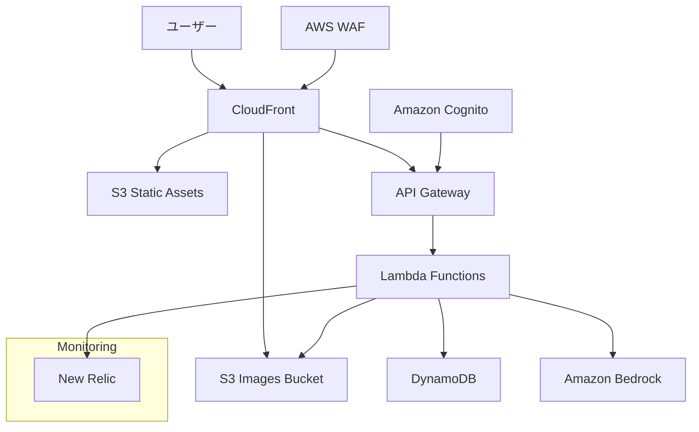
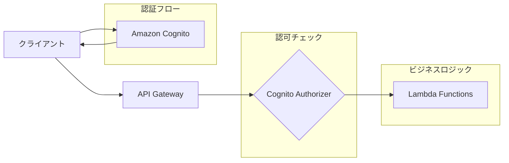

# 設計書

## 概要

「ほめびより」は、育児中の親をAIが優しく褒めてくれるWebアプリケーションです。Next.jsとFastAPIを使用したモダンなWebアプリケーションとして設計し、AWSクラウドインフラストラクチャ上で運用します。コスト最適化を重視したスモールスタート構成を採用します。

## アーキテクチャ

### システム全体構成



### 技術スタック

**フロントエンド**
- Next.js 14 (App Router、SSG/ISRモード)
- TypeScript
- Tailwind CSS
- React Hook Form (フォーム管理)
- Framer Motion (アニメーション)
- AWS Amplify Auth (認証クライアント)

**バックエンド**
- AWS Lambda (Python 3.11+)
- FastAPI (Lambda用に最適化)
- Pydantic (データバリデーション)
- Boto3 (AWS SDK)
- Mangum (FastAPI-Lambda アダプター)

**インフラストラクチャ**
- AWS Lambda (サーバーレス実行環境)
- Amazon API Gateway (RESTful API)
- Amazon DynamoDB (NoSQLデータベース)
- Amazon S3 (静的ホスティング、画像ストレージ)
- Amazon Cognito (認証・認可)
- Amazon Bedrock (AI/LLMサービス)
- AWS CloudFront (CDN)
- AWS WAF (Webアプリケーションファイアウォール)
- Terraform (Infrastructure as Code)
- New Relic (監視・パフォーマンス分析)

## コンポーネントと インターフェース

### フロントエンドコンポーネント構成

```
src/
├── app/                   # Next.jsのApp Routerによるページ構成
│   ├── (auth)/            # 認証関連のルートグループ
│   │   ├── login/         # ログインページ
│   │   └── register/      # アカウント登録ページ
│   ├── dashboard/         # ダッシュボード（木の成長UI、育児日数表示）
│   ├── post/              # 投稿作成ページ（テキスト・画像投稿、褒めレベル選択）
│   ├── chat/              # AIチャット相談機能（つぶやきの木陰）
│   ├── settings/          # 設定ページ（AIロール選択、プロフィール編集）
│   └── layout.tsx         # 共通レイアウト（ヘッダー、フッター、ナビゲーション）
├── components/            # 再利用可能なコンポーネント
│   ├── ui/                # 基本UIコンポーネント
│   │   ├── Button.tsx     # ボタンコンポーネント
│   │   ├── Input.tsx      # 入力フィールドコンポーネント
│   │   ├── Modal.tsx      # モーダルダイアログコンポーネント
│   │   ├── WatercolorTree.tsx # 木の成長UIコンポーネント
│   │   └── Animation.tsx  # アニメーション効果コンポーネント
│   ├── features/          # 機能別コンポーネント
│   │   ├── auth/          # 認証関連コンポーネント
│   │   ├── post/          # 投稿関連コンポーネント
│   │   ├── praise/        # 褒め機能関連コンポーネント
│   │   ├── chat/          # AIチャット機能関連コンポーネント
│   │   └── tree/          # 木の成長UI関連コンポーネント
│   └── layout/            # レイアウト関連コンポーネント
├── lib/                   # ユーティリティ関数とサービス
│   ├── auth.ts            # 認証関連ユーティリティ
│   ├── api.ts             # APIクライアント
│   ├── aiRoleStyles.ts    # AIロール別スタイル定義
│   └── utils.ts           # 共通ユーティリティ関数
└── types/                 # TypeScript型定義
    └── index.ts           # 共通型定義
```

### バックエンドAPI構成（マイクロサービス型Lambda関数）

**機能単位でのLambda関数分割**

```
lambdas/
├── user-service/          # ユーザー管理サービス
│   ├── handler.py         # ユーザー管理処理のエントリーポイント
│   ├── models.py          # ユーザー、子供情報モデル
│   ├── service.py         # ユーザー管理ビジネスロジック
│   └── requirements.txt   # 依存関係
│
├── post-service/          # 投稿管理サービス
│   ├── handler.py         # 投稿処理のエントリーポイント
│   ├── models.py          # 投稿関連データモデル
│   ├── service.py         # 投稿管理ビジネスロジック
│   └── requirements.txt   # 依存関係
│
├── praise-service/        # AI褒め生成サービス
│   ├── handler.py         # AI褒め処理のエントリーポイント
│   ├── models.py          # 褒めメッセージモデル
│   ├── service.py         # AI褒め生成ビジネスロジック
│   └── requirements.txt   # 依存関係（Bedrock SDK含む）
│
├── chat-service/          # AIチャット相談サービス
│   ├── handler.py         # チャット処理のエントリーポイント
│   ├── models.py          # チャットメッセージモデル
│   ├── service.py         # AIチャットビジネスロジック
│   └── requirements.txt   # 依存関係（Bedrock SDK含む）
│
├── stats-service/         # 統計・可視化データサービス
│   ├── handler.py         # 統計処理のエントリーポイント
│   ├── models.py          # 統計データモデル
│   ├── service.py         # 統計計算ビジネスロジック
│   └── requirements.txt   # 依存関係
│
├── image-service/         # 画像処理サービス
│   ├── handler.py         # 画像処理のエントリーポイント
│   ├── models.py          # 画像メタデータモデル
│   ├── service.py         # 画像アップロード・最適化ロジック
│   └── requirements.txt   # 依存関係（PIL、boto3含む）
│
└── shared/                # 共通ライブラリ（Lambda Layer）
    ├── models/            # 共通データモデル
    │   ├── base.py        # ベースモデル
    │   └── exceptions.py  # カスタム例外
    ├── services/          # 共通サービス
    │   ├── dynamodb.py    # DynamoDB操作
    │   ├── s3.py          # S3操作
    │   └── auth_utils.py  # JWT解析ヘルパー（認証後の情報取得用）
    ├── utils/             # 共通ユーティリティ
    │   ├── validators.py  # バリデーション
    │   ├── logger.py      # ログ設定
    │   └── config.py      # 設定管理
    └── requirements.txt   # 共通依存関係
```

**各Lambda関数の責務**

| Lambda関数 | 責務 | 主要エンドポイント |
|-----------|------|------------------|
| **user-service** | ユーザー・子供情報管理 | `GET,PUT /users/*`, `*  /children/*` |
| **post-service** | 投稿CRUD操作 | `GET,POST,DELETE /posts/*` |
| **praise-service** | AI褒めメッセージ生成 | `POST /praise/generate`, `GET /praise/history` |
| **chat-service** | AIチャット応答生成 | `POST /chat/*`, `GET /chat/history` |
| **stats-service** | 統計・可視化データ処理 | `GET /stats/*` |
| **image-service** | 画像アップロード・処理 | `POST /images/upload` |

**認証・認可設計の最適化**

auth-serviceを削除し、API Gateway + Amazon Cognitoの組み合わせで認証認可を完結させる設計に変更しました。

**マイクロサービス設計の利点**

1. **独立したデプロイ**: 各機能を個別にデプロイ・更新可能
2. **スケーリング最適化**: AI処理など重い処理のみスケール調整
3. **障害の局所化**: 一部機能の障害が全体に影響しない
4. **チーム開発効率**: 機能別にチーム分担可能
5. **コスト最適化**: 使用頻度に応じたメモリ・タイムアウト設定

**共通Lambda Layerの活用**

- **shared Layer**: 全Lambda関数で共通使用
- **dependencies**: boto3、pydantic、common utilities
- **models**: 共通データモデル（User、Post等）
- **services**: DynamoDB、S3操作の共通化

### API エンドポイント設計

**API Gateway統合パターン**

```
API Gateway (Cognito Authorizer)
├── /users/*      → user-service Lambda  
├── /children/*   → user-service Lambda
├── /posts/*      → post-service Lambda
├── /praise/*     → praise-service Lambda
├── /chat/*       → chat-service Lambda
├── /stats/*      → stats-service Lambda
└── /images/*     → image-service Lambda

# 認証はAPI Gateway + Cognitoで完結
# - JWT検証はAPI Gateway Cognito Authorizerが自動処理
# - 各Lambda関数では認証済みユーザー情報を取得するのみ
```

**認証・認可アーキテクチャ**



**認証処理の分担**

| 処理 | 担当コンポーネント | 詳細 |
|-----|------------------|------|
| **Google OAuth認証** | Amazon Cognito | Hosted UIまたはAmplify Auth使用 |
| **JWT発行・更新** | Amazon Cognito | 自動処理 |
| **JWT検証** | API Gateway Cognito Authorizer | リクエスト毎に自動実行 |
| **ユーザー情報取得** | Lambda関数（共通Layer） | JWTからuser_idを抽出 |

**メンテナンスモード**
- AWS WAFを使用してメンテナンス時のアクセス制御を実装
- メンテナンス中は専用のメンテナンスページを表示
- 特定IPからの管理アクセスのみ許可

**認証フロー（Cognito + API Gateway）**
- フロントエンドでGoogle OAuth認証（Cognito Hosted UI or Amplify Auth）
- Cognitoから取得したJWTトークンをAPIリクエストヘッダーに付加
- API Gateway Cognito AuthorizerがJWT検証を自動実行
- 検証成功時のみLambda関数を実行
- Lambda関数内でJWTからuser_id等を取得してビジネスロジック実行

**ユーザー管理（user-service）**
- `GET /users/profile` - ユーザープロフィール取得
- `PUT /users/profile` - ユーザープロフィール更新
- `POST /users/children` - 子供情報登録
- `GET /users/children` - 子供情報一覧取得
- `PUT /users/children/{child_id}` - 子供情報更新
- `DELETE /users/children/{child_id}` - 子供情報削除

**投稿関連（post-service）**
- `POST /posts` - 投稿作成（テキスト・画像）
- `GET /posts` - 投稿一覧取得
- `GET /posts/{post_id}` - 投稿詳細取得
- `DELETE /posts/{post_id}` - 投稿削除

**褒め機能（praise-service）**
- `POST /praise/generate` - AI褒めメッセージ生成
- `GET /praise/history` - 褒め履歴取得

**AIチャット相談機能（chat-service）**
- `POST /chat/send` - チャットメッセージ送信（テキスト・感情アイコン）
- `GET /chat/history` - チャット履歴取得
- `POST /chat/emotion` - 感情アイコン送信

**画像処理（image-service）**
- `POST /images/upload` - 画像アップロード
- `GET /images/{image_id}` - 画像メタデータ取得

**可視化データ（stats-service）**
- `GET /stats/tree` - 木の成長データ取得
- `GET /stats/milestones` - マイルストーン情報取得

## データモデル

### DynamoDB テーブル設計

**Users テーブル**
```json
{
  "PK": "USER#user_id",
  "SK": "PROFILE",
  "user_id": "string",
  "email": "string",
  "name": "string",
  "ai_role": "tama|madoka|hidejii",
  "praise_level": "light|standard|deep",
  "created_at": "timestamp",
  "updated_at": "timestamp"
}
```

**Children テーブル**
```json
{
  "PK": "USER#user_id",
  "SK": "CHILD#child_id",
  "child_id": "string",
  "user_id": "string",
  "name": "string",
  "birth_date": "date",
  "created_at": "timestamp"
}
```

**Posts テーブル**
```json
{
  "PK": "USER#user_id",
  "SK": "POST#timestamp",
  "post_id": "string",
  "user_id": "string",
  "content_s3_key": "string",
  "image_url": "string",
  "post_type": "text|image",
  "created_at": "timestamp"
}
```

**投稿コンテンツ保存戦略**
- テキスト投稿内容はS3に保存し、DynamoDBには`content_s3_key`のみ保存
- S3キー例: `posts/{user_id}/{post_id}/content.txt`
- 将来的なストレージコスト増加を抑制
- DynamoDBは高速アクセスが必要なメタデータのみ保存

**Praises テーブル**
```json
{
  "PK": "USER#user_id",
  "SK": "PRAISE#timestamp",
  "praise_id": "string",
  "user_id": "string",
  "post_id": "string",
  "ai_role": "string",
  "praise_level": "string",
  "message": "string",
  "created_at": "timestamp"
}
```

**Chat テーブル（つぶやきの木陰）**
```json
{
  "PK": "USER#user_id",
  "SK": "CHAT#timestamp",
  "chat_id": "string",
  "user_id": "string",
  "message_type": "text|emotion|system",
  "user_message": "string",
  "ai_response": "string",
  "ai_role": "tama|madoka|hidejii",
  "emotion_icon": "string",
  "created_at": "timestamp"
}
```

**Stats テーブル**
```json
{
  "PK": "USER#user_id",
  "SK": "STATS",
  "user_id": "string",
  "total_posts": "number",
  "tree_level": "number",
  "parenting_days": "number",
  "milestones": ["array"],
  "updated_at": "timestamp"
}
```

### S3 バケット構成

**画像バケット (homebiyori-images)**
```
homebiyori-images/
├── users/
│   └── {user_id}/
│       └── posts/
│           └── {post_id}/
│               └── {filename}
```

**静的アセットバケット (homebiyori-static)**
```
homebiyori-static/
├── _next/
│   ├── static/
│   └── image/
├── images/
│   ├── ui/
│   ├── animations/
│   ├── trees/
│   └── icons/
└── fonts/
```

**CloudFront配信設定**
- Origin 1: API Gateway (動的コンテンツ) - `/api/*`, `/auth/*`
- Origin 2: S3 Static Bucket (静的アセット) - `/_next/*`, `/images/*`, `/fonts/*`
- Origin 3: S3 Images Bucket (ユーザー画像) - `/uploads/*`

## AI機能設計

### AIロール設計

**たまさん（下町のベテランおばちゃん）**
- テーマカラー：緑
- 特徴：感情の受容力が圧倒的、初産・不安定なユーザーの心を溶かす力
- 対象：人情味と「大丈夫って言ってほしい人」に最適

**まどか姉さん（バリキャリ共働きママ）**
- テーマカラー：赤
- 特徴：論理的な共感＋自己効力感を高める褒め方
- 対象：忙しい人、自己評価が低いがんばり屋に響く

**ヒデじい（元教師のやさしい詩人）**
- テーマカラー：オレンジ
- 特徴：夜に効く、静かな言葉の薬
- 対象：「行動」ではなく「姿勢」や「人生」に光を当てる

### AI回答制御原則

**助言禁止原則**
- 教育、人生判断などの専門的アドバイスを一切行わず、共感にとどめる

**比較禁止原則**
- 他者との比較・過去のユーザー行動との評価を避ける

**領域フィルター**
- 医療相談：「ごめんね、わたしにはそれをちゃんと考える力がまだなくて…」
- DV・虐待に関する疑い：緊急連絡先を提示する導線へ
- 離婚・死別などの深刻な人生相談：「重たい気持ちだね…。それだけ大事なことなんだね」位に留める

### 機能間の相互補完関係

**要件1→要件5**：褒め投稿時に表現に困った場合、チャット相談機能への誘導を行う
**要件5→要件1**：チャット相談後、感情を整理できた段階で褒め記録への投稿を誘導する
**データ連携**：チャット応答時に過去の投稿履歴を参照し、親密感のある応答を生成する

## UI/UX設計

### 木の成長UI

**成長段階**
- 生後7日まで：芽（256px）
- 生後30日まで：小さな苗（288px）
- 生後90日まで：若木（320px）
- 生後180日まで：中木（384px）
- 生後365日まで：大木（550px）
- 生後3年以降：巨木（700px）

**実の可視化**
- AIロール別の色分け：たまさん（緑）、まどか姉さん（赤）、ヒデじい（オレンジ）
- 光る実：投稿済み、光らない実：未投稿（1日1個まで）
- 実をタップ：褒めメッセージをふんわり浮遊演出で表示

### 投稿フロー設計

**投稿→お祝い→手紙→実の出現**
1. 投稿送信：「静かに喜んでくれる」演出（拍手アニメーション等）
2. AI分析完了：手紙や箱を開けるような演出でメッセージ表示
3. 手紙を閉じる：木に新しい実が出現（特別エフェクト付き）

## エラーハンドリング

### エラー分類と対応

**認証エラー**
- 401 Unauthorized: トークン無効・期限切れ
- 403 Forbidden: 権限不足
- 対応: 自動リフレッシュ、ログイン画面へリダイレクト

**バリデーションエラー**
- 400 Bad Request: 入力データ不正
- 対応: フィールドレベルエラーメッセージ表示

**外部サービスエラー**
- Amazon Bedrock API エラー
- S3 アップロードエラー
- 対応: リトライ機構、フォールバック処理

**システムエラー**
- 500 Internal Server Error
- 対応: エラーログ記録、ユーザーフレンドリーなエラーメッセージ

### エラーレスポンス形式

```json
{
  "error": {
    "code": "VALIDATION_ERROR",
    "message": "入力内容に問題があります",
    "details": [
      {
        "field": "content",
        "message": "投稿内容は必須です"
      }
    ]
  }
}
```

## テスト戦略

### フロントエンドテスト

**単体テスト**
- Jest + React Testing Library
- コンポーネントの動作確認
- カスタムフックのテスト

**統合テスト**
- Playwright
- ユーザーフロー全体のテスト
- 認証フローのテスト

**視覚回帰テスト**
- Chromatic (Storybook)
- UIコンポーネントの視覚的変更検知

### バックエンドテスト

**単体テスト**
- pytest
- FastAPI Test Client
- モック使用したサービス層テスト

**統合テスト**
- DynamoDB Local使用
- 実際のAWSサービスとの連携テスト

**負荷テスト**
- Locust
- API エンドポイントの性能テスト

### E2Eテスト

**シナリオテスト**
- ユーザー登録からAI褒め機能まで
- 画像投稿フロー
- AIチャット相談機能
- 木の成長可視化機能

## セキュリティ設計

### 認証・認可

**Amazon Cognito設定**
- Google OAuth 2.0 連携
- JWT トークン使用
- リフレッシュトークンローテーション

**API セキュリティ**
- CORS 設定
- Rate Limiting
- Input Validation

### データ保護

**暗号化**
- DynamoDB: 保存時暗号化有効
- S3: SSE-S3 暗号化
- 通信: HTTPS/TLS 1.3

**アクセス制御**
- IAM ロール最小権限原則
- VPC エンドポイント使用
- WAF ルール設定

### プライバシー保護

**個人情報管理**
- 画像メタデータ除去
- データ削除機能
- GDPR 準拠設計

## パフォーマンス最適化

### フロントエンド最適化

**コード分割**
- Next.js Dynamic Import
- ルートレベル分割
- コンポーネント遅延読み込み

**画像最適化**
- Next.js Image コンポーネント
- WebP 形式対応
- レスポンシブ画像

**キャッシュ戦略**
- SWR使用
- CloudFront キャッシュ
- ブラウザキャッシュ

### バックエンド最適化

**データベース最適化**
- DynamoDB GSI 設計
- バッチ処理使用
- 接続プール管理

**AI API 最適化**
- プロンプト効率化
- レスポンスキャッシュ
- 非同期処理

## 監視・ログ

### New Relic 監視設定

**アプリケーション監視**
- フロントエンド: Browser Agent
- バックエンド: Python Agent
- インフラ: Infrastructure Agent

**アラート設定**
- エラー率閾値
- レスポンス時間監視
- リソース使用率監視

### ログ管理

**構造化ログ**
- JSON 形式
- 相関ID 使用
- ログレベル分類

**ログ収集**
- CloudWatch Logs
- New Relic Logs
- セキュリティログ分離

## デプロイメント戦略

### CI/CD パイプライン

**GitHub Actions**
- プルリクエスト時: テスト実行
- マージ時: ビルド・デプロイ
- セキュリティスキャン

**デプロイ戦略**
- Blue-Green デプロイメント
- ヘルスチェック
- 自動ロールバック

### 環境管理

**環境構成**
- Production環境のみ（スモールスタート）

**設定管理**
- AWS Systems Manager Parameter Store
- 環境変数管理
- シークレット管理

## コスト最適化

### AWS リソース最適化

**Lambda**
- プロビジョニングされた同時実行数の最適化
- メモリ設定の最適化
- コールドスタート対策
- Lambda Layers活用

**API Gateway**
- キャッシュ設定
- スロットリング設定
- ステージ変数の活用

**DynamoDB**
- オンデマンド課金
- TTL 設定
- 適切なキー設計
- GSIの最適化

**S3**
- Intelligent Tiering
- ライフサイクルポリシー
- 不要データ削除
- 静的ウェブサイトホスティング最適化

**Bedrock**
- 効率的プロンプト設計
- キャッシュ活用
- 使用量監視
- トークン数最適化

### 監視・アラート

**コスト監視**
- AWS Cost Explorer
- 予算アラート設定
- リソース使用量追跡

**最適化提案**
- AWS Trusted Advisor
- 定期的なコスト見直し
- 不要リソース削除

## 想定コスト算出（月間100ユーザー）

### 前提条件
- 月間アクティブユーザー: 100名
- ユーザー1人あたり月間投稿数: 15回
- 画像投稿率: 30%（テキスト投稿: 70%）
- AIチャット利用: ユーザー1人あたり月間10回
- 月間総投稿数: 1,500回
- 月間総チャット: 1,000回
- 月間総画像アップロード: 450枚
- 平均画像サイズ: 2MB
- AI褒めメッセージ生成: 投稿1回につき1回
- AIチャット応答生成: チャット1回につき1回
- 月間総API呼び出し: 25,000回（投稿、チャット、取得、認証等）

### AWS サービス別コスト

**API Gateway**
- API呼び出し: 25,000回 × $3.50/百万リクエスト = **$0.09**
- データ転送: 6GB × $0.09/GB = **$0.54**
- 月額: **$0.63**

**Lambda（マイクロサービス構成、auth-service削除）**
- user-service（5,000リクエスト）: 5,000回 × 300ms × 512MB = 750GB-秒  
- post-service（5,000リクエスト）: 5,000回 × 400ms × 512MB = 1,000GB-秒
- praise-service（1,500リクエスト）: 1,500回 × 3,000ms × 1GB = 4,500GB-秒
- chat-service（1,000リクエスト）: 1,000回 × 3,000ms × 1GB = 3,000GB-秒
- stats-service（500リクエスト）: 500回 × 500ms × 512MB = 125GB-秒
- image-service（500リクエスト）: 500回 × 1,000ms × 1GB = 500GB-秒
- 合計: 9,875GB-秒
- 無料枠: 400,000GB-秒/月
- 月額: **$0.00**（無料枠内）

※auth-service削除により認証処理がAPI Gateway + Cognitoで完結し、Lambda実行コストを削減

**DynamoDB (オンデマンド)**
- 書き込み要求単位 (WRU): 1,500投稿 + 1,000チャット + 100ユーザー更新 = 2,600回
- 読み取り要求単位 (RRU): 20,000回（投稿閲覧、チャット履歴、統計取得等）
- ストレージ: 約150MB（メタデータのみ、投稿内容とチャット履歴はS3保存）
- 月額: $3.25 (WRU) + $2.50 (RRU) + $0.038 (ストレージ) = **$5.79**

**S3**
- 画像ストレージ: 450枚 × 2MB = 900MB
- 投稿テキストコンテンツ: 1,050件 × 1KB = 1MB
- チャット履歴: 1,000件 × 2KB = 2MB
- 静的アセット: 100MB
- 総ストレージ: 1.1GB
- PUT要求: 450回（画像） + 1,050回（テキスト） + 1,000回（チャット） = 2,500回
- GET要求: 4,500回（画像表示） + 15,000回（テキスト読み込み） + 5,000回（チャット履歴） = 24,500回
- 月額: $0.025 (ストレージ) + $0.0125 (PUT) + $0.0098 (GET) = **$0.047**

**CloudFront**
- データ転送量: 12GB（画像 + 静的アセット）
- リクエスト数: 60,000回
- 月額: $1.02 (データ転送) + $0.009 (リクエスト) = **$1.03**

**Amazon Cognito**
- 月間アクティブユーザー: 100名
- 月額: $0.55 (100MAU × $0.0055) = **$0.55**

**Amazon Bedrock (Claude 3 Haiku想定)**
- 褒めメッセージ生成:
  - 入力トークン: 1,500回 × 700トークン = 1,050,000トークン
  - 出力トークン: 1,500回 × 150トークン = 225,000トークン
- チャット応答生成:
  - 入力トークン: 1,000回 × 800トークン = 800,000トークン（過去履歴含む）
  - 出力トークン: 1,000回 × 200トークン = 200,000トークン
- 月間総トークン:
  - 入力: 1,850,000トークン
  - 出力: 425,000トークン
- 月額: $0.463 (入力) + $0.638 (出力) = **$1.10**

**AWS WAF**
- Web ACL: 1個
- ルール: 5個
- リクエスト: 100万回
- 月額: $1.00 + $1.00 + $0.60 = **$2.60**

### 総コスト

| サービス | 月額コスト |
|---------|-----------|
| API Gateway | $0.63 |
| Lambda | $0.00 |
| DynamoDB | $5.79 |
| S3 | $0.047 |
| CloudFront | $1.03 |
| Cognito | $0.55 |
| Bedrock | $1.10 |
| WAF | $2.60 |
| **合計** | **$11.71** |

※ New Relicは監視ツールとして採用しますが、コスト計算からは除外しています。

### コスト削減効果

| 構成 | 月額コスト | 削減額 | 削減率 |
|---------|-----------|--------|--------|
| Fargate + ALB + NAT Gateway | $79.71 | - | - |
| API Gateway + Lambda | $11.71 | $68.00 | 85% |

サーバレス構成への移行により、月額コストを約85%削減できます。特に固定費（Fargate、ALB、NAT Gateway）が不要になることが大きな削減要因です。

**マイクロサービス化による追加メリット**
- 各Lambda関数で個別最適化されたメモリ設定
- 使用頻度に応じたタイムアウト設定
- 障害時の影響範囲の局所化
- 機能別の独立デプロイ・スケーリング

AIチャット機能追加により若干コストは増加しますが、マイクロサービス化により効率的なリソース利用を実現し、依然として大幅なコスト削減を維持しています。