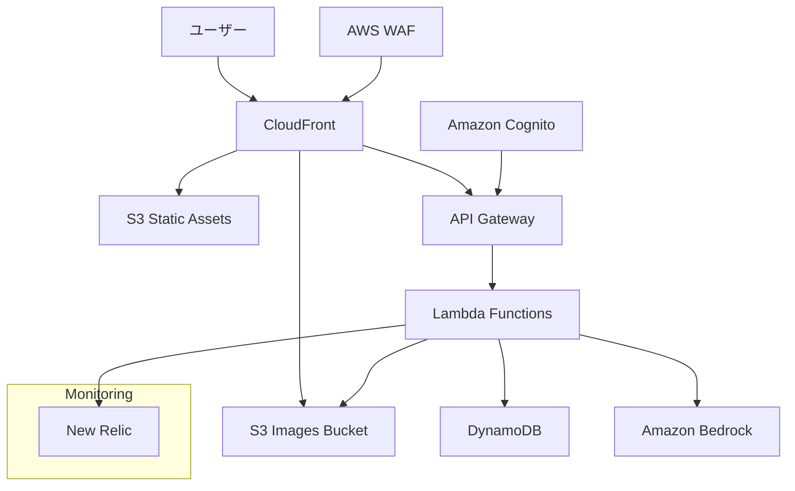

# 設計書

## 概要

「ほめびより」は、育児中の親をAIが優しく褒めてくれるWebアプリケーションです。Next.jsとFastAPIを使用したモダンなWebアプリケーションとして設計し、AWSクラウドインフラストラクチャ上で運用します。コスト最適化を重視したスモールスタート構成を採用します。

## アーキテクチャ

### システム全体構成



### 技術スタック

**フロントエンド**
- Next.js 14 (App Router、SSG/ISRモード)
- TypeScript
- Tailwind CSS
- React Hook Form (フォーム管理)
- Framer Motion (アニメーション)
- AWS Amplify Auth (認証クライアント)

**バックエンド**
- AWS Lambda (Python 3.11+)
- FastAPI (Lambda用に最適化)
- Pydantic (データバリデーション)
- Boto3 (AWS SDK)
- Mangum (FastAPI-Lambda アダプター)

**インフラストラクチャ**
- AWS Lambda (サーバーレス実行環境)
- Amazon API Gateway (RESTful API)
- Amazon DynamoDB (NoSQLデータベース)
- Amazon S3 (静的ホスティング、画像ストレージ)
- Amazon Cognito (認証・認可)
- Amazon Bedrock (AI/LLMサービス)
- AWS CloudFront (CDN)
- AWS WAF (Webアプリケーションファイアウォール)
- Terraform (Infrastructure as Code)
- New Relic (監視・パフォーマンス分析)

## コンポーネントと インターフェース

### フロントエンドコンポーネント構成

```
src/
├── app/                   # Next.jsのApp Routerによるページ構成
│   ├── (auth)/            # 認証関連のルートグループ
│   │   ├── login/         # ログインページ
│   │   └── register/      # アカウント登録ページ
│   ├── dashboard/         # ダッシュボード（花畑UI、育児日数表示）
│   ├── post/              # 投稿作成ページ（テキスト・画像投稿、褒めレベル選択）
│   ├── settings/          # 設定ページ（AIロール選択、プロフィール編集）
│   └── layout.tsx         # 共通レイアウト（ヘッダー、フッター、ナビゲーション）
├── components/            # 再利用可能なコンポーネント
│   ├── ui/                # 基本UIコンポーネント
│   │   ├── Button.tsx     # ボタンコンポーネント
│   │   ├── Input.tsx      # 入力フィールドコンポーネント
│   │   ├── Modal.tsx      # モーダルダイアログコンポーネント
│   │   └── Animation.tsx  # アニメーション効果コンポーネント
│   ├── features/          # 機能別コンポーネント
│   │   ├── auth/          # 認証関連コンポーネント
│   │   ├── post/          # 投稿関連コンポーネント
│   │   ├── praise/        # 褒め機能関連コンポーネント
│   │   └── garden/        # 花畑UI関連コンポーネント
│   └── layout/            # レイアウト関連コンポーネント
├── lib/                   # ユーティリティ関数とサービス
│   ├── auth.ts            # 認証関連ユーティリティ
│   ├── api.ts             # APIクライアント
│   └── utils.ts           # 共通ユーティリティ関数
└── types/                 # TypeScript型定義
    └── index.ts           # 共通型定義
```

### バックエンドAPI構成（Lambda関数）

```
app/
├── handler.py             # Lambda関数のエントリーポイント、Mangumアダプター設定
├── main.py                # FastAPIインスタンス設定
├── routers/               # APIエンドポイント定義
│   ├── auth.py            # 認証関連エンドポイント（ログイン、ログアウト）
│   ├── posts.py           # 投稿関連エンドポイント（作成、取得、削除）
│   ├── praise.py          # 褒め機能関連エンドポイント（生成、履歴）
│   ├── users.py           # ユーザー管理エンドポイント（プロフィール）
│   └── children.py        # 子供情報管理エンドポイント（登録、更新）
├── models/                # データモデル定義
│   ├── user.py            # ユーザーモデル（プロフィール、設定）
│   ├── post.py            # 投稿モデル（テキスト、画像）
│   ├── child.py           # 子供情報モデル（名前、生年月日）
│   └── praise.py          # 褒めメッセージモデル（AIロール、レベル）
├── services/              # ビジネスロジック実装
│   ├── auth_service.py    # 認証サービス（JWT検証、Cognito連携）
│   ├── ai_service.py      # AI連携サービス（Bedrock API呼び出し）
│   ├── image_service.py   # 画像処理サービス（S3アップロード、最適化）
│   └── dynamodb_service.py # DynamoDB操作サービス（CRUD操作）
├── core/                  # コア機能・設定
│   ├── config.py          # 環境変数、アプリ設定
│   ├── security.py        # セキュリティ機能（認証、認可）
│   └── dependencies.py    # FastAPI依存関係（DB接続、認証）
├── utils/                 # ユーティリティ関数
│   └── helpers.py         # 共通ヘルパー関数
└── layers/                # Lambda Layers
    ├── common/            # 共通ライブラリ
    └── newrelic/          # New Relic Lambda Layer
```

### API エンドポイント設計

**メンテナンスモード**
- AWS WAFを使用してメンテナンス時のアクセス制御を実装
- メンテナンス中は専用のメンテナンスページを表示
- 特定IPからの管理アクセスのみ許可

**認証関連**
- `POST /auth/google` - Googleアカウント連携ログイン
- `POST /auth/refresh` - トークンリフレッシュ
- `POST /auth/logout` - ログアウト

**ユーザー管理**
- `GET /users/profile` - ユーザープロフィール取得
- `PUT /users/profile` - ユーザープロフィール更新
- `POST /users/children` - 子供情報登録
- `GET /users/children` - 子供情報一覧取得
- `PUT /users/children/{child_id}` - 子供情報更新
- `DELETE /users/children/{child_id}` - 子供情報削除

**投稿関連**
- `POST /posts` - 投稿作成（テキスト・画像）
- `GET /posts` - 投稿一覧取得
- `GET /posts/{post_id}` - 投稿詳細取得
- `DELETE /posts/{post_id}` - 投稿削除

**褒め機能**
- `POST /praise/generate` - AI褒めメッセージ生成
- `GET /praise/history` - 褒め履歴取得

**可視化データ**
- `GET /stats/garden` - 花畑データ取得
- `GET /stats/milestones` - マイルストーン情報取得


## データモデル

### DynamoDB テーブル設計

**Users テーブル**
```json
{
  "PK": "USER#user_id",
  "SK": "PROFILE",
  "user_id": "string",
  "email": "string",
  "name": "string",
  "ai_role": "tama|madoka|hide",
  "praise_level": "light|standard|deep",
  "created_at": "timestamp",
  "updated_at": "timestamp"
}
```

**Children テーブル**
```json
{
  "PK": "USER#user_id",
  "SK": "CHILD#child_id",
  "child_id": "string",
  "user_id": "string",
  "name": "string",
  "birth_date": "date",
  "created_at": "timestamp"
}
```

**Posts テーブル**
```json
{
  "PK": "USER#user_id",
  "SK": "POST#timestamp",
  "post_id": "string",
  "user_id": "string",
  "content_s3_key": "string",
  "image_url": "string",
  "post_type": "text|image",
  "created_at": "timestamp"
}
```

**投稿コンテンツ保存戦略**
- テキスト投稿内容はS3に保存し、DynamoDBには`content_s3_key`のみ保存
- S3キー例: `posts/{user_id}/{post_id}/content.txt`
- 将来的なストレージコスト増加を抑制
- DynamoDBは高速アクセスが必要なメタデータのみ保存

**Praises テーブル**
```json
{
  "PK": "USER#user_id",
  "SK": "PRAISE#timestamp",
  "praise_id": "string",
  "user_id": "string",
  "post_id": "string",
  "ai_role": "string",
  "praise_level": "string",
  "message": "string",
  "created_at": "timestamp"
}
```

**Stats テーブル**
```json
{
  "PK": "USER#user_id",
  "SK": "STATS",
  "user_id": "string",
  "total_posts": "number",
  "garden_level": "number",
  "milestones": ["array"],
  "updated_at": "timestamp"
}
```

### S3 バケット構成

**画像バケット (homebiyori-images)**
```
homebiyori-images/
├── users/
│   └── {user_id}/
│       └── posts/
│           └── {post_id}/
│               └── {filename}
```

**静的アセットバケット (homebiyori-static)**
```
homebiyori-static/
├── _next/
│   ├── static/
│   └── image/
├── images/
│   ├── ui/
│   ├── animations/
│   └── icons/
└── fonts/
```

**CloudFront配信設定**
- Origin 1: API Gateway (動的コンテンツ) - `/api/*`, `/auth/*`
- Origin 2: S3 Static Bucket (静的アセット) - `/_next/*`, `/images/*`, `/fonts/*`
- Origin 3: S3 Images Bucket (ユーザー画像) - `/uploads/*`

## エラーハンドリング

### エラー分類と対応

**認証エラー**
- 401 Unauthorized: トークン無効・期限切れ
- 403 Forbidden: 権限不足
- 対応: 自動リフレッシュ、ログイン画面へリダイレクト

**バリデーションエラー**
- 400 Bad Request: 入力データ不正
- 対応: フィールドレベルエラーメッセージ表示

**外部サービスエラー**
- Amazon Bedrock API エラー
- S3 アップロードエラー
- 対応: リトライ機構、フォールバック処理

**システムエラー**
- 500 Internal Server Error
- 対応: エラーログ記録、ユーザーフレンドリーなエラーメッセージ

### エラーレスポンス形式

```json
{
  "error": {
    "code": "VALIDATION_ERROR",
    "message": "入力内容に問題があります",
    "details": [
      {
        "field": "content",
        "message": "投稿内容は必須です"
      }
    ]
  }
}
```

## テスト戦略

### フロントエンドテスト

**単体テスト**
- Jest + React Testing Library
- コンポーネントの動作確認
- カスタムフックのテスト

**統合テスト**
- Playwright
- ユーザーフロー全体のテスト
- 認証フローのテスト

**視覚回帰テスト**
- Chromatic (Storybook)
- UIコンポーネントの視覚的変更検知

### バックエンドテスト

**単体テスト**
- pytest
- FastAPI Test Client
- モック使用したサービス層テスト

**統合テスト**
- DynamoDB Local使用
- 実際のAWSサービスとの連携テスト

**負荷テスト**
- Locust
- API エンドポイントの性能テスト

### E2Eテスト

**シナリオテスト**
- ユーザー登録からAI褒め機能まで
- 画像投稿フロー
- 花畑可視化機能

## セキュリティ設計

### 認証・認可

**Amazon Cognito設定**
- Google OAuth 2.0 連携
- JWT トークン使用
- リフレッシュトークンローテーション

**API セキュリティ**
- CORS 設定
- Rate Limiting
- Input Validation

### データ保護

**暗号化**
- DynamoDB: 保存時暗号化有効
- S3: SSE-S3 暗号化
- 通信: HTTPS/TLS 1.3

**アクセス制御**
- IAM ロール最小権限原則
- VPC エンドポイント使用
- WAF ルール設定

### プライバシー保護

**個人情報管理**
- 画像メタデータ除去
- データ削除機能
- GDPR 準拠設計

## パフォーマンス最適化

### フロントエンド最適化

**コード分割**
- Next.js Dynamic Import
- ルートレベル分割
- コンポーネント遅延読み込み

**画像最適化**
- Next.js Image コンポーネント
- WebP 形式対応
- レスポンシブ画像

**キャッシュ戦略**
- SWR使用
- CloudFront キャッシュ
- ブラウザキャッシュ

### バックエンド最適化

**データベース最適化**
- DynamoDB GSI 設計
- バッチ処理使用
- 接続プール管理

**AI API 最適化**
- プロンプト効率化
- レスポンスキャッシュ
- 非同期処理

## 監視・ログ

### New Relic 監視設定

**アプリケーション監視**
- フロントエンド: Browser Agent
- バックエンド: Python Agent
- インフラ: Infrastructure Agent

**アラート設定**
- エラー率閾値
- レスポンス時間監視
- リソース使用率監視

### ログ管理

**構造化ログ**
- JSON 形式
- 相関ID 使用
- ログレベル分類

**ログ収集**
- CloudWatch Logs
- New Relic Logs
- セキュリティログ分離

## デプロイメント戦略

### CI/CD パイプライン

**GitHub Actions**
- プルリクエスト時: テスト実行
- マージ時: ビルド・デプロイ
- セキュリティスキャン

**デプロイ戦略**
- Blue-Green デプロイメント
- ヘルスチェック
- 自動ロールバック

### 環境管理

**環境構成**
- Production環境のみ（スモールスタート）

**設定管理**
- AWS Systems Manager Parameter Store
- 環境変数管理
- シークレット管理

## コスト最適化

### AWS リソース最適化

**Lambda**
- プロビジョニングされた同時実行数の最適化
- メモリ設定の最適化
- コールドスタート対策
- Lambda Layers活用

**API Gateway**
- キャッシュ設定
- スロットリング設定
- ステージ変数の活用

**DynamoDB**
- オンデマンド課金
- TTL 設定
- 適切なキー設計
- GSIの最適化

**S3**
- Intelligent Tiering
- ライフサイクルポリシー
- 不要データ削除
- 静的ウェブサイトホスティング最適化

**Bedrock**
- 効率的プロンプト設計
- キャッシュ活用
- 使用量監視
- トークン数最適化

### 監視・アラート

**コスト監視**
- AWS Cost Explorer
- 予算アラート設定
- リソース使用量追跡

**最適化提案**
- AWS Trusted Advisor
- 定期的なコスト見直し
- 不要リソース削除

## 想定コスト算出（月間100ユーザー）

### 前提条件
- 月間アクティブユーザー: 100名
- ユーザー1人あたり月間投稿数: 15回
- 画像投稿率: 30%（テキスト投稿: 70%）
- 月間総投稿数: 1,500回
- 月間総画像アップロード: 450枚
- 平均画像サイズ: 2MB
- AI褒めメッセージ生成: 投稿1回につき1回
- 月間総API呼び出し: 20,000回（投稿、取得、認証等）

### AWS サービス別コスト

**API Gateway**
- API呼び出し: 20,000回 × $3.50/百万リクエスト = **$0.07**
- データ転送: 5GB × $0.09/GB = **$0.45**
- 月額: **$0.52**

**Lambda**
- 通常API（18,500リクエスト）:
  - 実行: 18,500回 × 500ms × 1GB = 9,250GB-秒
- AI褒め生成API（1,500リクエスト）:
  - 実行: 1,500回 × 3,000ms × 1GB = 4,500GB-秒
- 合計: 13,750GB-秒
- 無料枠: 400,000GB-秒/月
- 月額: **$0.00**（無料枠内）

**DynamoDB (オンデマンド)**
- 書き込み要求単位 (WRU): 1,500投稿 + 100ユーザー更新 = 1,600回
- 読み取り要求単位 (RRU): 15,000回（投稿閲覧、統計取得等）
- ストレージ: 約100MB（メタデータのみ、投稿内容はS3保存）
- 月額: $2.00 (WRU) + $1.88 (RRU) + $0.025 (ストレージ) = **$3.91**

**S3**
- 画像ストレージ: 450枚 × 2MB = 900MB
- 投稿テキストコンテンツ: 1,050件 × 1KB = 1MB
- 静的アセット: 100MB
- 総ストレージ: 1GB
- PUT要求: 450回（画像） + 1,050回（テキスト） = 1,500回
- GET要求: 4,500回（画像表示） + 15,000回（テキスト読み込み） = 19,500回
- 月額: $0.023 (ストレージ) + $0.0075 (PUT) + $0.0078 (GET) = **$0.038**

**CloudFront**
- データ転送量: 10GB（画像 + 静的アセット）
- リクエスト数: 50,000回
- 月額: $0.85 (データ転送) + $0.0075 (リクエスト) = **$0.86**

**Amazon Cognito**
- 月間アクティブユーザー: 100名
- 月額: $0.55 (100MAU × $0.0055) = **$0.55**

**Amazon Bedrock (Claude 3 Haiku想定)**
- 入力トークン内訳:
  - ユーザー入力: 200トークン（日本語約150文字）
  - AIロール情報とキャラクター設定: 300トークン
  - システムプロンプト（褒め方の指示など）: 200トークン
  - 合計: 700トークン/リクエスト
- 月間入力トークン: 1,500回 × 700トークン = 1,050,000トークン
- 出力トークン: 1,500回 × 150トークン = 225,000トークン
  - 150トークン ≈ 日本語110文字程度の褒めメッセージ
- 月額: $0.263 (入力) + $0.30 (出力) = **$0.563**

※トークン数の目安：日本語は1文字あたり約1.3トークン程度。200トークンは約150文字、150トークンは約110文字に相当します。

**AWS WAF**
- Web ACL: 1個
- ルール: 5個
- リクエスト: 100万回
- 月額: $1.00 + $1.00 + $0.60 = **$2.60**

### 総コスト

| サービス | 月額コスト |
|---------|-----------|
| API Gateway | $0.52 |
| Lambda | $0.00 |
| DynamoDB | $3.91 |
| S3 | $0.038 |
| CloudFront | $0.86 |
| Cognito | $0.55 |
| Bedrock | $0.563 |
| WAF | $2.60 |
| **合計** | **$9.04** |

※ New Relicは監視ツールとして採用しますが、コスト計算からは除外しています。

### コスト削減効果

| 構成 | 月額コスト | 削減額 | 削減率 |
|---------|-----------|--------|--------|
| Fargate + ALB + NAT Gateway | $79.71 | - | - |
| API Gateway + Lambda | $9.04 | $70.67 | 89% |

サーバレス構成への移行により、月額コストを約89%削減できます。特に固定費（Fargate、ALB、NAT Gateway）が不要になることが大きな削減要因です。
