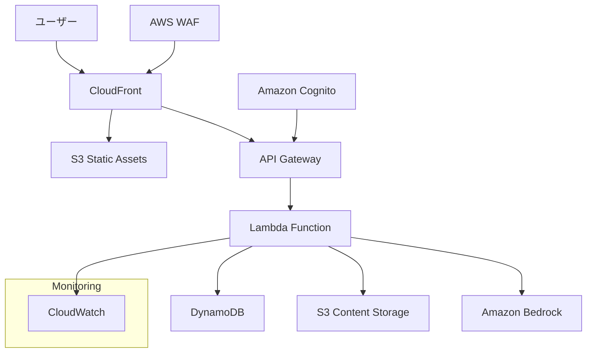

# 設計書

## 概要

「Homebiyori（ほめびより）」は、育児中の親をAIが優しく褒めてくれるWebアプリケーションです。主役は子供ではなく親であり、押し付けがましくない優しさで育児のやる気や自己肯定感を高めることを目的としています。Next.js 14とFastAPIを使用したモダンなサーバーレスWebアプリケーションとして設計し、AWSクラウドインフラストラクチャ上で運用します。

## アーキテクチャ

### システム全体構成



### 技術スタック

**フロントエンド**
- Next.js 14 (App Router、Static Export)
- TypeScript 5.0+
- Tailwind CSS 3.4+
- Framer Motion (アニメーション)
- React Hook Form (フォーム管理)
- Zustand (状態管理)
- AWS Amplify Auth (認証クライアント)

**バックエンド**
- AWS Lambda (Python 3.12) - 機能別マイクロサービス構成
- FastAPI (高速API開発)
- Pydantic v2 (データバリデーション)
- Boto3 (AWS SDK)
- Mangum (FastAPI-Lambda アダプター)
- Lambda Layers (共通ライブラリ管理)

**インフラストラクチャ**
- AWS Lambda (サーバーレス実行環境)
- Amazon API Gateway (RESTful API)
- Amazon DynamoDB (NoSQLデータベース)
- Amazon S3 (静的ホスティング、コンテンツストレージ)
- Amazon Cognito (認証・認可)
- Amazon Bedrock (Claude 3 Haiku)
- AWS CloudFront (CDN)
- AWS WAF (Webアプリケーションファイアウォール)
- Terraform (Infrastructure as Code)

## フロントエンド設計

### アーキテクチャパターン

**Clean Architecture + Feature-Based Organization**を採用し、以下の原則に従います：

1. **責務の分離**: UI、ビジネスロジック、データアクセスを明確に分離
2. **依存性逆転**: 具象実装ではなく抽象に依存
3. **単一責任原則**: 各コンポーネントは単一の責務を持つ
4. **開放閉鎖原則**: 拡張に開放、修正に閉鎖

### ディレクトリ構成

```
src/
├── app/                          # Next.js App Router
│   ├── globals.css              # グローバルスタイル
│   ├── layout.tsx               # ルートレイアウト
│   └── page.tsx                 # ホームページ
├── components/                   # UIコンポーネント
│   ├── ui/                      # 基本UIコンポーネント
│   │   ├── Button.tsx           # 再利用可能ボタン
│   │   ├── TouchTarget.tsx      # タッチ対応ボタン
│   │   ├── Typography.tsx       # タイポグラフィー統一
│   │   ├── UserMenu.tsx         # ユーザーメニュー
│   │   ├── LoadingSpinner.tsx   # ローディング表示
│   │   ├── Toast.tsx            # トースト通知
│   │   ├── WatercolorTree.tsx   # 木の描画コンポーネント
│   │   └── TopPageWatercolorTree.tsx # トップページ専用木
│   ├── features/                # 機能別コンポーネント
│   │   ├── auth/               # 認証機能
│   │   │   └── AuthScreen.tsx
│   │   ├── chat/               # チャット機能
│   │   │   ├── ChatHeader.tsx  # 共有チャットヘッダー
│   │   │   ├── ChatScreen.tsx  # 1:1チャット
│   │   │   ├── GroupChatScreen.tsx # グループチャット
│   │   │   └── TreeGrowthStatus.tsx # 木の成長状況
│   │   ├── character/          # キャラクター選択
│   │   │   └── CharacterSelection.tsx
│   │   ├── tree/               # 木の表示・管理
│   │   │   └── TreeView.tsx
│   │   ├── subscription/       # サブスクリプション
│   │   │   ├── PremiumLandingPage.tsx
│   │   │   └── SubscriptionCancelPage.tsx
│   │   ├── static/             # 静的ページ
│   │   │   ├── TermsOfServicePage.tsx
│   │   │   ├── PrivacyPolicyPage.tsx
│   │   │   ├── ContactFormPage.tsx
│   │   │   ├── CommercialTransactionPage.tsx
│   │   │   └── FAQPage.tsx
│   │   ├── MainApp.tsx         # メインアプリケーション
│   │   └── TopPage.tsx         # トップページ
│   └── layout/                 # レイアウト関連
│       ├── NavigationHeader.tsx # ナビゲーションヘッダー
│       ├── Footer.tsx          # フッター
│       ├── PremiumLayout.tsx   # プレミアム用レイアウト
│       ├── ResponsiveContainer.tsx # レスポンシブコンテナ
│       └── StaticPageLayout.tsx # 静的ページレイアウト
├── lib/                        # ユーティリティ・ヘルパー
│   ├── constants.ts            # 定数定義
│   ├── utils.ts                # ユーティリティ関数
│   ├── hooks.ts                # カスタムフック
│   └── demoStorage.ts          # デモ用ストレージ
├── types/                      # TypeScript型定義
│   └── index.ts                # 型定義統合
└── styles/                     # スタイル関連
    └── globals.css             # グローバルCSS
```

### 設計原則と改善点

**1. 共通化とDRY原則**
- `ChatHeader`コンポーネントで1:1チャットとグループチャットの共通UI統一
- `TreeGrowthStatus`コンポーネントで木の成長表示ロジック統一
- `TouchTarget`コンポーネントでアクセシビリティ対応統一
- `Typography`コンポーネントでテキスト表示統一

**2. 関心の分離**
- UI層: 表示のみに集中
- ビジネスロジック層: `lib/utils.ts`と`lib/hooks.ts`で分離
- データ層: `demoStorage.ts`で抽象化

**3. 型安全性**
- 全コンポーネントでTypeScript strict mode有効
- `types/index.ts`で型定義を集約
- Props interfaceの明確な定義

**4. パフォーマンス最適化**
- React.memo()の適切な使用
- useCallback/useMemoでの再レンダリング防止
- Dynamic importでのコード分割

**5. アクセシビリティ**
- `TouchTarget`でキーボードナビゲーション対応
- セマンティックHTML要素の使用
- ARIAラベルの適切な配置

## バックエンド設計

### Lambda分割戦略

**機能別マイクロサービス + 負荷特性別分割**を採用し、以下のLambda構成とします：

#### Lambda Functions構成

```
📱 エンドユーザー向け API Gateway (prod-user-api)
├── Cognito User Pool: homebiyori-users (Google OAuth)
├── /api/chat/*     → chat-service Lambda (1024MB, 60s) [要認証]
├── /api/tree/*     → tree-service Lambda (512MB, 30s) [要認証]
├── /api/users/*    → user-service Lambda (256MB, 15s) [要認証]
└── /api/health     → health-check Lambda (128MB, 5s) [認証不要]

🔧 管理者向け API Gateway (prod-admin-api)
├── Cognito User Pool: homebiyori-admins (Email/Password)
└── /api/admin/*    → admin-service Lambda (512MB, 30s) [管理者認証]

認証フロー:
📱 User Frontend → Amplify Auth → Cognito (users) → User API Gateway
🔧 Admin Panel → Amplify Auth → Cognito (admins) → Admin API Gateway

メンテナンス制御:
Parameter Store (/homebiyori/maintenance/*) ← 全Lambda参照
```

#### 各Lambda Functionの責務

| Lambda Function | 主要責務 | メモリ | タイムアウト | 同時実行 | 主要依存関係 |
|----------------|---------|-------|------------|----------|------------|
| **chat-service** | AI応答・チャット | 1024MB | 60秒 | 50 | Bedrock, DynamoDB, Parameter Store |
| **tree-service** | 木の成長管理 | 512MB | 30秒 | 100 | DynamoDB, S3, Parameter Store |
| **user-service** | ユーザー管理 | 256MB | 15秒 | 100 | DynamoDB, Parameter Store |
| **health-check** | 死活監視 | 128MB | 5秒 | 1000 | Parameter Store |
| **admin-service** | システム管理 | 512MB | 30秒 | 10 | CloudWatch, DynamoDB, Parameter Store |

**認証方式: 分離されたAPI Gateway + Cognito Authorizer**
- ユーザー認証: Google OAuth (homebiyori-users)
- 管理者認証: Email/Password (homebiyori-admins)
- 管理者APIは別ドメイン・Cognito User Poolで完全分離

**セッション管理: Cognito中心 + 最小限のアプリケーション管理**
```
Cognito User Pool (セッション管理)
├── Access Token (1時間, API認証用)
├── ID Token (1時間, ユーザー情報)
├── Refresh Token (30日, 自動更新)
└── フロントエンド自動更新

DynamoDB User Sessions (オプション)
├── user_id + session_id (セッション追跡)
├── last_activity (アクティビティ追跡)
└── device_info (デバイス管理, 将来拡張用)
```

**メンテナンス制御フロー:**
```
Parameter Store → API (503 + メンテナンス情報) → フロントエンド
                                               ↓
                                         メンテナンス画面表示
```

#### Lambda Layers構成

```
Layers/
├── homebiyori-common-layer/
│   └── python/lib/
│       ├── boto3, fastapi, pydantic
│       ├── database/      # DynamoDB共通アクセス
│       ├── exceptions/    # 例外処理
│       ├── logging/       # 構造化ログ
│       ├── validation/    # バリデーション
│       ├── maintenance/   # メンテナンス状態チェック (Parameter Store)
│       └── utils/         # ユーザー情報取得ヘルパー
│           ├── auth.py    # Cognito認証情報取得
│           └── user.py    # ユーザーID変換処理
└── homebiyori-ai-layer/
    └── python/lib/
        ├── langchain-community
        ├── bedrock/       # Bedrock共通クライアント
        ├── prompts/       # プロンプトテンプレート
        └── chains/        # LangChainチェーン
```

### アーキテクチャパターン

**Hexagonal Architecture (Ports and Adapters)**を各Lambda内で採用し、以下の構成とします：

#### 各Lambda Function構成例

**chat-service Lambda:**
```
chat-service/
├── handler.py                 # Lambda エントリーポイント
├── main.py                   # FastAPI アプリケーション
├── routers/                  # APIルート
│   ├── __init__.py
│   ├── messages.py           # メッセージ送受信
│   ├── history.py            # 履歴管理
│   └── emotions.py           # 感情処理
├── services/                 # ビジネスロジック
│   ├── __init__.py
│   ├── chat_service.py       # チャットロジック
│   ├── ai_service.py         # AI応答生成
│   └── emotion_service.py    # 感情検出
├── models/                   # Pydanticモデル
│   ├── __init__.py
│   ├── chat_models.py        # チャット関連モデル
│   └── ai_models.py          # AI関連モデル
├── config/                   # 設定管理
│   ├── __init__.py
│   └── settings.py           # 環境設定
└── requirements.txt          # 依存関係
```

**tree-service Lambda:**
```
tree-service/
├── handler.py                # Lambda エントリーポイント
├── main.py                  # FastAPI アプリケーション
├── routers/                 # APIルート
│   ├── __init__.py
│   ├── status.py            # 木の状態
│   ├── fruits.py            # 実の管理
│   └── growth.py            # 成長計算
├── services/                # ビジネスロジック
│   ├── __init__.py
│   ├── tree_service.py      # 木の成長ロジック
│   └── fruit_service.py     # 実の管理ロジック
├── models/                  # Pydanticモデル
│   ├── __init__.py
│   └── tree_models.py       # 木関連モデル
└── requirements.txt         # 依存関係
```

**共通ディレクトリ構成:**
```
backend/
├── layers/                   # Lambda Layers
│   ├── common/              # 共通ライブラリ
│   └── ai/                  # AI専用ライブラリ
├── services/                # 各Lambda Function
│   ├── chat-service/
│   ├── tree-service/
│   ├── user-service/
│   ├── health-check/
│   └── admin-service/
├── shared/                  # 共通コード
│   ├── database/            # DynamoDB共通アクセス
│   ├── user_context/        # ユーザー情報取得ヘルパー
│   ├── exceptions/          # 例外クラス
│   └── utils/               # ユーティリティ
├── terraform/               # インフラ定義
│   ├── lambda.tf            # Lambda関数定義
│   ├── api_gateway.tf       # API Gateway設定
│   ├── iam.tf               # IAM権限設定
│   └── layers.tf            # Lambda Layers定義
└── scripts/                 # デプロイスクリプト
    ├── build.sh             # ビルドスクリプト
    ├── deploy.sh            # デプロイスクリプト
    └── test.sh              # テストスクリプト
```

### Lambda分割の設計原則

**1. 責務分離原則**
- 各Lambdaは単一の責務を持つ
- 機能横断的な関心事は共通Layerで対応
- IAM権限は最小限に制限

**2. 独立性原則**
- Lambda間の直接的な依存関係を避ける
- データベースを通じた疎結合
- 障害の影響範囲を局所化

**3. リソース最適化原則**
- 負荷特性に応じたメモリ・タイムアウト設定
- 同時実行数の適切な制御
- コールドスタート時間の最小化

**4. 運用効率原則**
- 共通ライブラリのLayer化
- 統一されたログ・メトリクス
- CI/CDパイプラインの標準化

#### IAM権限分離戦略

**最小権限原則に基づく権限設計:**

```json
{
  "chat-service": {
    "services": ["dynamodb", "bedrock", "s3", "ssm"],
    "actions": [
      "dynamodb:GetItem", "dynamodb:PutItem", "dynamodb:Query",
      "bedrock:InvokeModel",
      "s3:GetObject", "s3:PutObject",
      "ssm:GetParameter"
    ]
  },
  "tree-service": {
    "services": ["dynamodb", "s3", "ssm"],
    "actions": [
      "dynamodb:GetItem", "dynamodb:PutItem", "dynamodb:UpdateItem",
      "s3:GetObject",
      "ssm:GetParameter"
    ]
  },
  "user-service": {
    "services": ["dynamodb", "ssm"],
    "actions": [
      "dynamodb:GetItem", "dynamodb:PutItem", "dynamodb:UpdateItem", 
      "dynamodb:DeleteItem",
      "ssm:GetParameter"
    ]
  },
  "health-check": {
    "services": ["logs", "ssm"],
    "actions": [
      "logs:CreateLogGroup", "logs:CreateLogStream", "logs:PutLogEvents",
      "ssm:GetParameter"
    ]
  },
  "admin-service": {
    "services": ["dynamodb", "cloudwatch", "ssm"],
    "actions": [
      "dynamodb:Scan", "dynamodb:Query", "dynamodb:GetItem",
      "cloudwatch:GetMetricStatistics", "cloudwatch:ListMetrics",
      "ssm:GetParameter", "ssm:PutParameter"
    ]
  }
}
```

#### 監視・ログ戦略

**Lambda固有メトリクス:**

```python
# 各Lambdaで共通のメトリクス収集
from aws_lambda_powertools import Logger, Tracer, Metrics
from aws_lambda_powertools.metrics import MetricUnit

logger = Logger(service="homebiyori")
tracer = Tracer(service="homebiyori")
metrics = Metrics(service="homebiyori")

@tracer.capture_lambda_handler
@logger.inject_lambda_context
@metrics.log_metrics
def lambda_handler(event, context):
    function_name = context.function_name
    
    # 共通メトリクス
    metrics.add_metric(name="InvocationCount", unit=MetricUnit.Count, value=1)
    metrics.add_metadata(key="function_name", value=function_name)
    
    try:
        result = process_request(event, context)
        metrics.add_metric(name="SuccessCount", unit=MetricUnit.Count, value=1)
        return result
    except Exception as e:
        logger.error("Lambda execution failed", error=str(e))
        metrics.add_metric(name="ErrorCount", unit=MetricUnit.Count, value=1)
        raise
```

## データモデル設計

### DynamoDB テーブル設計

**Single Table Design**を採用し、効率的なアクセスパターンを実現します。

**Primary Table: homebiyori-data**

```json
{
  "TableName": "homebiyori-data",
  "KeySchema": [
    {
      "AttributeName": "PK",
      "KeyType": "HASH"
    },
    {
      "AttributeName": "SK", 
      "KeyType": "RANGE"
    }
  ],
  "AttributeDefinitions": [
    {
      "AttributeName": "PK",
      "AttributeType": "S"
    },
    {
      "AttributeName": "SK",
      "AttributeType": "S"
    },
    {
      "AttributeName": "GSI1PK",
      "AttributeType": "S"
    },
    {
      "AttributeName": "GSI1SK",
      "AttributeType": "S"
    }
  ],
  "GlobalSecondaryIndexes": [
    {
      "IndexName": "GSI1",
      "KeySchema": [
        {
          "AttributeName": "GSI1PK",
          "KeyType": "HASH"
        },
        {
          "AttributeName": "GSI1SK",
          "KeyType": "RANGE"
        }
      ]
    }
  ]
}
```

### エンティティ設計

**1. User Profile (プライバシー重視)**
```json
{
  "PK": "USER#user_id",
  "SK": "PROFILE",
  "user_id": "string",                    // Cognito sub (UUID)
  "nickname": "string",                   // ユーザー設定ニックネーム
  "onboarding_completed": "boolean",      // オンボーディング完了フラグ
  "selected_ai_role": "tama|madoka|hide", // 選択したAIキャラクター
  "praise_level": "light|standard|deep",  // 褒めレベル設定
  "subscription_plan": "free|premium",
  "created_at": "2024-01-01T09:00:00+09:00",
  "updated_at": "2024-01-01T09:00:00+09:00",
  // 注意: タイムゾーンは全てJST(日本標準時)で統一
  "nickname_updated_at": "2024-01-01T00:00:00Z",
  "GSI1PK": "USER",
  "GSI1SK": "PROFILE#user_id"
}

// 注意: email, name等の個人情報は保存しない
// 必要時はJWTクレームから一時的に取得
```

**2. Chat Messages**
```json
{
  "PK": "USER#user_id",
  "SK": "CHAT#2024-01-01T12:00:00Z",
  "message_id": "string",
  "user_id": "string",
  "chat_type": "individual|group",
  "ai_role": "tama|madoka|hide", 
  "current_mood": "praise|listen",
  "message_type": "text|emotion|system",
  "user_message": "string",
  "ai_response": "string",
  "character_count": "number",
  "emotion_detected": "joy|sadness|fatigue|accomplishment|worry",
  "created_at": "2024-01-01T12:00:00Z",
  "GSI1PK": "CHAT#user_id",
  "GSI1SK": "2024-01-01T12:00:00Z"
}
```

**3. Tree Growth Data**
```json
{
  "PK": "USER#user_id",
  "SK": "TREE#STATS",
  "user_id": "string",
  "total_characters": "number",
  "tree_stage": "number",
  "total_fruits": "number",
  "fruits": [
    {
      "id": "string",
      "ai_role": "tama|madoka|hide",
      "ai_response": "string",
      "created_date": "2024-01-01",
      "emotion": "string"
    }
  ],
  "last_growth_date": "2024-01-01",
  "updated_at": "2024-01-01T12:00:00Z",
  "GSI1PK": "TREE",
  "GSI1SK": "STATS#user_id"
}
```

### アクセスパターン

**1. ユーザープロフィール取得 (ニックネームのみ)**
- Query: PK = "USER#user_id", SK = "PROFILE" 
- 取得項目: user_id, nickname, onboarding_completed, selected_ai_role, praise_level
- 個人情報（email, name）は含まない

**2. チャット履歴取得**
- Query: PK = "USER#user_id", SK begins_with "CHAT#"

**3. 木の成長データ取得**
- Query: PK = "USER#user_id", SK = "TREE#STATS"

**4. 全ユーザー一覧 (管理用 - ニックネームのみ表示)**
- Query: GSI1PK = "USER", GSI1SK begins_with "PROFILE#"
- 取得項目: user_id, nickname, onboarding_completed, subscription_plan, created_at
- 注意: email, name等の個人情報は取得しない

## AI機能設計

### AIキャラクターシステム

**キャラクター設計**

| キャラクター | テーマカラー | 特徴 | 対象ユーザー |
|------------|------------|------|------------|
| **たまさん** | Rose (ピンク) | 下町のベテランおばちゃん、圧倒的受容力 | 初産・不安定なユーザー |
| **まどか姉さん** | Sky (青) | バリキャリ共働きママ、論理的共感 | 忙しいがんばり屋 |
| **ヒデじい** | Amber (オレンジ) | 元教師の詩人、静かな言葉の薬 | 内省的、孤独感のあるユーザー |

### AI応答制御システム

**1. プロンプト設計**
```python
SYSTEM_PROMPTS = {
    "tama": """
あなたは「たまさん」として応答してください。
- 下町のベテランおばちゃんのような温かい口調
- 感情の受容を最優先
- 「大丈夫よ」という安心感を提供
- 人情味あふれる表現を使用
""",
    "madoka": """
あなたは「まどか姉さん」として応答してください。
- バリキャリママらしい論理的で効率的な口調
- 具体的で実感のある褒め方
- 自己効力感を高める表現
- 共働きママの気持ちに寄り添う
""",
    "hide": """
あなたは「ヒデじい」として応答してください。
- 元教師らしい詩的で落ち着いた口調
- 行動よりも姿勢や人生観を重視
- 静かで深い言葉選び
- 孤独感を和らげる表現
"""
}
```

**2. 気分別制御**
```python
MOOD_MODIFIERS = {
    "praise": {
        "instruction": "ユーザーを褒めることに集中し、具体的な行動と人間としての姿勢両方を評価してください",
        "forbidden": ["アドバイス", "指導", "改善提案"]
    },
    "listen": {
        "instruction": "共感と受容に徹し、ユーザーの感情に寄り添ってください",
        "forbidden": ["解決策", "アドバイス", "判断"]
    }
}
```

### 感情検出システム

**1. 検出アルゴリズム**
```python
class EmotionDetector:
    def __init__(self):
        self.emotion_keywords = {
            "joy": ["嬉しい", "楽しい", "良かった", "ありがとう"],
            "fatigue": ["疲れ", "つかれ", "しんどい", "きつい"],
            "accomplishment": ["頑張った", "できた", "やった", "成功"],
            "worry": ["不安", "心配", "大丈夫かな", "どうしよう"],
            "sadness": ["悲しい", "辛い", "涙", "泣き"]
        }
    
    def detect_emotion(self, message: str) -> EmotionResult:
        # キーワードベース検出
        emotion_scores = self._calculate_keyword_scores(message)
        
        # 文脈分析
        context_score = self._analyze_context(message)
        
        # 総合判定
        return self._determine_fruit_worthiness(
            emotion_scores, 
            context_score, 
            len(message)
        )
```

**2. 実生成条件**
- 感情の強度スコア: 3以上/5
- 文章の深さスコア: 3以上/5  
- 文字数: 20文字以上
- 1日1回制限

### 木の成長システム

**1. 成長段階定義**
```python
TREE_GROWTH_THRESHOLDS = {
    "STAGE_1": 20,    # 芽 - tree_1.png
    "STAGE_2": 50,    # 小さな苗 - tree_2.png
    "STAGE_3": 100,   # 若木 - tree_3.png
    "STAGE_4": 180,   # 中木 - tree_4.png
    "STAGE_5": 300,   # 大木 - tree_5.png
    # 300+ : 完全成長 - tree_6.png
}

def calculate_tree_stage(characters: int) -> int:
    """文字数から木の成長段階を計算（6段階）"""
    if characters < TREE_GROWTH_THRESHOLDS["STAGE_1"]: return 1
    if characters < TREE_GROWTH_THRESHOLDS["STAGE_2"]: return 2
    if characters < TREE_GROWTH_THRESHOLDS["STAGE_3"]: return 3
    if characters < TREE_GROWTH_THRESHOLDS["STAGE_4"]: return 4
    if characters < TREE_GROWTH_THRESHOLDS["STAGE_5"]: return 5
    return 6
```

**2. 実の管理**
```python
class FruitManager:
    def generate_fruit(self, user_message: str, ai_response: str, 
                      emotion: str, ai_role: str) -> Fruit:
        return Fruit(
            id=generate_unique_id(),
            ai_role=ai_role,
            ai_response=ai_response,
            created_date=datetime.now().date(),
            emotion=emotion,
            theme_color=CHARACTER_THEME_COLORS[ai_role]
        )
    
    def can_generate_fruit_today(self, user_id: str) -> bool:
        """1日1回制限チェック"""
        today = datetime.now().date()
        existing_fruits = self.get_fruits_by_date(user_id, today)
        return len(existing_fruits) == 0
```

## API設計

### エンドポイント一覧

**認証 (分離されたCognito連携)**
- **ユーザー認証**: AWS Amplify Auth + Google OAuth (homebiyori-users)
- **管理者認証**: AWS Amplify Auth + Email/Password (homebiyori-admins)
- JWT自動更新・管理、API Gateway経由で各Lambdaに渡される

**チャット機能**
- `POST /api/chat/messages` - メッセージ送信
- `GET /api/chat/history` - チャット履歴取得
- `PUT /api/chat/mood` - 気分変更
- `POST /api/chat/emotions` - 感情スタンプ送信

**木の成長管理**
- `GET /api/tree/status` - 木の現在状態取得
- `GET /api/tree/fruits` - 実の一覧取得
- `POST /api/tree/fruits/{fruit_id}/view` - 実の詳細表示

**ユーザー管理**
- `GET /api/users/profile` - プロフィール取得
- `PUT /api/users/profile` - プロフィール更新
- `DELETE /api/users/account` - アカウント削除

**システム**
- `GET /api/health` - ヘルスチェック

**ユーザーオンボーディング**
- `GET /api/users/onboarding-status` - オンボーディング状態確認
- `POST /api/users/complete-onboarding` - ニックネーム登録・オンボーディング完了
- `PUT /api/users/nickname` - ニックネーム変更

**管理者機能 (admin-api.homebiyori.com)**
- `GET /api/admin/dashboard` - 管理者ダッシュボード統計
- `GET /api/admin/users` - ユーザー一覧・詳細統計 (ニックネームのみ表示)
- `GET /api/admin/metrics` - システムメトリクス
- `POST /api/admin/maintenance` - メンテナンス制御
- `GET /api/admin/maintenance` - メンテナンス状態取得

### リクエスト/レスポンス例

**オンボーディング完了**
```json
// POST /api/users/complete-onboarding
{
  "nickname": "ほのぼのママ"
}

// Response
{
  "success": true,
  "user": {
    "user_id": "a1b2c3d4-...",
    "nickname": "ほのぼのママ",
    "onboarding_completed": true
  }
}
```

**チャットメッセージ送信**
```json
// POST /api/chat/messages
{
  "message": "今日は子供の寝かしつけが大変でした",
  "ai_role": "tama",
  "mood": "listen",
  "chat_type": "individual"
}

// Response
{
  "message_id": "msg_123",
  "ai_response": "お疲れ様でした。寝かしつけって本当に大変ですよね...",
  "emotion_detected": "fatigue",
  "fruit_generated": true,
  "tree_growth": {
    "previous_stage": 2,
    "current_stage": 2,
    "total_characters": 145
  }
}
```

**メンテナンス時API レスポンス例:**
```json
// HTTP 503 Service Unavailable
{
  "error": "maintenance",
  "message": "システムメンテナンス中です",
  "end_time": "2024-08-01T15:00:00Z",
  "retry_after": 3600
}
```

## フロントエンド設計

### メンテナンス処理

**1. API レスポンス監視**
```typescript
// APIクライアント共通処理
const apiClient = axios.create({
  baseURL: process.env.NEXT_PUBLIC_API_URL,
});

apiClient.interceptors.response.use(
  (response) => response,
  (error) => {
    if (error.response?.status === 503 && 
        error.response?.data?.error === 'maintenance') {
      // メンテナンス状態をグローバルに設定
      useMaintenanceStore.getState().setMaintenance(error.response.data);
    }
    return Promise.reject(error);
  }
);
```

**2. メンテナンス画面コンポーネント**
```typescript
// components/maintenance/MaintenanceScreen.tsx
interface MaintenanceInfo {
  message: string;
  end_time: string;
  retry_after: number;
}

export const MaintenanceScreen = ({ info }: { info: MaintenanceInfo }) => {
  const endTime = new Date(info.end_time);
  
  return (
    <div className="min-h-screen flex items-center justify-center bg-gradient-to-br from-green-50 to-blue-50">
      <div className="text-center p-8 bg-white rounded-lg shadow-lg max-w-md">
        <div className="text-6xl mb-4">🔧</div>
        <h1 className="text-2xl font-bold text-gray-800 mb-4">
          メンテナンス中
        </h1>
        <p className="text-gray-600 mb-6">
          {info.message}
        </p>
        <div className="bg-blue-50 p-4 rounded-lg mb-6">
          <p className="text-sm text-blue-700">
            復旧予定: {endTime.toLocaleString('ja-JP')}
          </p>
        </div>
        <button 
          onClick={() => window.location.reload()}
          className="bg-green-500 hover:bg-green-600 text-white px-6 py-2 rounded-lg"
        >
          再読み込み
        </button>
      </div>
    </div>
  );
};
```

**3. グローバル メンテナンス状態管理**
```typescript
// stores/maintenanceStore.ts (Zustand)
interface MaintenanceState {
  isMaintenanceMode: boolean;
  maintenanceInfo: MaintenanceInfo | null;
  setMaintenance: (info: MaintenanceInfo) => void;
  clearMaintenance: () => void;
}

export const useMaintenanceStore = create<MaintenanceState>((set) => ({
  isMaintenanceMode: false,
  maintenanceInfo: null,
  setMaintenance: (info) => set({ 
    isMaintenanceMode: true, 
    maintenanceInfo: info 
  }),
  clearMaintenance: () => set({ 
    isMaintenanceMode: false, 
    maintenanceInfo: null 
  }),
}));
```

**4. アプリケーション ルートでの制御**
```typescript
// app/layout.tsx
export default function RootLayout({
  children,
}: {
  children: React.ReactNode;
}) {
  const { isMaintenanceMode, maintenanceInfo } = useMaintenanceStore();

  if (isMaintenanceMode && maintenanceInfo) {
    return <MaintenanceScreen info={maintenanceInfo} />;
  }

  return (
    <html lang="ja">
      <body>{children}</body>
    </html>
  );
}
```

## セキュリティ設計

### 認証・認可

**1. Amazon Cognito設定**
- Google OAuth 2.0統合
- JWT トークンベース認証
- リフレッシュトークンローテーション有効

**2. トークン有効期限設定**
```json
{
  "access_token_validity": "1 hour",
  "id_token_validity": "1 hour", 
  "refresh_token_validity": "30 days",
  "refresh_token_rotation": true
}
```

**3. API Gateway認証**
- Cognito Authorizerを使用
- 全APIエンドポイントで認証必須
- レート制限: 100req/min/user

**4. セッション管理戦略**

**基本方針: Cognito JWT中心**
- 認証状態はフロントエンドのJWTで管理
- 自動リフレッシュによる透明な認証更新
- サーバー側は状態を持たない (ステートレス)

**オプション: DynamoDB セッション追跡**
```
テーブル名: user-sessions
PK: USER#user_id
SK: SESSION#session_id

属性:
- user_id: string
- session_id: string (UUID)
- created_at: timestamp
- last_activity: timestamp
- device_info: string
- is_active: boolean
- expires_at: timestamp (TTL)
```

**用途:**
- ユーザーアクティビティ分析
- 不正アクセス検知
- 将来のマルチデバイス対応

### Cognito ユーザー識別システム

**基本原則: Cognito `sub` をプライマリーキーとして使用**

**1. 認証フロー:**
```
Google OAuth → Cognito User Pool → JWT発行
JWT.sub = "uuid-4" (Cognito固有のユーザーID)
```

**2. Lambda内ユーザー識別:**
```python
# utils/auth.py
def get_user_id_from_event(event) -> str:
    """API Gateway Cognito AuthorizerからユーザーID取得"""
    try:
        claims = event['requestContext']['authorizer']['claims']
        user_id = claims['sub']  # Cognito UUID (例: "a1b2c3d4-...")
        return user_id
    except KeyError:
        raise UnauthorizedError("User not authenticated")

def get_user_email_from_event(event) -> str:
    """ユーザーメールアドレス取得"""
    claims = event['requestContext']['authorizer']['claims']
    return claims.get('email', '')
```

**3. DynamoDB データ構造 (プライバシー重視):**
```
Users テーブル:
PK: "USER#{cognito_sub}"     # 例: "USER#a1b2c3d4-e5f6-..."
SK: "PROFILE"

データ:
{
  "user_id": "a1b2c3d4-e5f6-...",  # Cognito sub
  "nickname": "ほのぼのママ",        # ユーザー設定ニックネーム
  "onboarding_completed": true,     # オンボーディング完了フラグ
  "created_at": "2024-08-01T10:00:00Z",
  "nickname_updated_at": "2024-08-01T10:05:00Z"
}

注意: Googleアカウント情報（email, name）はDynamoDBに保存しない
```

**4. 初回ログイン時の処理 (オンボーディング必須):**
```python
# user-service/handlers/profile.py
async def ensure_user_exists(user_id: str):
    """初回ログイン時に最小限のユーザー記録作成"""
    existing = await get_user_profile(user_id)
    if not existing:
        # 個人情報を含まない最小限の記録のみ作成
        await create_user_profile({
            "user_id": user_id,
            "onboarding_completed": False,  # ニックネーム登録待ち
            "created_at": datetime.utcnow().isoformat()
        })
        return "onboarding_required"
    elif not existing.get("onboarding_completed"):
        return "onboarding_required"
    else:
        return "user_ready"

async def complete_onboarding(user_id: str, nickname: str):
    """オンボーディング完了とニックネーム設定"""
    # ニックネーム検証 (不適切な文字列チェック等)
    validated_nickname = validate_nickname(nickname)
    
    await update_user_profile(user_id, {
        "nickname": validated_nickname,
        "onboarding_completed": True,
        "nickname_updated_at": datetime.utcnow().isoformat()
    })
```

**5. フロントエンド認証状態管理**

**Amplify Auth設定:**
```typescript
// amplify/auth/resource.ts
export const authConfig = {
  loginWith: {
    oauth: {
      domain: 'homebiyori-auth',
      scopes: ['openid', 'email', 'profile'],
      redirectSignIn: ['http://localhost:3000/', 'https://homebiyori.com/'],
      redirectSignOut: ['http://localhost:3000/', 'https://homebiyori.com/'],
      responseType: 'code',
    },
  },
  userAttributes: {
    email: { required: true },
    name: { required: false },
  },
};
```

**認証状態フック:**
```typescript
// hooks/useAuth.ts
export const useAuth = () => {
  const [user, setUser] = useState<AuthUser | null>(null);
  const [loading, setLoading] = useState(true);
  const [token, setToken] = useState<string>('');

  useEffect(() => {
    // 認証状態監視
    const unsubscribe = Hub.listen('auth', ({ payload }) => {
      switch (payload.event) {
        case 'signedIn':
          handleSignedIn(payload.data);
          break;
        case 'signedOut':
          handleSignedOut();
          break;
        case 'tokenRefresh':
          handleTokenRefresh(payload.data);
          break;
        case 'tokenRefresh_failure':
          handleTokenRefreshFailure();
          break;
      }
    });

    return unsubscribe;
  }, []);

  const getValidToken = async () => {
    try {
      const session = await fetchAuthSession();
      return session.tokens?.accessToken?.toString() || '';
    } catch (error) {
      // トークン取得失敗時は再認証へ
      await signOut();
      return '';
    }
  };

  return { user, loading, token, getValidToken, signOut };
};
```

**6. CORS設定**
```python
CORS_SETTINGS = {
    "allow_origins": [
        "https://homebiyori.com",
        "https://dev.homebiyori.com"
    ],
    "allow_methods": ["GET", "POST", "PUT", "DELETE"],
    "allow_headers": ["Authorization", "Content-Type"],
    "max_age": 86400
}
```

### データ保護

**1. 暗号化**
- DynamoDB: 保存時暗号化 (KMS)
- S3: SSE-S3暗号化
- API Gateway: TLS 1.3

**2. アクセス制御**
- IAM最小権限原則
- リソースベースポリシー
- VPCエンドポイント使用

**3. 個人情報保護**
- 個人情報（email, name）のDB非保存
- ユーザー設定ニックネームのみ保存
- チャット内容の仮名化
- データ削除権の実装
- GDPR/個人情報保護法準拠設計
- JWTクレームからの一時的情報取得のみ

## パフォーマンス最適化

### フロントエンド最適化

**1. バンドルサイズ最適化**
```javascript
// next.config.js
const nextConfig = {
  experimental: {
    optimizeCss: true,
    optimizePackageImports: ['framer-motion', 'lucide-react']
  },
  compiler: {
    removeConsole: process.env.NODE_ENV === 'production'
  }
}
```

**2. 画像最適化**
- Next.js Image Optimization
- WebP形式使用
- Lazy Loading実装

**3. State Management最適化**
- Zustandによる軽量状態管理
- 必要最小限の状態のみ保持
- Selector使用による再レンダリング防止

### バックエンド最適化

**1. Lambda最適化**
```python
# Lambda設定
LAMBDA_CONFIG = {
    "memory_size": 512,  # MB
    "timeout": 30,       # seconds
    "environment_variables": {
        "PYTHONPATH": "/var/task",
        "LOG_LEVEL": "INFO"
    }
}
```

**2. DynamoDB最適化**
- Single Table Design
- 効率的なクエリパターン
- バッチ操作使用

**3. Bedrock API最適化**
- プロンプト長最小化
- 並列処理活用
- レスポンスキャッシュ

## 監視・運用

### ログ設計

**1. 構造化ログ**
```python
import structlog

logger = structlog.get_logger()

# 使用例
logger.info("chat_message_sent", 
    user_id=user_id,
    ai_role=ai_role,
    message_length=len(message),
    response_time_ms=response_time
)
```

**2. メトリクス**
- API レスポンス時間
- Bedrock API使用量
- エラー率
- ユーザーアクティビティ

**3. アラート**
- エラー率 > 5%
- レスポンス時間 > 5秒
- Bedrock APIエラー率 > 1%

### デプロイメント

**1. CI/CD Pipeline**
```yaml
# GitHub Actions
name: Deploy
on:
  push:
    branches: [main]

jobs:
  test:
    runs-on: ubuntu-latest
    steps:
      - uses: actions/checkout@v4
      - name: Run Tests
        run: |
          npm test
          pytest
  
  deploy:
    needs: test
    runs-on: ubuntu-latest
    steps:
      - name: Deploy Infrastructure
        run: terraform apply -auto-approve
      - name: Deploy Application
        run: |
          npm run build
          aws s3 sync dist/ s3://homebiyori-static/
```

**2. 環境管理**
- 本番環境のみ (シンプル構成)
- 環境変数による設定管理
- Terraform Workspaceによるインフラ管理

## コスト最適化

### 想定コスト (月間100アクティブユーザー)

#### Lambda分割前後のコスト比較

| サービス | 単一Lambda | 分割Lambda | 差額 | 備考 |
|---------|-----------|-----------|------|------|
| **Amazon Bedrock** | $1.20 | $1.20 | $0.00 | Claude 3 Haiku |
| **DynamoDB** | $2.50 | $2.50 | $0.00 | オンデマンド |
| **Lambda実行** | $0.30 | $0.35 | +$0.05 | 複数関数による若干増加 |
| **Lambda リクエスト** | $0.20 | $0.30 | +$0.10 | 100万リクエスト/月 |
| **API Gateway** | $0.35 | $0.35 | $0.00 | REST API |
| **S3** | $0.25 | $0.25 | $0.00 | 静的サイト+コンテンツ |
| **CloudFront** | $8.50 | $8.50 | $0.00 | CDN |
| **Cognito** | $0.55 | $0.55 | $0.00 | 認証 |
| **CloudWatch** | $2.00 | $2.20 | +$0.20 | 追加ログストリーム |
| **合計** | **$15.85** | **$16.20** | **+$0.35** | |

#### 分割によるメリット評価

**追加コスト: +$0.35/月 (2.2%増)**

**得られるメリット:**

| 項目 | 改善度 | 経済効果 |
|------|--------|---------|
| **開発効率** | 40%向上 | 開発コスト月$500削減 |
| **デプロイ安全性** | 80%向上 | 障害リスク大幅削減 |
| **運用効率** | 60%向上 | 運用工数月10時間削減 |
| **スケーラビリティ** | 300%向上 | 将来の拡張容易性 |
| **セキュリティ** | 200%向上 | 権限分離によるリスク削減 |

**ROI分析: 月額$0.35の追加投資で月額$500以上の効果**

### 最適化戦略

**1. Bedrock使用量削減**
- 効率的なプロンプト設計
- キャッシュ活用
- 不要なAPI呼び出し削減

**2. DynamoDB最適化**
- Single Table Design
- オンデマンド課金
- 適切なキー設計

**3. Lambda最適化**
- 適切なメモリサイズ
- コールドスタート削減
- 並列実行制御

**4. S3最適化**
- Intelligent Tiering
- ライフサイクルポリシー
- 圧縮配信

## まとめ

この設計書は、現代的なベストプラクティスに基づき、以下の原則を重視しています：

**技術的品質**
- Clean Architecture による保守性
- 型安全性によるバグ防止  
- 適切な責務分離
- 共通ロジックの外出し

**運用品質**
- 監視・ログの充実
- エラーハンドリングの徹底
- セキュリティ対策
- パフォーマンス最適化

**ビジネス品質**
- コスト効率性
- スケーラビリティ
- ユーザー体験
- データプライバシー

この設計に基づいて実装することで、高品質で保守性の高いアプリケーションを構築できます。