# 設計書

## 概要

「Homebiyori（ほめびより）」は、育児中の親をAIが優しく褒めてくれるWebアプリケーションです。主役は子供ではなく親であり、押し付けがましくない優しさで育児のやる気や自己肯定感を高めることを目的としています。Next.js 14とFastAPIを使用したモダンなサーバーレスWebアプリケーションとして設計し、AWSクラウドインフラストラクチャ上で運用します。

## アーキテクチャ

### システム全体構成

```mermaid
graph TB
    User[ユーザー] --> CF[CloudFront]
    CF --> S3Static[S3 Static Assets]
    CF --> APIGW[API Gateway]
    
    WAF[AWS WAF] --> CF
    
    Cognito[Amazon Cognito] --> APIGW
    APIGW --> Lambda[Lambda Function]
    
    Lambda --> DynamoDB[DynamoDB]
    Lambda --> DynamoDB
    Lambda --> Bedrock[Amazon Bedrock]
    
    subgraph "Monitoring"
        CloudWatch[CloudWatch]
    end
    
    Lambda --> CloudWatch
```



### 技術スタック

**フロントエンド**
- Next.js 14 (App Router、Static Export)
- TypeScript 5.0+
- Tailwind CSS 3.4+
- Framer Motion (アニメーション)
- React Hook Form (フォーム管理)
- Zustand (状態管理)
- AWS Amplify Auth (認証クライアント)

**バックエンド**
- AWS Lambda (Python 3.12) - 機能別マイクロサービス構成
- FastAPI (高速API開発)
- Pydantic v2 (データバリデーション)
- Boto3 (AWS SDK)
- Mangum (FastAPI-Lambda アダプター)
- Lambda Layers (共通ライブラリ管理)

**インフラストラクチャ**
- AWS Lambda (サーバーレス実行環境)
- Amazon API Gateway (RESTful API)
- Amazon DynamoDB (NoSQLデータベース - ハイブリッド構成: TTL要件別テーブル分離)
- Amazon S3 (静的ホスティング)
- Amazon Cognito (認証・認可)
- Amazon Bedrock (Claude 3 Haiku)
- AWS CloudFront (CDN)
- AWS WAF (Webアプリケーションファイアウォール)
- Terraform (Infrastructure as Code)

## フロントエンド設計

### アーキテクチャパターン

**Clean Architecture + Feature-Based Organization**を採用し、以下の原則に従います：

1. **責務の分離**: UI、ビジネスロジック、データアクセスを明確に分離
2. **依存性逆転**: 具象実装ではなく抽象に依存
3. **単一責任原則**: 各コンポーネントは単一の責務を持つ
4. **開放閉鎖原則**: 拡張に開放、修正に閉鎖

### ディレクトリ構成

```
src/
├── app/                          # Next.js App Router
│   ├── globals.css              # グローバルスタイル
│   ├── layout.tsx               # ルートレイアウト
│   └── page.tsx                 # ホームページ
├── components/                   # UIコンポーネント
│   ├── ui/                      # 基本UIコンポーネント
│   │   ├── Button.tsx           # 再利用可能ボタン
│   │   ├── TouchTarget.tsx      # タッチ対応ボタン
│   │   ├── Typography.tsx       # タイポグラフィー統一
│   │   ├── UserMenu.tsx         # ユーザーメニュー
│   │   ├── LoadingSpinner.tsx   # ローディング表示
│   │   ├── Toast.tsx            # トースト通知
│   │   ├── WatercolorTree.tsx   # 木の描画コンポーネント
│   │   └── TopPageWatercolorTree.tsx # トップページ専用木
│   ├── features/                # 機能別コンポーネント
│   │   ├── auth/               # 認証機能
│   │   │   └── AuthScreen.tsx
│   │   ├── chat/               # チャット機能
│   │   │   ├── ChatHeader.tsx  # 共有チャットヘッダー
│   │   │   ├── ChatScreen.tsx  # 1:1チャット
│   │   │   ├── GroupChatScreen.tsx # グループチャット
│   │   │   └── TreeGrowthStatus.tsx # 木の成長状況
│   │   ├── character/          # キャラクター選択
│   │   │   └── CharacterSelection.tsx
│   │   ├── tree/               # 木の表示・管理
│   │   │   └── TreeView.tsx
│   │   ├── subscription/       # サブスクリプション
│   │   │   ├── PremiumLandingPage.tsx
│   │   │   └── SubscriptionCancelPage.tsx
│   │   ├── static/             # 静的ページ
│   │   │   ├── TermsOfServicePage.tsx
│   │   │   ├── PrivacyPolicyPage.tsx
│   │   │   ├── ContactFormPage.tsx
│   │   │   ├── CommercialTransactionPage.tsx
│   │   │   └── FAQPage.tsx
│   │   ├── MainApp.tsx         # メインアプリケーション
│   │   └── TopPage.tsx         # トップページ
│   └── layout/                 # レイアウト関連
│       ├── NavigationHeader.tsx # ナビゲーションヘッダー
│       ├── Footer.tsx          # フッター
│       ├── PremiumLayout.tsx   # プレミアム用レイアウト
│       ├── ResponsiveContainer.tsx # レスポンシブコンテナ
│       └── StaticPageLayout.tsx # 静的ページレイアウト
├── lib/                        # ユーティリティ・ヘルパー
│   ├── constants.ts            # 定数定義
│   ├── utils.ts                # ユーティリティ関数
│   ├── hooks.ts                # カスタムフック
│   └── demoStorage.ts          # デモ用ストレージ
├── types/                      # TypeScript型定義
│   └── index.ts                # 型定義統合
└── styles/                     # スタイル関連
    └── globals.css             # グローバルCSS
```

### 設計原則と改善点

**1. 共通化とDRY原則**
- `ChatHeader`コンポーネントで1:1チャットとグループチャットの共通UI統一
- `TreeGrowthStatus`コンポーネントで木の成長表示ロジック統一
- `TouchTarget`コンポーネントでアクセシビリティ対応統一
- `Typography`コンポーネントでテキスト表示統一

**2. 関心の分離**
- UI層: 表示のみに集中
- ビジネスロジック層: `lib/utils.ts`と`lib/hooks.ts`で分離
- データ層: `demoStorage.ts`で抽象化

**3. 型安全性**
- 全コンポーネントでTypeScript strict mode有効
- `types/index.ts`で型定義を集約
- Props interfaceの明確な定義

**4. パフォーマンス最適化**
- React.memo()の適切な使用
- useCallback/useMemoでの再レンダリング防止
- Dynamic importでのコード分割

**5. アクセシビリティ**
- `TouchTarget`でキーボードナビゲーション対応
- セマンティックHTML要素の使用
- ARIAラベルの適切な配置

## バックエンド設計

### Lambda分割戦略

**機能別マイクロサービス + 負荷特性別分割**を採用し、以下のLambda構成とします：

#### Lambda Functions構成

```
📱 エンドユーザー向け API Gateway (prod-user-api)
├── Cognito User Pool: prod-homebiyori-users (Google OAuth)
├── /api/chat/*     → chat-service Lambda (1024MB, 60s) [要認証]
├── /api/tree/*     → tree-service Lambda (512MB, 30s) [要認証]
├── /api/users/*    → user-service Lambda (256MB, 15s) [要認証]
└── /api/health     → health-check Lambda (128MB, 5s) [認証不要]

🔧 管理者向け API Gateway (prod-admin-api)
├── Cognito User Pool: homebiyori-admins (Email/Password)
└── /api/admin/*    → admin-service Lambda (512MB, 30s) [管理者認証]

認証フロー:
📱 User Frontend → Amplify Auth → Cognito (users) → User API Gateway
🔧 Admin Panel → Amplify Auth → Cognito (admins) → Admin API Gateway

メンテナンス制御:
Parameter Store (/homebiyori/maintenance/*) ← 全Lambda参照
```

#### 各Lambda Functionの責務

| Lambda Function | 主要責務 | メモリ | タイムアウト | 同時実行 | 主要依存関係 |
|----------------|---------|-------|------------|----------|------------|
| **chat-service** | AI応答・チャット | 1024MB | 60秒 | 50 | Bedrock, DynamoDB, Parameter Store |
| **tree-service** | 木の成長管理 | 512MB | 30秒 | 100 | DynamoDB, S3, Parameter Store |
| **user-service** | ユーザー管理 | 256MB | 15秒 | 100 | DynamoDB, Parameter Store |
| **billing-service** | Stripe課金管理 | 512MB | 30秒 | 50 | Stripe API, DynamoDB, Parameter Store |
| **webhook-service** | Webhook処理 | 256MB | 15秒 | 100 | Stripe API, DynamoDB, SQS, Parameter Store |
| **notification-service** | 通知管理 | 256MB | 15秒 | 100 | DynamoDB, Parameter Store |
| **ttl-updater** | TTL一括更新 | 256MB | 300秒 | 10 | DynamoDB, SQS |
| **health-check** | 死活監視 | 128MB | 5秒 | 1000 | Parameter Store |
| **admin-service** | システム管理 | 512MB | 30秒 | 10 | CloudWatch, DynamoDB, Parameter Store |

**認証方式: 分離されたAPI Gateway + Cognito Authorizer**
- ユーザー認証: Google OAuth (prod-homebiyori-users)
- 管理者認証: Email/Password (homebiyori-admins)
- 管理者APIは別ドメイン・Cognito User Poolで完全分離

**セッション管理: Cognito中心 + 最小限のアプリケーション管理**
```
Cognito User Pool (セッション管理)
├── Access Token (1時間, API認証用)
├── ID Token (1時間, ユーザー情報)
├── Refresh Token (30日, 自動更新)
└── フロントエンド自動更新

```

**メンテナンス制御フロー:**
```
Parameter Store → API (503 + メンテナンス情報) → フロントエンド
                                               ↓
                                         メンテナンス画面表示
```

**プラン切り替え + TTL更新フロー（セキュリティ考慮）:**
```
1. Stripe Webhook (subscription.updated/deleted)
   ↓ 🔒Stripe署名検証
2. webhook-service Lambda
   ├── Webhook署名検証
   ├── イベント種別判定
   ├── ユーザープロフィール更新
   └── SQSにTTL更新メッセージ送信 🔒IAM Role
   ↓
3. SQS Queue (ttl-update-queue) 🔒IAM Role制限
   ↓
4. ttl-updater Lambda (SQSトリガー)
   ├── ユーザーの全チャット履歴を取得
   ├── TTL値を一括更新 (±150日調整)
   └── notification-serviceに通知作成依頼 🔒Lambda間呼び出し
```

### Lambda間内部通信セキュリティ

**1. SQS経由通信（webhook-service → ttl-updater）**
```python
# webhook-service内での通知送信
async def send_ttl_update_message(user_id: str, plan_change: dict):
    """
    SQS経由でTTL更新を依頼（セキュア）
    """
    message = {
        'user_id': user_id,
        'old_plan': plan_change['old_plan'],
        'new_plan': plan_change['new_plan'],
        'timestamp': datetime.now().isoformat(),
        'source': 'webhook-service',
        'request_id': context.aws_request_id  # Lambda context
    }
    
    # SQSメッセージ送信（IAM Roleで認証）
    await sqs_client.send_message(
        QueueUrl=settings.TTL_UPDATE_QUEUE_URL,
        MessageBody=json.dumps(message),
        MessageAttributes={
            'source_lambda': {
                'StringValue': 'webhook-service',
                'DataType': 'String'
            }
        }
    )
```

**2. 内部API経由の通知作成（ttl-updater → API Gateway → notification-service）**
```python
# ttl-updater内での通知作成依頼
import httpx
import os

async def create_completion_notification(user_id: str, plan_info: dict):
    """
    内部API経由で通知作成（統一経路管理）
    """
    
    payload = {
        'action': 'create_notification',
        'user_id': user_id,
        'type': 'plan_change_completed', 
        'title': 'プラン変更完了',
        'message': f'{plan_info["old_plan"]}から{plan_info["new_plan"]}への変更が完了しました',
        'priority': 'normal',
        'source_lambda': 'ttl-updater'
    }
    
    try:
        # 内部API経由で通知作成（統一経路管理）
        async with httpx.AsyncClient(timeout=10.0) as client:
            response = await client.post(
                f"{settings.INTERNAL_API_BASE_URL}/internal/notifications/create",
                json=payload,
                headers={
                    'X-API-Key': settings.INTERNAL_API_KEY,
                    'Content-Type': 'application/json',
                    'X-Source-Lambda': 'ttl-updater'
                }
            )
            response.raise_for_status()
            logger.info(f"Notification created: {response.json()}")
            
    except httpx.HTTPError as e:
        logger.error(f"Internal API error: {e}")
        # 通知作成失敗は非致命的エラーとして処理
        pass

# または、SQS経由での非同期通信も選択肢
async def create_notification_via_sqs(user_id: str, notification_data: dict):
    """
    SQS経由での通知作成依頼（代替案）
    """
    sqs_client = boto3.client('sqs')
    
    message = {
        'action': 'create_notification',
        'user_id': user_id,
        **notification_data,
        'source': 'ttl-updater',
        'timestamp': datetime.now().isoformat()
    }
    
    await sqs_client.send_message(
        QueueUrl=settings.NOTIFICATION_QUEUE_URL,
        MessageBody=json.dumps(message)
    )
```

**3. IAM Role分離**
```terraform
# webhook-service用IAMロール
resource "aws_iam_role" "webhook_service_role" {
  name = "homebiyori-webhook-service-role"
  
  assume_role_policy = jsonencode({
    Version = "2012-10-17"
    Statement = [
      {
        Action = "sts:AssumeRole"
        Effect = "Allow"
        Principal = {
          Service = "lambda.amazonaws.com"
        }
      }
    ]
  })
}

# SQS送信権限のみ
resource "aws_iam_role_policy" "webhook_sqs_policy" {
  name = "webhook-sqs-policy"
  role = aws_iam_role.webhook_service_role.id
  
  policy = jsonencode({
    Version = "2012-10-17"
    Statement = [
      {
        Effect = "Allow"
        Action = [
          "sqs:SendMessage"
        ]
        Resource = aws_sqs_queue.ttl_update_queue.arn
      }
    ]
  })
}
```

**課金システム統合アーキテクチャ:**
```
Stripe Dashboard ←→ Stripe API
                     ↓ Webhooks
                  webhook-service
                     ↓
    ┌────────────────┼────────────────┐
    ↓                ↓                ↓
DynamoDB          SQS Queue         直接通知
(User Profile)   (TTL Updates)
                     ↓
                 ttl-updater
                     ↓ 内部API
              ┌──────────────┐
              ↓              ↓
         API Gateway    notification-service
         (内部用)        (App内通知)
```

**Lambda間の責務分離:**
```
billing-service:
├── Stripe Checkout作成
├── サブスクリプション状態取得
├── 解約・再開処理
└── Customer Portal URL取得

webhook-service:
├── Stripe Webhook受信・検証
├── サブスクリプション状態同期
├── プラン変更検出
└── SQS TTL更新キュー送信

notification-service:
├── 通知作成・管理
├── 未読通知取得
└── 通知既読化

ttl-updater:
├── SQS経由TTL一括更新
├── チャット履歴TTL調整
└── 内部API経由更新完了通知
```

### Lambdaアクセス制御・セキュリティ設計

#### 1. billing-service Lambda
**アクセス制御:**
```
API Gateway (User向け)
├── Cognito Authorizer (prod-homebiyori-users)
├── CORS設定: フロントエンドドメインのみ
├── Rate Limiting: 100req/min/user
└── WAF: 一般的な攻撃パターンをブロック
```

**セキュリティ実装:**
```python
# billing-service/middleware/auth.py
@require_authentication
@require_valid_subscription  # 既存サブスクリプション必須（一部API）
async def billing_endpoint(request, user_context):
    user_id = user_context['sub']  # Cognito sub
    # Stripe Customer IDとユーザーIDの紐付け検証
    if not await verify_user_stripe_association(user_id):
        raise HTTPException(403, "Invalid user-billing association")
```

#### 2. webhook-service Lambda
**アクセス制御:**
```
API Gateway (Webhook専用)
├── 認証なし（Stripe署名検証で代替）
├── IP制限: Stripeの公開IPレンジのみ許可
├── Custom Domain: webhook.homebiyori.com
└── WAF: Stripe以外のリクエストをブロック
```

**Stripe署名検証実装:**
```python
# webhook-service/middleware/stripe_verification.py
import stripe
import hmac
import hashlib

async def verify_stripe_signature(request):
    """
    Stripe Webhook署名検証（必須）
    """
    payload = await request.body()
    sig_header = request.headers.get('stripe-signature')
    
    if not sig_header:
        raise HTTPException(401, "Missing Stripe signature")
    
    try:
        # Stripe署名検証
        event = stripe.Webhook.construct_event(
            payload, 
            sig_header, 
            settings.STRIPE_WEBHOOK_SECRET
        )
        return event
    except ValueError:
        raise HTTPException(400, "Invalid payload")
    except stripe.error.SignatureVerificationError:
        raise HTTPException(401, "Invalid signature")

@webhook_verification_required
async def stripe_webhook_endpoint(request):
    # 検証済みStripeイベントのみ処理
    pass
```

**Stripe IP制限設定:**
```terraform
# API Gateway Resource Policy
resource "aws_api_gateway_rest_api_policy" "webhook_policy" {
  rest_api_id = aws_api_gateway_rest_api.webhook.id
  
  policy = jsonencode({
    Version = "2012-10-17"
    Statement = [
      {
        Effect = "Allow"
        Principal = "*"
        Action = "execute-api:Invoke"
        Resource = "${aws_api_gateway_rest_api.webhook.execution_arn}/*/*"
        Condition = {
          IpAddress = {
            "aws:SourceIp" = [
              "54.187.174.169/32",
              "54.187.205.235/32", 
              "54.187.216.72/32",
              "54.241.31.99/32",
              "54.241.31.102/32",
              "54.241.34.107/32"
              # Stripe's webhook IP ranges
            ]
          }
        }
      }
    ]
  })
}
```

#### 3. notification-service Lambda  
**アクセス制御:**
```
API Gateway (User向け)
├── 外部用エンドポイント: /api/*
└── 内部用エンドポイント: /internal/*
├── ユーザー向けAPI: Cognito Authorizer必須
├── 内部API: Lambda間呼び出しのみ
├── Lambda間通信: IAM Role認証
└── Rate Limiting: 200req/min/user
```

**内部API保護実装:**
```python
# notification-service/middleware/internal_auth.py
@internal_api_only
async def create_notification_internal(request):
    """
    内部API: 他のLambdaからの通知作成
    Lambda間呼び出しのみ許可
    """
    # Lambda間呼び出しの認証ヘッダー確認
    lambda_source = request.headers.get('X-Source-Lambda')
    if lambda_source not in ['ttl-updater', 'webhook-service']:
        raise HTTPException(403, "Access denied: Invalid Lambda source")
    
    # Lambda間のIAM Role認証
    lambda_context = request.headers.get('X-Lambda-Context')
    if not verify_lambda_caller_role(lambda_context):
        raise HTTPException(403, "Invalid Lambda caller")

@require_authentication  
async def get_notifications_user(request, user_context):
    """
    ユーザー向けAPI: 認証必須
    """
    user_id = user_context['sub']
    # ユーザー自身の通知のみアクセス可能
    pass
```

#### 4. ttl-updater Lambda
**アクセス制御:**
```
SQSトリガーのみ
├── API Gateway経由のアクセス不可
├── SQSキューへのメッセージ送信は認証済みLambdaのみ
├── Dead Letter Queue設定
└── 実行失敗時のアラート
```

**SQSセキュリティ設定:**
```terraform
# SQS Queue Policy
resource "aws_sqs_queue_policy" "ttl_update_queue_policy" {
  queue_url = aws_sqs_queue.ttl_update_queue.id
  
  policy = jsonencode({
    Version = "2012-10-17"
    Statement = [
      {
        Effect = "Allow"
        Principal = {
          AWS = aws_iam_role.webhook_service_role.arn
        }
        Action = [
          "sqs:SendMessage"
        ]
        Resource = aws_sqs_queue.ttl_update_queue.arn
      }
    ]
  })
}
```

### API Gateway分離戦略

#### 1. ユーザー向けAPI Gateway
**ドメイン: `api.homebiyori.com`**
```
User API Gateway
├── /api/chat/* → chat-service
├── /api/tree/* → tree-service  
├── /api/users/* → user-service
├── /api/billing/* → billing-service
├── /api/notifications/* → notification-service
└── /api/health → health-check
```

**セキュリティ設定:**
- Cognito Authorizer (prod-homebiyori-users)
- CORS: フロントエンドドメインのみ
- Rate Limiting: ユーザー別制限
- WAF: DDoS、SQLインジェクション対策

#### 2. Webhook専用API Gateway  
**ドメイン: `webhook.homebiyori.com`**
```
Webhook API Gateway
├── /stripe → webhook-service (Stripe専用)
└── /health → webhook-service (死活確認)
```

**セキュリティ設定:**
- 認証なし（Stripe署名検証で代替）
- IP制限: Stripe公開IPレンジのみ
- Rate Limiting: なし（Stripeからの正当なリクエストのみ）
- Custom WAF: Stripe以外完全ブロック

#### 3. 管理者向けAPI Gateway
**ドメイン: `admin-api.homebiyori.com`**
```
Admin API Gateway  
├── /api/admin/* → admin-service
└── 完全分離（ユーザーAPIとは別Cognito）
```

### セキュリティレイヤー構成

```
Internet
    ↓
CloudFront (CDN)
    ↓ 
AWS WAF (Layer 7 Protection)
    ↓
API Gateway (Authentication & Rate Limiting)
    ↓
Lambda (Application Logic)
    ↓
AWS Managed Services (DynamoDB/S3/Cognito)
```

**各レイヤーの責務:**
1. **CloudFront**: DDoS軽減、地理的制限、HTTPSターミネーション
2. **WAF**: アプリケーション層攻撃防御、IP制限
3. **API Gateway**: 認証・認可・Rate Limiting・CORS
4. **Lambda**: ビジネスロジック・データ検証・IAM権限制御
5. **AWS Managed Services**: データ保護・暗号化・アクセス制御

#### Lambda Layers構成

```
Layers/
├── homebiyori-common-layer/
│   └── python/lib/
│       ├── boto3, fastapi, pydantic
│       ├── database/      # DynamoDB共通アクセス
│       ├── exceptions/    # 例外処理
│       ├── logging/       # 構造化ログ
│       ├── validation/    # バリデーション
│       ├── maintenance/   # メンテナンス状態チェック (Parameter Store)
│       ├── notifications/ # 通知システム共通処理
│       └── utils/         # ユーザー情報取得ヘルパー
│           ├── auth.py    # Cognito認証情報取得
│           └── user.py    # ユーザーID変換処理
├── homebiyori-ai-layer/
│   └── python/lib/
│       ├── langchain-community
│       ├── bedrock/       # Bedrock共通クライアント
│       ├── prompts/       # プロンプトテンプレート
│       └── chains/        # LangChainチェーン
└── homebiyori-payment-layer/
    └── python/lib/
        ├── stripe         # Stripe SDK
        ├── payment/       # 課金システム共通処理
        └── webhook/       # Webhook処理共通
```

### アーキテクチャパターン

**Hexagonal Architecture (Ports and Adapters)**を各Lambda内で採用し、以下の構成とします：

#### 各Lambda Function構成例

**chat-service Lambda:**
```
chat-service/
├── handler.py                 # Lambda エントリーポイント
├── main.py                   # FastAPI アプリケーション
├── routers/                  # APIルート
│   ├── __init__.py
│   ├── messages.py           # メッセージ送受信
│   ├── history.py            # 履歴管理
│   └── emotions.py           # 感情処理
├── services/                 # ビジネスロジック
│   ├── __init__.py
│   ├── chat_service.py       # チャットロジック
│   ├── ai_service.py         # AI応答生成
│   └── emotion_service.py    # 感情検出
├── models/                   # Pydanticモデル
│   ├── __init__.py
│   ├── chat_models.py        # チャット関連モデル
│   └── ai_models.py          # AI関連モデル
├── config/                   # 設定管理
│   ├── __init__.py
│   └── settings.py           # 環境設定
└── requirements.txt          # 依存関係
```

**tree-service Lambda:**
```
tree-service/
├── handler.py                # Lambda エントリーポイント
├── main.py                  # FastAPI アプリケーション
├── routers/                 # APIルート
│   ├── __init__.py
│   ├── status.py            # 木の状態
│   ├── fruits.py            # 実の管理
│   └── growth.py            # 成長計算
├── services/                # ビジネスロジック
│   ├── __init__.py
│   ├── tree_service.py      # 木の成長ロジック
│   └── fruit_service.py     # 実の管理ロジック
├── models/                  # Pydanticモデル
│   ├── __init__.py
│   └── tree_models.py       # 木関連モデル
└── requirements.txt         # 依存関係
```

**billing-service Lambda:**
```
billing-service/
├── handler.py               # Lambda エントリーポイント
├── main.py                 # FastAPI アプリケーション
├── routers/                # APIルート
│   ├── __init__.py
│   ├── checkout.py         # Stripe Checkout連携
│   ├── subscription.py     # サブスクリプション状態管理
│   └── portal.py           # Customer Portal連携
├── services/               # ビジネスロジック
│   ├── __init__.py
│   ├── stripe_service.py   # Stripe API連携
│   └── billing_service.py  # 課金処理
├── models/                 # Pydanticモデル
│   ├── __init__.py
│   └── billing_models.py   # 課金関連モデル
└── requirements.txt        # 依存関係（stripe, fastapi, pydantic）
```

**webhook-service Lambda:**
```
webhook-service/
├── handler.py              # Lambda エントリーポイント
├── main.py                # FastAPI アプリケーション
├── routers/               # APIルート
│   ├── __init__.py
│   └── webhooks.py        # Stripe Webhook処理
├── services/              # ビジネスロジック
│   ├── __init__.py
│   ├── webhook_processor.py # Webhook処理
│   ├── subscription_sync.py # サブスクリプション同期
│   └── ttl_queue_service.py # SQS TTL更新キュー
├── models/                # Pydanticモデル
│   ├── __init__.py
│   └── webhook_models.py  # Webhook関連モデル
└── requirements.txt       # 依存関係（stripe, boto3）
```

**notification-service Lambda:**
```
notification-service/
├── handler.py             # Lambda エントリーポイント
├── main.py               # FastAPI アプリケーション
├── routers/              # APIルート
│   ├── __init__.py
│   └── notifications.py  # 通知管理API
├── services/             # ビジネスロジック
│   ├── __init__.py
│   └── notification_service.py # 通知処理
├── models/               # Pydanticモデル
│   ├── __init__.py
│   └── notification_models.py # 通知モデル
└── requirements.txt      # 依存関係（fastapi, pydantic）
```

**ttl-updater Lambda:**
```
ttl-updater/
├── handler.py            # Lambda エントリーポイント（SQSトリガー）
├── services/             # ビジネスロジック
│   ├── __init__.py
│   └── ttl_service.py    # TTL一括更新処理
├── models/               # Pydanticモデル
│   ├── __init__.py
│   └── ttl_models.py     # TTL更新モデル
└── requirements.txt      # 依存関係（boto3）
```

**共通ディレクトリ構成:**
```
backend/
├── layers/                   # Lambda Layers
│   ├── common/              # 共通ライブラリ
│   └── ai/                  # AI専用ライブラリ
├── services/                # 各Lambda Function
│   ├── chat-service/
│   ├── tree-service/
│   ├── user-service/
│   ├── health-check/
│   └── admin-service/
├── shared/                  # 共通コード
│   ├── database/            # DynamoDB共通アクセス
│   ├── user_context/        # ユーザー情報取得ヘルパー
│   ├── exceptions/          # 例外クラス
│   └── utils/               # ユーティリティ
├── terraform/               # インフラ定義
│   ├── lambda.tf            # Lambda関数定義
│   ├── api_gateway.tf       # API Gateway設定
│   ├── iam.tf               # IAM権限設定
│   └── layers.tf            # Lambda Layers定義
└── scripts/                 # デプロイスクリプト
    ├── build.sh             # ビルドスクリプト
    ├── deploy.sh            # デプロイスクリプト
    └── test.sh              # テストスクリプト
```

### Lambda分割の設計原則

**1. 責務分離原則**
- 各Lambdaは単一の責務を持つ
- 機能横断的な関心事は共通Layerで対応
- IAM権限は最小限に制限

**2. 独立性原則**
- Lambda間の直接的な依存関係を避ける
- データベースを通じた疎結合
- 障害の影響範囲を局所化

**3. リソース最適化原則**
- 負荷特性に応じたメモリ・タイムアウト設定
- 同時実行数の適切な制御
- コールドスタート時間の最小化

**4. 運用効率原則**
- 共通ライブラリのLayer化
- 統一されたログ・メトリクス
- CI/CDパイプラインの標準化

#### IAM権限分離戦略

**最小権限原則に基づく権限設計:**

```json
{
  "chat-service": {
    "services": ["dynamodb", "bedrock", "s3", "ssm"],
    "actions": [
      "dynamodb:GetItem", "dynamodb:PutItem", "dynamodb:Query",
      "bedrock:InvokeModel",
      "s3:GetObject", "s3:PutObject",
      "ssm:GetParameter"
    ]
  },
  "tree-service": {
    "services": ["dynamodb", "s3", "ssm"],
    "actions": [
      "dynamodb:GetItem", "dynamodb:PutItem", "dynamodb:UpdateItem",
      "s3:GetObject",
      "ssm:GetParameter"
    ]
  },
  "user-service": {
    "services": ["dynamodb", "ssm"],
    "actions": [
      "dynamodb:GetItem", "dynamodb:PutItem", "dynamodb:UpdateItem", 
      "dynamodb:DeleteItem",
      "ssm:GetParameter"
    ]
  },
  "health-check": {
    "services": ["logs", "ssm"],
    "actions": [
      "logs:CreateLogGroup", "logs:CreateLogStream", "logs:PutLogEvents",
      "ssm:GetParameter"
    ]
  },
  "admin-service": {
    "services": ["dynamodb", "cloudwatch", "ssm"],
    "actions": [
      "dynamodb:Scan", "dynamodb:Query", "dynamodb:GetItem",
      "cloudwatch:GetMetricStatistics", "cloudwatch:ListMetrics",
      "ssm:GetParameter", "ssm:PutParameter"
    ]
  }
}
```

#### 監視・ログ戦略

**Lambda固有メトリクス:**

```python
# 各Lambdaで共通のメトリクス収集
from aws_lambda_powertools import Logger, Tracer, Metrics
from aws_lambda_powertools.metrics import MetricUnit

logger = Logger(service="homebiyori")
tracer = Tracer(service="homebiyori")
metrics = Metrics(service="homebiyori")

@tracer.capture_lambda_handler
@logger.inject_lambda_context
@metrics.log_metrics
def lambda_handler(event, context):
    function_name = context.function_name
    
    # 共通メトリクス
    metrics.add_metric(name="InvocationCount", unit=MetricUnit.Count, value=1)
    metrics.add_metadata(key="function_name", value=function_name)
    
    try:
        result = process_request(event, context)
        metrics.add_metric(name="SuccessCount", unit=MetricUnit.Count, value=1)
        return result
    except Exception as e:
        logger.error("Lambda execution failed", error=str(e))
        metrics.add_metric(name="ErrorCount", unit=MetricUnit.Count, value=1)
        raise
```

## データモデル設計

### DynamoDB 7テーブル構成

**設計思想の変遷:**
当初は3テーブル（統合）→ 5テーブル（機能分割）→ **7テーブル（最適化完了）** に発展。  
各テーブルが単一責任を持ち、データ特性に応じた最適化を実現。

**プライバシー保護の強化:**
- 子供情報の保存を廃止（個人情報保護の徹底）
- メールアドレス、実名等の個人識別情報は一切保存しない
- Cognito subのみでユーザー識別を行う

#### テーブル構成と責務分離

```mermaid
graph TB
    Users[prod-homebiyori-users<br/>ユーザープロフィール<br/>永続保存]
    Subscriptions[prod-homebiyori-subscriptions<br/>サブスクリプション管理<br/>永続保存]
    Trees[prod-homebiyori-trees<br/>木の状態管理<br/>永続保存]
    Fruits[prod-homebiyori-fruits<br/>実の情報<br/>永続保存]
    Chats[prod-homebiyori-chats<br/>チャット履歴<br/>TTL管理]
    Notifications[prod-homebiyori-notifications<br/>アプリ内通知<br/>TTL管理]
    Feedback[prod-homebiyori-feedback<br/>解約理由アンケート<br/>永続保存・分析用]
    
    Users --> Trees
    Users --> Subscriptions
    Chats --> Fruits
    Subscriptions --> Chats
```



### 1. prod-homebiyori-users（ユーザープロフィール）

**設計意図:**
- 最小限の個人情報でユーザー体験を実現
- プライバシー保護を最優先に設計
- オンボーディング状態とAI設定の管理

```json
{
  "TableName": "prod-homebiyori-users",
  "KeySchema": [
    {"AttributeName": "PK", "KeyType": "HASH"},
    {"AttributeName": "SK", "KeyType": "RANGE"}
  ],
  "AttributeDefinitions": [
    {"AttributeName": "PK", "AttributeType": "S"},
    {"AttributeName": "SK", "AttributeType": "S"}
  ]
}
```

**エンティティ構造:**
```json
{
  "PK": "USER#user_id",
  "SK": "PROFILE",
  "user_id": "string",                    // Cognito sub (UUID)
  "nickname": "string?",                  // ユーザー設定ニックネーム（1-20文字）
  "ai_character": "tama|madoka|hide",     // 選択したAIキャラクター
  "praise_level": "normal|deep",          // 褒めレベル設定（2段階）
  "onboarding_completed": "boolean",      // オンボーディング完了フラグ
  "created_at": "2024-01-01T09:00:00+09:00",
  "updated_at": "2024-01-01T09:00:00+09:00"
}
```

**重要な設計決定:**
- メールアドレス、実名は保存しない（Cognito JWTから一時取得）
- ニックネームのみで個人化を実現
- praise_level は normal|deep の2段階（light削除）

### 2. prod-homebiyori-subscriptions（サブスクリプション管理）

**設計意図:**
- Stripe連携によるサブスクリプション状態の正確な管理
- プラン変更時のチャットデータTTL制御情報を保持
- 課金関連の監査証跡を確保

```json
{
  "PK": "USER#user_id",
  "SK": "SUBSCRIPTION",
  "user_id": "string",
  "subscription_id": "string?",           // Stripe Subscription ID
  "customer_id": "string?",               // Stripe Customer ID
  "current_plan": "free|monthly|yearly",
  "status": "active|canceled|cancel_scheduled|past_due",
  "current_period_start": "2024-01-01T00:00:00+09:00",
  "current_period_end": "2024-02-01T00:00:00+09:00",
  "cancel_at_period_end": "boolean",
  "ttl_days": "number",                   // チャット保持期間設定
  "created_at": "2024-01-01T09:00:00+09:00",
  "updated_at": "2024-01-01T09:00:00+09:00"
}
```

**TTL管理戦略:**
- フリープラン: 30日間保持
- プレミアムプラン: 180日間保持
- プラン変更時は一括TTL更新処理を実行

### 3. prod-homebiyori-trees（木の状態管理）

**設計意図:**
- ユーザーの育児努力を木の成長で可視化
- AIキャラクター別テーマカラーシステム
- 成長進捗の統計情報を効率的に管理

```json
{
  "PK": "USER#user_id",
  "SK": "TREE",
  "user_id": "string",
  "current_stage": "0-5",                // 木の成長段階（6段階）
  "total_characters": "number",          // 累積文字数
  "total_messages": "number",            // 総メッセージ数
  "total_fruits": "number",              // 総実数
  "theme_color": "warm_pink|cool_blue|warm_orange", // AIキャラクター対応
  "last_message_date": "2024-01-01T12:00:00+09:00",
  "last_fruit_date": "2024-01-01T12:00:00+09:00",
  "created_at": "2024-01-01T09:00:00+09:00",
  "updated_at": "2024-01-01T09:00:00+09:00"
}
```

**AIキャラクター別テーマカラー:**
- **たまさん (tama)**: warm_pink - ピンク系（温かい下町のおばちゃん）
- **まどか姉さん (madoka)**: cool_blue - ブルー系（クールなバリキャリママ）  
- **ヒデじい (hide)**: warm_orange - オレンジ系（秋の夕陽のような元教師）

### 4. prod-homebiyori-fruits（実の情報）

**設計意図:**
- 感情的価値のある瞬間を「実」として永続保存
- ユーザーとAIの会話内容を完全保存
- AIキャラクター別の実の色分けシステム

```json
{
  "TableName": "prod-homebiyori-fruits",
  "GlobalSecondaryIndexes": [
    {
      "IndexName": "GSI1",
      "KeySchema": [
        {"AttributeName": "GSI1PK", "KeyType": "HASH"},
        {"AttributeName": "GSI1SK", "KeyType": "RANGE"}
      ]
    }
  ]
}
```

**エンティティ構造:**
```json
{
  "PK": "USER#user_id",
  "SK": "FRUIT#2024-01-01T12:00:00Z",
  "fruit_id": "string",
  "user_id": "string",
  
  // 会話内容の完全保存
  "user_message": "string",               // 実生成のきっかけとなったユーザーメッセージ
  "ai_response": "string",                // AIキャラクターの応答メッセージ
  "ai_character": "tama|madoka|hide",     // どのAIキャラクターとの会話か
  
  // 感情分析結果
  "detected_emotion": "joy|sadness|fatigue|accomplishment|worry",
  "fruit_color": "warm_pink|cool_blue|warm_orange", // AIキャラクター別の実の色
  
  "created_at": "2024-01-01T12:00:00+09:00",
  "GSI1PK": "FRUIT#user_id",
  "GSI1SK": "2024-01-01T12:00:00Z"
}
```

**重要な設計変更:**
- x_position, y_position を削除（描画時に動的計算）
- fruit_type と emotion_source を detected_emotion に統一
- AI応答メッセージを完全保存で思い出機能を強化

### 5. prod-homebiyori-chats（チャット履歴TTL管理）

**設計意図:**
- プラン別データ保持期間の動的制御
- LangChain最適化のためのコンテキスト情報保持
- 木の成長に寄与した履歴の詳細記録

```json
{
  "TableName": "prod-homebiyori-chats",
  "TimeToLiveSpecification": {
    "AttributeName": "TTL",
    "Enabled": true
  },
  "GlobalSecondaryIndexes": [
    {
      "IndexName": "GSI1",
      "KeySchema": [
        {"AttributeName": "GSI1PK", "KeyType": "HASH"},
        {"AttributeName": "GSI1SK", "KeyType": "RANGE"}
      ]
    }
  ]
}
```

**エンティティ構造:**
```json
{
  "PK": "USER#user_id",
  "SK": "CHAT#2024-01-01T12:00:00Z",
  "chat_id": "string",
  "user_id": "string",
  
  // メッセージ内容（DynamoDB直接保存）
  "user_message": "string",
  "ai_response": "string",
  
  // AI設定メタデータ
  "ai_character": "tama|madoka|hide",
  "praise_level": "normal|deep",          // 修正: 2段階
  "detected_emotions": ["joy", "accomplishment"],
  
  // 木の成長関連
  "growth_points_gained": "number",
  "new_fruits_generated": ["joy", "accomplishment"],
  "tree_stage_at_time": "0-5",
  
  // タイムスタンプ（JST統一）
  "created_at": "2024-01-01T12:00:00+09:00",
  
  // プラン別TTL設定
  "TTL": "1708516200",                    // エポック秒
  "subscription_plan": "free|monthly|yearly", // TTL計算基準
  
  "GSI1PK": "CHAT#user_id",
  "GSI1SK": "2024-01-01T12:00:00Z"
}
```

**TTL管理方式:**
- フリーユーザー: TTL = created_at + 30日
- プレミアムユーザー: TTL = created_at + 180日  
- プラン変更時: SQS + Lambda非同期でTTL一括更新

### 6. prod-homebiyori-notifications（アプリ内通知）

**設計意図:**
- メール送信に依存しない確実な通知配信
- サブスクリプション状態変更の重要な通知を確実に配信
- 90日間の適度な保持期間でストレージ最適化

```json
{
  "TableName": "prod-homebiyori-notifications",
  "TimeToLiveSpecification": {
    "AttributeName": "expires_at",
    "Enabled": true
  }
}
```

**エンティティ構造:**
```json
{
  "PK": "USER#user_id",
  "SK": "NOTIFICATION#2024-01-01T12:00:00Z",
  "notification_id": "string",
  "user_id": "string",
  "type": "subscription_canceled|payment_succeeded|plan_changed|system_maintenance",
  "title": "string",
  "message": "string",
  "is_read": "boolean",
  "priority": "low|normal|high",
  "action_url": "string?",               // アクション可能な通知のURL
  "created_at": "2024-01-01T12:00:00+09:00",
  "expires_at": "1738876800",            // 90日後に自動削除
  "GSI1PK": "NOTIFICATION#user_id",
  "GSI1SK": "2024-01-01T12:00:00Z"
}
```

### 7. prod-homebiyori-feedback（解約理由アンケート）

**設計意図:**
- サービス改善のための解約理由分析
- 匿名化可能な設計でプライバシー保護
- 月次・四半期レポート生成の効率化

```json
{
  "TableName": "prod-homebiyori-feedback",
  "GlobalSecondaryIndexes": [
    {
      "IndexName": "GSI1",
      "KeySchema": [
        {"AttributeName": "GSI1PK", "KeyType": "HASH"},
        {"AttributeName": "GSI1SK", "KeyType": "RANGE"}
      ]
    }
  ]
}
```

**エンティティ構造:**
```json
{
  "PK": "FEEDBACK#2024-01",              // 月次集計用のパーティション
  "SK": "CANCELLATION#user_id#timestamp",
  "feedback_id": "string",
  "user_id": "string",                   // 必要に応じて匿名化可能
  "feedback_type": "cancellation_reason",
  "reason_category": "price|features|usability|other",
  "reason_text": "string?",             // 自由記述
  "satisfaction_score": "1-5",          // 満足度スコア
  "improvement_suggestions": "string?",  // 改善提案
  "created_at": "2024-01-01T12:00:00+09:00",
  "GSI1PK": "FEEDBACK#cancellation",
  "GSI1SK": "2024-01-01T12:00:00Z"
}
```

### データアクセスパターンと最適化

#### 主要なクエリパターン

**1. ユーザー情報取得（認証後）**
```
GET prod-homebiyori-users: PK=USER#user_id, SK=PROFILE
GET prod-homebiyori-subscriptions: PK=USER#user_id, SK=SUBSCRIPTION  
GET prod-homebiyori-trees: PK=USER#user_id, SK=TREE
```

**2. チャット履歴表示**
```
QUERY prod-homebiyori-chats: PK=USER#user_id, SK begins_with CHAT#
ORDER BY SK DESC, LIMIT 20 (最新20件)
```

**3. 実の一覧表示**
```
QUERY prod-homebiyori-fruits: GSI1PK=FRUIT#user_id
ORDER BY GSI1SK DESC (作成日時降順)
```

**4. 通知一覧取得**
```
QUERY prod-homebiyori-notifications: PK=USER#user_id, SK begins_with NOTIFICATION#
FILTER is_read = false (未読のみ)
```

**5. 解約理由分析（管理者用）**
```
QUERY prod-homebiyori-feedback: GSI1PK=FEEDBACK#cancellation
GROUP BY reason_category (月次レポート)
```

### プラン変更時のTTL更新戦略

**SQS + Lambda非同期処理によるTTL一括更新:**

```python
# プラン変更検知（Stripe Webhook）
async def handle_subscription_change(user_id: str, old_plan: str, new_plan: str):
    """サブスクリプション変更処理"""
    
    # 1. サブスクリプション情報更新
    await update_subscription_table(user_id, new_plan)
    
    # 2. TTL変更処理をSQSに送信
    ttl_adjustment_days = calculate_ttl_difference(old_plan, new_plan)
    await send_ttl_update_message(user_id, ttl_adjustment_days)

# TTL一括更新処理（SQSトリガーLambda）
async def process_ttl_update(user_id: str, ttl_adjustment_days: int):
    """ユーザーの全チャット履歴TTL更新"""
    
    # TTL差分計算（秒単位）
    ttl_adjustment_seconds = ttl_adjustment_days * 24 * 60 * 60
    
    # ユーザーの全チャット履歴を取得・更新
    paginator = dynamodb.get_paginator('query')
    for page in paginator.paginate(
        TableName='prod-homebiyori-chats',
        KeyConditionExpression='PK = :pk AND begins_with(SK, :sk)',
        ExpressionAttributeValues={
            ':pk': f'USER#{user_id}',
            ':sk': 'CHAT#'
        }
    ):
        # バッチでTTL更新
        with table.batch_writer() as batch:
            for item in page['Items']:
                current_ttl = item.get('TTL')
                if current_ttl:
                    new_ttl = max(
                        current_ttl + ttl_adjustment_seconds,
                        int(datetime.now().timestamp()) + 86400  # 最低1日は保持
                    )
                    batch.put_item(Item={**item, 'TTL': new_ttl})
```

### 7テーブル設計のメリット

✅ **責務の明確な分離**: 各テーブルが単一責任を持つ  
✅ **独立したスケーリング**: テーブル毎に最適なキャパシティ設定  
✅ **障害影響の局所化**: 一部テーブルの問題が全体に波及しない  
✅ **バックアップ戦略の柔軟性**: データ特性に応じた保護レベル  
✅ **分析とレポーティング**: フィードバックデータの独立分析  
✅ **プライバシー保護強化**: 個人情報最小化の徹底  
✅ **運用効率**: データライフサイクルに応じた最適管理

## AI機能設計

### AIキャラクターシステム

**キャラクター設計**

| キャラクター | テーマカラー | 特徴 | 対象ユーザー |
|------------|------------|------|------------|
| **たまさん** | Rose (ピンク) | 下町のベテランおばちゃん、圧倒的受容力 | 初産・不安定なユーザー |
| **まどか姉さん** | Sky (青) | バリキャリ共働きママ、論理的共感 | 忙しいがんばり屋 |
| **ヒデじい** | Amber (オレンジ) | 元教師の詩人、静かな言葉の薬 | 内省的、孤独感のあるユーザー |

### AI応答制御システム

**1. プロンプト設計**
```python
SYSTEM_PROMPTS = {
    "tama": """
あなたは「たまさん」として応答してください。
- 下町のベテランおばちゃんのような温かい口調
- 感情の受容を最優先
- 「大丈夫よ」という安心感を提供
- 人情味あふれる表現を使用
""",
    "madoka": """
あなたは「まどか姉さん」として応答してください。
- バリキャリママらしい論理的で効率的な口調
- 具体的で実感のある褒め方
- 自己効力感を高める表現
- 共働きママの気持ちに寄り添う
""",
    "hide": """
あなたは「ヒデじい」として応答してください。
- 元教師らしい詩的で落ち着いた口調
- 行動よりも姿勢や人生観を重視
- 静かで深い言葉選び
- 孤独感を和らげる表現
"""
}
```

**2. 気分別制御**
```python
MOOD_MODIFIERS = {
    "praise": {
        "instruction": "ユーザーを褒めることに集中し、具体的な行動と人間としての姿勢両方を評価してください",
        "forbidden": ["アドバイス", "指導", "改善提案"]
    },
    "listen": {
        "instruction": "共感と受容に徹し、ユーザーの感情に寄り添ってください",
        "forbidden": ["解決策", "アドバイス", "判断"]
    }
}
```

### 感情検出システム

**1. 検出アルゴリズム**
```python
class EmotionDetector:
    def __init__(self):
        self.emotion_keywords = {
            "joy": ["嬉しい", "楽しい", "良かった", "ありがとう"],
            "fatigue": ["疲れ", "つかれ", "しんどい", "きつい"],
            "accomplishment": ["頑張った", "できた", "やった", "成功"],
            "worry": ["不安", "心配", "大丈夫かな", "どうしよう"],
            "sadness": ["悲しい", "辛い", "涙", "泣き"]
        }
    
    def detect_emotion(self, message: str) -> EmotionResult:
        # キーワードベース検出
        emotion_scores = self._calculate_keyword_scores(message)
        
        # 文脈分析
        context_score = self._analyze_context(message)
        
        # 総合判定
        return self._determine_fruit_worthiness(
            emotion_scores, 
            context_score, 
            len(message)
        )
```

**2. 実生成条件**
- 感情の強度スコア: 3以上/5
- 文章の深さスコア: 3以上/5  
- 文字数: 20文字以上
- 1日1回制限

### 木の成長システム

**1. 成長段階定義**
```python
TREE_GROWTH_THRESHOLDS = {
    "STAGE_1": 20,    # 芽 - tree_1.png
    "STAGE_2": 50,    # 小さな苗 - tree_2.png
    "STAGE_3": 100,   # 若木 - tree_3.png
    "STAGE_4": 180,   # 中木 - tree_4.png
    "STAGE_5": 300,   # 大木 - tree_5.png
    # 300+ : 完全成長 - tree_6.png
}

def calculate_tree_stage(characters: int) -> int:
    """文字数から木の成長段階を計算（6段階）"""
    if characters < TREE_GROWTH_THRESHOLDS["STAGE_1"]: return 1
    if characters < TREE_GROWTH_THRESHOLDS["STAGE_2"]: return 2
    if characters < TREE_GROWTH_THRESHOLDS["STAGE_3"]: return 3
    if characters < TREE_GROWTH_THRESHOLDS["STAGE_4"]: return 4
    if characters < TREE_GROWTH_THRESHOLDS["STAGE_5"]: return 5
    return 6
```

**2. 実の管理**
```python
class FruitManager:
    def generate_fruit(self, user_message: str, ai_response: str, 
                      emotion: str, ai_role: str) -> Fruit:
        return Fruit(
            id=generate_unique_id(),
            ai_role=ai_role,
            ai_response=ai_response,
            created_date=datetime.now().date(),
            emotion=emotion,
            theme_color=CHARACTER_THEME_COLORS[ai_role]
        )
    
    def can_generate_fruit_today(self, user_id: str) -> bool:
        """1日1回制限チェック"""
        today = datetime.now().date()
        existing_fruits = self.get_fruits_by_date(user_id, today)
        return len(existing_fruits) == 0
```

## API設計

### エンドポイント一覧

**認証 (分離されたCognito連携)**
- **ユーザー認証**: AWS Amplify Auth + Google OAuth (prod-homebiyori-users)
- **管理者認証**: AWS Amplify Auth + Email/Password (homebiyori-admins)
- JWT自動更新・管理、API Gateway経由で各Lambdaに渡される

**チャット機能**
- `POST /api/chat/messages` - メッセージ送信
- `GET /api/chat/history` - チャット履歴取得
- `PUT /api/chat/mood` - 気分変更
- `POST /api/chat/emotions` - 感情スタンプ送信

**木の成長管理**
- `GET /api/tree/status` - 木の現在状態取得
- `GET /api/tree/fruits` - 実の一覧取得
- `POST /api/tree/fruits/{fruit_id}/view` - 実の詳細表示

**ユーザー管理**
- `GET /api/users/profile` - プロフィール取得
- `PUT /api/users/profile` - プロフィール更新
- `DELETE /api/users/account` - アカウント削除

**課金・サブスクリプション管理（billing-service）**
- `POST /api/billing/checkout` - Stripe Checkout セッション作成 🔐認証必須
- `GET /api/billing/subscription` - サブスクリプション状態取得 🔐認証必須
- `POST /api/billing/cancel` - サブスクリプション解約（期間末解約） 🔐認証必須
- `POST /api/billing/reactivate` - サブスクリプション再開 🔐認証必須
- `GET /api/billing/portal` - Customer Portal URL取得 🔐認証必須

**Webhook処理（webhook-service）**
- `POST /api/webhook/stripe` - Stripe Webhook処理 🔒Stripe署名検証のみ
- `GET /api/webhook/health` - Webhook エンドポイント死活確認 ⚡認証不要

**通知管理（notification-service）**
- `GET /api/notifications` - 未読通知一覧取得 🔐認証必須
- `PUT /api/notifications/{id}/read` - 通知既読化 🔐認証必須
- `GET /api/notifications/unread-count` - 未読通知数取得 🔐認証必須
- `POST /api/notifications/create` - 通知作成 🔒Lambda間呼び出しのみ

**システム**
- `GET /api/health` - ヘルスチェック

**ユーザーオンボーディング**
- `GET /api/users/onboarding-status` - オンボーディング状態確認
- `POST /api/users/complete-onboarding` - ニックネーム登録・オンボーディング完了
- `PUT /api/users/nickname` - ニックネーム変更

**管理者機能 (admin-api.homebiyori.com)**
- `GET /api/admin/dashboard` - 管理者ダッシュボード統計
- `GET /api/admin/users` - ユーザー一覧・詳細統計 (ニックネームのみ表示)
- `GET /api/admin/metrics` - システムメトリクス
- `POST /api/admin/maintenance` - メンテナンス制御
- `GET /api/admin/maintenance` - メンテナンス状態取得

### リクエスト/レスポンス例

**オンボーディング完了**
```json
// POST /api/users/complete-onboarding
{
  "nickname": "ほのぼのママ"
}

// Response
{
  "success": true,
  "user": {
    "user_id": "a1b2c3d4-...",
    "nickname": "ほのぼのママ",
    "onboarding_completed": true
  }
}
```

**チャットメッセージ送信**
```json
// POST /api/chat/messages
{
  "message": "今日は子供の寝かしつけが大変でした",
  "ai_role": "tama",
  "mood": "listen",
  "chat_type": "individual"
}

// Response
{
  "message_id": "msg_123",
  "ai_response": "お疲れ様でした。寝かしつけって本当に大変ですよね...",
  "emotion_detected": "fatigue",
  "fruit_generated": true,
  "tree_growth": {
    "previous_stage": 2,
    "current_stage": 2,
    "total_characters": 145
  }
}
```

**チャットLambda - TTL格納仕様:**
```python
# chat-service Lambda内でのTTL計算・格納ロジック
import time
from datetime import datetime, timedelta

def calculate_ttl(subscription_plan: str, created_at: datetime) -> int:
    """
    サブスクリプションプランに基づくTTL計算
    """
    if subscription_plan in ["monthly", "yearly"]:
        ttl_datetime = created_at + timedelta(days=180)
    else:  # free plan
        ttl_datetime = created_at + timedelta(days=30)
    
    return int(ttl_datetime.timestamp())

# DynamoDBアイテム保存時
chat_item = {
    "PK": f"USER#{user_id}",
    "SK": f"CHAT#{timestamp}",
    "message_id": message_id,
    "user_message": user_message,
    "ai_response": ai_response,
    "created_at": created_at.isoformat(),
    "TTL": calculate_ttl(user_subscription_plan, created_at),  # ← 重要
    "subscription_plan": user_subscription_plan,
    # ... other attributes
}
```

**課金システム - Stripe Checkout作成:**
```json
// POST /api/payment/checkout
{
  "plan": "monthly" // or "yearly"
}

// Response
{
  "checkout_url": "https://checkout.stripe.com/pay/cs_test_..."
}
```

**課金システム - サブスクリプション状態取得:**
```json
// GET /api/payment/subscription

// Response
{
  "subscription_status": "active",
  "current_plan": "monthly",
  "subscription_end_date": "2024-01-31T23:59:59Z",
  "premium_access": true,
  "next_billing_amount": 580,
  "cancel_at_period_end": false
}
```

**課金システム - サブスクリプション解約（期間末解約）:**
```json
// POST /api/billing/cancel
{
  "reason": "price_too_high",
  "feedback": "もう少し安ければ継続したい"
}

// Response
{
  "success": true,
  "end_date": "2024-01-31T23:59:59Z",
  "message": "プランの解約手続きが完了しました",
  "status": "cancel_scheduled",
  "continues_until": "2024-01-31T23:59:59Z",
  "warning": "解約日まではプレミアム機能をご利用いただけます"
}
```

**プレミアム機能アクセス制御（期間末解約対応）:**
```json
// 解約予定ユーザーのAPI呼び出し時
// Response Headers:
X-Subscription-Warning: "利用期限: 2024年1月31日"
X-Expires-At: "2024-01-31T23:59:59Z"

// プレミアム機能API レスポンス例
{
  "data": "通常のレスポンス",
  "subscription_warning": {
    "status": "cancel_scheduled",
    "expires_at": "2024-01-31T23:59:59Z",
    "message": "プランは2024年1月31日に解約されます",
    "action_url": "/account/reactivate"
  }
}
```

**通知システム - 未読通知取得:**
```json
// GET /api/notifications

// Response
{
  "notifications": [
    {
      "id": "notification_123",
      "type": "subscription_canceled",
      "title": "プラン解約のお知らせ",
      "message": "プランの解約手続きが完了しました。2024年1月31日まではプレミアム機能をご利用いただけます。",
      "priority": "high",
      "action_url": "/account/reactivate",
      "created_at": "2024-01-01T12:00:00Z",
      "is_read": false
    }
  ],
  "unread_count": 1
}
```

**Stripe Webhook処理（期間末解約対応）:**
```python
# POST /api/webhook/stripe
# webhook-service Lambda内での詳細なWebhook処理

@webhook_handler
async def handle_subscription_updated(subscription: dict):
    """
    サブスクリプション更新時の処理
    期間末解約設定と解約キャンセルを区別
    
    重要：cancel_at_period_end設定時は即座にWebhookが配信される
    """
    user_id = await get_user_id_from_stripe_customer(subscription['customer'])
    
    if subscription.get('cancel_at_period_end'):
        # 解約予定が設定された場合（即座に実行される処理）
        await update_user_profile({
            'user_id': user_id,
            'subscription_status': 'cancel_scheduled',
            'subscription_end_date': subscription['current_period_end'],
            'premium_access': True,  # 期間内はまだアクセス可能
            'cancellation_date': subscription['current_period_end']
        })
        
        # 解約予定の通知作成（即座に）
        await create_cancellation_notification(user_id, subscription['current_period_end'])
        
    elif subscription['status'] == 'active' and not subscription.get('cancel_at_period_end'):
        # 解約予定がキャンセルされた場合
        await update_user_profile({
            'user_id': user_id,
            'subscription_status': 'active',
            'premium_access': True,
            # 解約理由とキャンセル日をクリア
        })
        
        # 解約キャンセルの通知作成
        await create_reactivation_notification(user_id)

@webhook_handler 
async def handle_subscription_deleted(subscription: dict):
    """
    サブスクリプション削除時の処理
    実際の解約実行時の処理（期間終了時に実行）
    """
    user_id = await get_user_id_from_stripe_customer(subscription['customer'])
    
    await update_user_profile({
        'user_id': user_id,
        'subscription_status': 'canceled',
        'premium_access': False,  # アクセス権剥奪
        'subscription_end_date': subscription['canceled_at']
    })
    
    # 解約完了の通知作成
    await create_subscription_deleted_notification(user_id)

async def check_premium_access(user_id: str) -> dict:
    """
    プレミアム機能アクセス判定
    cancel_scheduled状態での期間内アクセス制御
    """
    user = await get_user_profile(user_id)
    
    if not user or not user.get('subscription_id'):
        return {'has_access': False, 'reason': 'no_subscription'}
    
    # cancel_scheduledの場合は期間終了まで利用可能
    if user['subscription_status'] == 'cancel_scheduled':
        now = datetime.now()
        end_date = datetime.fromtimestamp(user['subscription_end_date'])
        
        if now <= end_date:
            return {
                'has_access': True,
                'reason': 'cancel_scheduled',
                'expires_at': end_date,
                'warning_message': f"利用期限: {end_date.strftime('%Y年%m月%d日')}"
            }
        else:
            # 期間終了後（Webhook遅延保険処理）
            await force_subscription_termination(user_id)
            return {'has_access': False, 'reason': 'subscription_expired'}
    
    if user['subscription_status'] == 'active':
        return {'has_access': True, 'reason': 'active'}
    
    return {'has_access': False, 'reason': user['subscription_status']}
```

### 期間末解約フロー詳細

**Webhookタイミングの重要な注意点:**

1. **解約操作時（即座）:**
   - `cancel_at_period_end: true`設定 → **即座に**`subscription.updated`配信
   - アプリ側で`cancel_scheduled`状態に変更
   - 解約予定通知を即座に作成
   - プレミアム機能は継続利用可能

2. **期間終了時:**
   - 実際の期間終了時 → `subscription.deleted`配信
   - アプリ側で`canceled`状態に変更
   - プレミアム機能のアクセス権を剥奪

**解約フロー状態管理パターン:**
```
1. 解約操作 → cancel_scheduled（即座・継続利用可能）
2. 期間内 → プレミアム機能利用可能（警告表示）
3. 期間終了 → canceled（アクセス権剥奪）
```

**重要な実装ポイント:**
- **Webhook遅延対策**: アプリ側でも期間チェックを実装
- **アクセス制御**: `cancel_scheduled`状態では期間内のみアクセス許可
- **ユーザー体験**: 解約後も期間内は通常通り利用可能
- **通知管理**: 解約予定と解約完了で異なる通知を送信

**メンテナンス時API レスポンス例:**
```json
// HTTP 503 Service Unavailable
{
  "error": "maintenance",
  "message": "システムメンテナンス中です",
  "end_time": "2024-08-01T15:00:00Z",
  "retry_after": 3600
}
```

## フロントエンド設計

### メンテナンス処理

**1. API レスポンス監視**
```typescript
// APIクライアント共通処理
const apiClient = axios.create({
  baseURL: process.env.NEXT_PUBLIC_API_URL,
});

apiClient.interceptors.response.use(
  (response) => response,
  (error) => {
    if (error.response?.status === 503 && 
        error.response?.data?.error === 'maintenance') {
      // メンテナンス状態をグローバルに設定
      useMaintenanceStore.getState().setMaintenance(error.response.data);
    }
    return Promise.reject(error);
  }
);
```

**2. メンテナンス画面コンポーネント**
```typescript
// components/maintenance/MaintenanceScreen.tsx
interface MaintenanceInfo {
  message: string;
  end_time: string;
  retry_after: number;
}

export const MaintenanceScreen = ({ info }: { info: MaintenanceInfo }) => {
  const endTime = new Date(info.end_time);
  
  return (
    <div className="min-h-screen flex items-center justify-center bg-gradient-to-br from-green-50 to-blue-50">
      <div className="text-center p-8 bg-white rounded-lg shadow-lg max-w-md">
        <div className="text-6xl mb-4">🔧</div>
        <h1 className="text-2xl font-bold text-gray-800 mb-4">
          メンテナンス中
        </h1>
        <p className="text-gray-600 mb-6">
          {info.message}
        </p>
        <div className="bg-blue-50 p-4 rounded-lg mb-6">
          <p className="text-sm text-blue-700">
            復旧予定: {endTime.toLocaleString('ja-JP')}
          </p>
        </div>
        <button 
          onClick={() => window.location.reload()}
          className="bg-green-500 hover:bg-green-600 text-white px-6 py-2 rounded-lg"
        >
          再読み込み
        </button>
      </div>
    </div>
  );
};
```

**3. グローバル メンテナンス状態管理**
```typescript
// stores/maintenanceStore.ts (Zustand)
interface MaintenanceState {
  isMaintenanceMode: boolean;
  maintenanceInfo: MaintenanceInfo | null;
  setMaintenance: (info: MaintenanceInfo) => void;
  clearMaintenance: () => void;
}

export const useMaintenanceStore = create<MaintenanceState>((set) => ({
  isMaintenanceMode: false,
  maintenanceInfo: null,
  setMaintenance: (info) => set({ 
    isMaintenanceMode: true, 
    maintenanceInfo: info 
  }),
  clearMaintenance: () => set({ 
    isMaintenanceMode: false, 
    maintenanceInfo: null 
  }),
}));
```

**4. アプリケーション ルートでの制御**
```typescript
// app/layout.tsx
export default function RootLayout({
  children,
}: {
  children: React.ReactNode;
}) {
  const { isMaintenanceMode, maintenanceInfo } = useMaintenanceStore();

  if (isMaintenanceMode && maintenanceInfo) {
    return <MaintenanceScreen info={maintenanceInfo} />;
  }

  return (
    <html lang="ja">
      <body>{children}</body>
    </html>
  );
}
```

## セキュリティ設計

### 認証・認可

**1. Amazon Cognito設定**
- Google OAuth 2.0統合
- JWT トークンベース認証
- リフレッシュトークンローテーション有効

**2. トークン有効期限設定**
```json
{
  "access_token_validity": "1 hour",
  "id_token_validity": "1 hour", 
  "refresh_token_validity": "30 days",
  "refresh_token_rotation": true
}
```

**3. API Gateway認証**
- Cognito Authorizerを使用
- 全APIエンドポイントで認証必須
- レート制限: 100req/min/user

**4. セッション管理戦略**

**基本方針: Cognito JWT中心**
- 認証状態はフロントエンドのJWTで管理
- 自動リフレッシュによる透明な認証更新
- サーバー側は状態を持たない (ステートレス)

**オプション: DynamoDB セッション追跡**
```
テーブル名: user-sessions
PK: USER#user_id
SK: SESSION#session_id

属性:
- user_id: string
- session_id: string (UUID)
- created_at: timestamp
- last_activity: timestamp
- device_info: string
- is_active: boolean
- TTL: timestamp (TTL)
```

**用途:**
- ユーザーアクティビティ分析
- 不正アクセス検知
- 将来のマルチデバイス対応

### Cognito ユーザー識別システム

**基本原則: Cognito `sub` をプライマリーキーとして使用**

**1. 認証フロー:**
```
Google OAuth → Cognito User Pool → JWT発行
JWT.sub = "uuid-4" (Cognito固有のユーザーID)
```

**2. Lambda内ユーザー識別:**
```python
# utils/auth.py
def get_user_id_from_event(event) -> str:
    """API Gateway Cognito AuthorizerからユーザーID取得"""
    try:
        claims = event['requestContext']['authorizer']['claims']
        user_id = claims['sub']  # Cognito UUID (例: "a1b2c3d4-...")
        return user_id
    except KeyError:
        raise UnauthorizedError("User not authenticated")

def get_user_email_from_event(event) -> str:
    """ユーザーメールアドレス取得"""
    claims = event['requestContext']['authorizer']['claims']
    return claims.get('email', '')
```

**3. DynamoDB データ構造 (プライバシー重視):**
```
Users テーブル:
PK: "USER#{cognito_sub}"     # 例: "USER#a1b2c3d4-e5f6-..."
SK: "PROFILE"

データ:
{
  "user_id": "a1b2c3d4-e5f6-...",  # Cognito sub
  "nickname": "ほのぼのママ",        # ユーザー設定ニックネーム
  "onboarding_completed": true,     # オンボーディング完了フラグ
  "created_at": "2024-08-01T10:00:00Z",
  "nickname_updated_at": "2024-08-01T10:05:00Z"
}

注意: Googleアカウント情報（email, name）はDynamoDBに保存しない
```

**4. 初回ログイン時の処理 (オンボーディング必須):**
```python
# user-service/handlers/profile.py
async def ensure_user_exists(user_id: str):
    """初回ログイン時に最小限のユーザー記録作成"""
    existing = await get_user_profile(user_id)
    if not existing:
        # 個人情報を含まない最小限の記録のみ作成
        await create_user_profile({
            "user_id": user_id,
            "onboarding_completed": False,  # ニックネーム登録待ち
            "created_at": datetime.utcnow().isoformat()
        })
        return "onboarding_required"
    elif not existing.get("onboarding_completed"):
        return "onboarding_required"
    else:
        return "user_ready"

async def complete_onboarding(user_id: str, nickname: str):
    """オンボーディング完了とニックネーム設定"""
    # ニックネーム検証 (不適切な文字列チェック等)
    validated_nickname = validate_nickname(nickname)
    
    await update_user_profile(user_id, {
        "nickname": validated_nickname,
        "onboarding_completed": True,
        "nickname_updated_at": datetime.utcnow().isoformat()
    })
```

**5. フロントエンド認証状態管理**

**Amplify Auth設定:**
```typescript
// amplify/auth/resource.ts
export const authConfig = {
  loginWith: {
    oauth: {
      domain: 'homebiyori-auth',
      scopes: ['openid', 'email', 'profile'],
      redirectSignIn: ['http://localhost:3000/', 'https://homebiyori.com/'],
      redirectSignOut: ['http://localhost:3000/', 'https://homebiyori.com/'],
      responseType: 'code',
    },
  },
  userAttributes: {
    email: { required: true },
    name: { required: false },
  },
};
```

**認証状態フック:**
```typescript
// hooks/useAuth.ts
export const useAuth = () => {
  const [user, setUser] = useState<AuthUser | null>(null);
  const [loading, setLoading] = useState(true);
  const [token, setToken] = useState<string>('');

  useEffect(() => {
    // 認証状態監視
    const unsubscribe = Hub.listen('auth', ({ payload }) => {
      switch (payload.event) {
        case 'signedIn':
          handleSignedIn(payload.data);
          break;
        case 'signedOut':
          handleSignedOut();
          break;
        case 'tokenRefresh':
          handleTokenRefresh(payload.data);
          break;
        case 'tokenRefresh_failure':
          handleTokenRefreshFailure();
          break;
      }
    });

    return unsubscribe;
  }, []);

  const getValidToken = async () => {
    try {
      const session = await fetchAuthSession();
      return session.tokens?.accessToken?.toString() || '';
    } catch (error) {
      // トークン取得失敗時は再認証へ
      await signOut();
      return '';
    }
  };

  return { user, loading, token, getValidToken, signOut };
};
```

**6. CORS設定**
```python
CORS_SETTINGS = {
    "allow_origins": [
        "https://homebiyori.com",
        "https://dev.homebiyori.com"
    ],
    "allow_methods": ["GET", "POST", "PUT", "DELETE"],
    "allow_headers": ["Authorization", "Content-Type"],
    "max_age": 86400
}
```

### データ保護

**1. 暗号化**
- DynamoDB: 保存時暗号化 (KMS)
- S3: SSE-S3暗号化
- API Gateway: TLS 1.3

**2. アクセス制御**
- IAM最小権限原則
- リソースベースポリシー
- IAM Role最小権限原則

**3. 個人情報保護**
- 個人情報（email, name）のDB非保存
- ユーザー設定ニックネームのみ保存
- チャット内容の仮名化
- データ削除権の実装
- GDPR/個人情報保護法準拠設計
- JWTクレームからの一時的情報取得のみ

## パフォーマンス最適化

### フロントエンド最適化

**1. バンドルサイズ最適化**
```javascript
// next.config.js
const nextConfig = {
  experimental: {
    optimizeCss: true,
    optimizePackageImports: ['framer-motion', 'lucide-react']
  },
  compiler: {
    removeConsole: process.env.NODE_ENV === 'production'
  }
}
```

**2. 画像最適化**
- Next.js Image Optimization
- WebP形式使用
- Lazy Loading実装

**3. State Management最適化**
- Zustandによる軽量状態管理
- 必要最小限の状態のみ保持
- Selector使用による再レンダリング防止

### バックエンド最適化

**1. Lambda最適化**
```python
# Lambda設定
LAMBDA_CONFIG = {
    "memory_size": 512,  # MB
    "timeout": 30,       # seconds
    "environment_variables": {
        "PYTHONPATH": "/var/task",
        "LOG_LEVEL": "INFO"
    }
}
```

**2. DynamoDB最適化**
- Single Table Design
- 効率的なクエリパターン
- バッチ操作使用

**3. Bedrock API最適化**
- プロンプト長最小化
- 並列処理活用
- レスポンスキャッシュ

## 監視・運用

### ログ設計

**1. 構造化ログ**
```python
import structlog

logger = structlog.get_logger()

# 使用例
logger.info("chat_message_sent", 
    user_id=user_id,
    ai_role=ai_role,
    message_length=len(message),
    response_time_ms=response_time
)
```

**2. メトリクス**
- API レスポンス時間
- Bedrock API使用量
- エラー率
- ユーザーアクティビティ

**3. アラート**
- エラー率 > 5%
- レスポンス時間 > 5秒
- Bedrock APIエラー率 > 1%

### デプロイメント

**1. CI/CD Pipeline**
```yaml
# GitHub Actions
name: Deploy
on:
  push:
    branches: [main]

jobs:
  test:
    runs-on: ubuntu-latest
    steps:
      - uses: actions/checkout@v4
      - name: Run Tests
        run: |
          npm test
          pytest
  
  deploy:
    needs: test
    runs-on: ubuntu-latest
    steps:
      - name: Deploy Infrastructure
        run: terraform apply -auto-approve
      - name: Deploy Application
        run: |
          npm run build
          aws s3 sync dist/ s3://homebiyori-static/
```

**2. 環境管理**
- 本番環境のみ (シンプル構成)
- 環境変数による設定管理
- Terraform Workspaceによるインフラ管理

## コスト最適化

### 想定コスト (月間100アクティブユーザー)

#### Lambda分割前後のコスト比較

| サービス | 単一Lambda | 分割Lambda | 差額 | 備考 |
|---------|-----------|-----------|------|------|
| **Amazon Bedrock** | $1.20 | $1.20 | $0.00 | Claude 3 Haiku |
| **DynamoDB** | $2.50 | $2.70 | +$0.20 | ハイブリッド構成（2テーブル） |
| **Lambda実行** | $0.30 | $0.35 | +$0.05 | 複数関数による若干増加 |
| **Lambda リクエスト** | $0.20 | $0.30 | +$0.10 | 100万リクエスト/月 |
| **API Gateway** | $0.35 | $0.35 | $0.00 | REST API |
| **S3** | $0.25 | $0.25 | $0.00 | 静的サイト+コンテンツ |
| **CloudFront** | $8.50 | $8.50 | $0.00 | CDN |
| **Cognito** | $0.55 | $0.55 | $0.00 | 認証 |
| **CloudWatch** | $2.00 | $2.20 | +$0.20 | 追加ログストリーム |
| **合計** | **$15.85** | **$16.40** | **+$0.55** | |

#### 分割によるメリット評価

**追加コスト: +$0.55/月 (3.5%増)**

**得られるメリット:**

| 項目 | 改善度 | 経済効果 |
|------|--------|---------|
| **開発効率** | 40%向上 | 開発コスト月$500削減 |
| **デプロイ安全性** | 80%向上 | 障害リスク大幅削減 |
| **運用効率** | 60%向上 | 運用工数月10時間削減 |
| **スケーラビリティ** | 300%向上 | 将来の拡張容易性 |
| **セキュリティ** | 200%向上 | 権限分離によるリスク削減 |

**ROI分析: 月額$0.55の追加投資で月額$500以上の効果**

#### ハイブリッド構成の追加メリット
- **TTL柔軟性**: サブスクリプションプラン別データ保持期限対応
- **コスト効率**: データ特性に応じた最適化
- **GDPR準拠**: 自動データ削除による法的コンプライアンス
- **拡張性**: 将来的な保持期限変更への対応容易性

### 最適化戦略

**1. Bedrock使用量削減**
- 効率的なプロンプト設計
- キャッシュ活用
- 不要なAPI呼び出し削減

**2. DynamoDB最適化**
- ハイブリッド構成によるデータ特性別最適化
- オンデマンド課金によるコスト効率
- TTL自動削除による不要データ排除
- 適切なキー設計とGSI活用

**3. Lambda最適化**
- 適切なメモリサイズ
- コールドスタート削減
- 並列実行制御

**4. S3最適化**
- Intelligent Tiering
- ライフサイクルポリシー
- 圧縮配信

## まとめ

この設計書は、現代的なベストプラクティスに基づき、以下の原則を重視しています：

**技術的品質**
- Clean Architecture による保守性
- 型安全性によるバグ防止  
- 適切な責務分離
- 共通ロジックの外出し

**運用品質**
- 監視・ログの充実
- エラーハンドリングの徹底
- セキュリティ対策
- パフォーマンス最適化

**ビジネス品質**
- コスト効率性
- スケーラビリティ
- ユーザー体験
- データプライバシー

この設計に基づいて実装することで、高品質で保守性の高いアプリケーションを構築できます。

## 設計変更履歴

### v2.0 - DynamoDBハイブリッド構成採用 (2024年)

**変更理由**: TTL制約とデータ特性に基づく最適化

**主な変更内容**:
1. **データベース設計変更**
   - Single Table Design → ハイブリッド構成に変更
   - チャット専用テーブルをサブスクリプション別に分離（フリー/プレミアム）
   - ユーザーデータテーブルは統合設計を維持

2. **TTL制約対応**
   - フリーユーザー: 30日チャット保持 (`homebiyori-chat-free`)
   - プレミアムユーザー: 365日チャット保持 (`homebiyori-chat-premium`)
   - プラン切り替え時のデータ移行戦略を策定

3. **コスト影響**
   - 追加コスト: +$0.55/月 (3.5%増)
   - ROI: TTL柔軟性とGDPR準拠の価値が追加コストを上回る

4. **実装上の変更点**
   - チャットサービスでのテーブル選択ロジック追加
   - ユーザープロフィールのsubscription_plan基準テーブル判定
   - プラン切り替え時のデータ移行処理追加
   - IAM権限のテーブル別最適化

**技術的メリット**:
- DynamoDBのTTL制約を適切に回避
- データ特性に応じた最適化
- GDPR等法的要件への自動対応
- 将来的なプラン変更への柔軟性