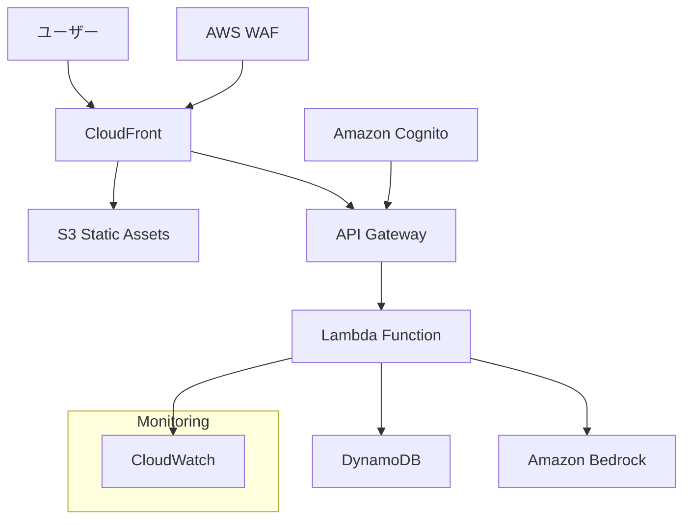

# アーキテクチャ設計書

## 概要

「Homebiyori（ほめびより）」は、育児中の親をAIが優しく褒めてくれるWebアプリケーションです。主役は子供ではなく親であり、押し付けがましくない優しさで育児のやる気や自己肯定感を高めることを目的としています。Next.js 14とFastAPIを使用したモダンなサーバーレスWebアプリケーションとして設計し、AWSクラウドインフラストラクチャ上で運用します。

## システム全体構成



## 技術スタック

**フロントエンド**
- Next.js 14 (App Router、Static Export)
- TypeScript 5.0+
- Tailwind CSS 3.4+
- Framer Motion (アニメーション)
- React Hook Form (フォーム管理)
- Zustand (状態管理)
- AWS Amplify Auth (認証クライアント)

**バックエンド**
- AWS Lambda (Python 3.12) - 機能別マイクロサービス構成
- FastAPI (高速API開発)
- Pydantic v2 (データバリデーション)
- Boto3 (AWS SDK)
- Mangum (FastAPI-Lambda アダプター)
- Lambda Layers (共通ライブラリ管理)
  - homebiyori-common-layer: 共通基盤機能統合

**インフラストラクチャ**
- AWS Lambda (サーバーレス実行環境)
- Amazon API Gateway (RESTful API)
- Amazon DynamoDB (NoSQLデータベース - ハイブリッド構成: TTL要件別テーブル分離)
- Amazon S3 (静的ホスティング)
- Amazon Cognito (認証・認可)
- Amazon Bedrock (Claude 3 Haiku)
- AWS CloudFront (CDN)
- AWS WAF (Webアプリケーションファイアウォール)
- Terraform (Infrastructure as Code)

## アーキテクチャパターン

**Clean Architecture + Feature-Based Organization**を採用し、以下の原則に従います：

1. **責務の分離**: UI、ビジネスロジック、データアクセスを明確に分離
2. **依存性逆転**: 具象実装ではなく抽象に依存
3. **単一責任原則**: 各コンポーネントは単一の責務を持つ
4. **開放閉鎖原則**: 拡張に開放、修正に閉鎖

## 設計原則と改善点

**1. 共通化とDRY原則**
- `ChatHeader`コンポーネントで1:1チャットとグループチャットの共通UI統一
- `TreeGrowthStatus`コンポーネントで木の成長表示ロジック統一
- `TouchTarget`コンポーネントでアクセシビリティ対応統一
- `Typography`コンポーネントでテキスト表示統一

**2. 関心の分離**
- UI層: 表示のみに集中
- ビジネスロジック層: `lib/utils.ts`と`lib/hooks.ts`で分離
- データ層: `demoStorage.ts`で抽象化

**3. 型安全性**
- 全コンポーネントでTypeScript strict mode有効
- `types/index.ts`で型定義を集約
- Props interfaceの明確な定義

**4. パフォーマンス最適化**
- React.memo()の適切な使用
- useCallback/useMemoでの再レンダリング防止
- Dynamic importでのコード分割

**5. アクセシビリティ**
- `TouchTarget`でキーボードナビゲーション対応
- セマンティックHTML要素の使用
- ARIAラベルの適切な配置

## Lambda Layers による共通機能統合

### 設計思想

**「共通機能の統合とビジネスロジックの分離」**を目的として、Lambda Layersを活用した階層化アーキテクチャを採用しています。

### アーキテクチャ層構造

```
┌─────────────────────────────────────────────┐
│            APIエンドポイント層               │
│     (handler.py + main.py)                  │
├─────────────────────────────────────────────┤
│          ビジネスロジック層                 │
│    (各サービス/database.py + models.py)    │
├─────────────────────────────────────────────┤
│           共通基盤機能層                    │
│      (homebiyori-common-layer)              │
└─────────────────────────────────────────────┘
```

### 責務分離原則

#### **homebiyori-common-layer (共通基盤機能層)**
```python
📦 homebiyori_common/
├── database/client.py     # DynamoDB基本操作統一
├── utils/datetime_utils.py # JST時刻処理統一
├── logger/structured_logger.py # JSON構造化ログ統一
├── exceptions/custom_exceptions.py # 例外処理統一
└── utils/validation.py    # 入力検証統一
```

**責務**: 全サービス共通の横断的関心事
- データベース基本操作 (CRUD)
- ログ出力フォーマット統一
- 例外処理とエラーハンドリング
- 時刻処理とタイムゾーン統一
- 入力値検証とサニタイゼーション

#### **各サービス/database.py (ビジネスロジック層)**
```python
# 例: chat_service/database.py
class ChatServiceDatabase:
    def __init__(self):
        self.db_client = DynamoDBClient()  # 共通Layer活用
    
    async def save_chat_message(self, chat_message: ChatMessage):
        # チャット特有のビジネスロジック
        # - TTL計算（サブスクリプション連動）
        # - GSI設定（キャラクター検索用）
        # - 統計更新（木の成長連携）
```

**責務**: サービス固有のビジネスロジック
- 複合的なデータ操作とトランザクション
- ドメイン知識に基づいた業務ルール実装
- サービス間データ整合性の保持
- Pydanticモデルとの統合

#### **各サービス/models.py (データモデル層)**
```python
# 例: chat_service/models.py  
class ChatMessage(BaseModel):
    message_id: str = Field(default_factory=lambda: str(uuid.uuid4()))
    ai_character: AICharacterType
    created_at: datetime = Field(default_factory=get_current_jst)
```

**責務**: サービス固有のデータモデル定義
- Pydanticモデルによる型安全なデータ構造
- サービス特化バリデーションルール
- API契約仕様とスキーマ定義

### 設計メリット

#### **保守性**
- **コード重複削除**: 200行以上の重複コード削除
- **統一性**: 全サービス一貫したデータアクセスパターン
- **変更影響範囲限定**: 基盤変更は共通Layer、業務変更は各サービス

#### **開発効率**
- **新サービス開発加速**: 共通機能の流用による開発時間短縮
- **テストしやすさ**: モック可能な構造によるユニットテスト容易化
- **デバッグ効率**: 統一ログフォーマットによる問題特定迅速化

#### **運用効率**
- **デプロイサイズ最適化**: Lambda パッケージサイズ削減
- **コールドスタート改善**: 共通Layer事前ロードによる起動高速化
- **監視統一**: 全サービス統一メトリクスとアラート