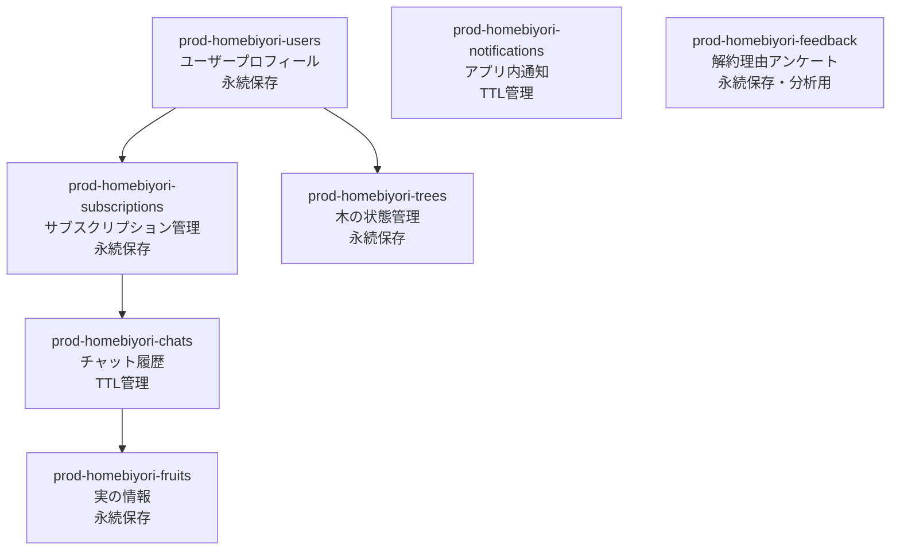

# データベース設計書

## DynamoDB 7テーブル構成

**設計思想の変遷:**
当初は3テーブル（統合）→ 5テーブル（機能分割）→ **7テーブル（最適化完了）** に発展。  
各テーブルが単一責任を持ち、データ特性に応じた最適化を実現。

**プライバシー保護の強化:**
- 子供情報の保存を廃止（個人情報保護の徹底）
- メールアドレス、実名等の個人識別情報は一切保存しない
- Cognito subのみでユーザー識別を行う

## テーブル構成と責務分離



## 1. prod-homebiyori-users（ユーザープロフィール）

**設計意図:**
- 最小限の個人情報でユーザー体験を実現
- プライバシー保護を最優先に設計
- オンボーディング状態とAI設定の管理

**エンティティ構造:**
```json
{
  "PK": "USER#user_id",
  "SK": "PROFILE",
  "user_id": "string",                    // Cognito sub (UUID)
  "nickname": "string?",                  // ユーザー設定ニックネーム（1-20文字）
  "ai_character": "tama|madoka|hide",     // 選択したAIキャラクター
  "praise_level": "normal|deep",          // 褒めレベル設定（2段階）
  "interaction_mode": "praise|listen", // 対話モード（褒めモード/傾聴モード）
  "onboarding_completed": "boolean",      // オンボーディング完了フラグ
  "created_at": "2024-01-01T09:00:00+09:00",
  "updated_at": "2024-01-01T09:00:00+09:00"
}
```

**interaction_mode 仕様:**
- **praise**: 褒めモード - 積極的な肯定・承認・励まし中心
- **listen**: 傾聴モード - 共感・理解・寄り添い中心
- デフォルト値: "praise"
- chat_serviceでプロンプト生成時にpraise_levelと組み合わせて使用
- ユーザーの今日の気分や必要に応じてAI応答のトーンを調整

## 2. prod-homebiyori-subscriptions（サブスクリプション管理）

**設計意図:**
- Stripe連携によるサブスクリプション状態の正確な管理
- プラン変更時のチャットデータTTL制御情報を保持
- 課金関連の監査証跡を確保

**エンティティ構造:**
```json
{
  "PK": "USER#user_id",
  "SK": "SUBSCRIPTION",
  "user_id": "string",
  "subscription_id": "string?",           // Stripe Subscription ID
  "customer_id": "string?",               // Stripe Customer ID
  "current_plan": "free|monthly|yearly",
  "status": "active|canceled|cancel_scheduled|past_due",
  "current_period_start": "2024-01-01T00:00:00+09:00",
  "current_period_end": "2024-02-01T00:00:00+09:00",
  "cancel_at_period_end": "boolean",
  "ttl_days": "number",                   // チャット保持期間設定
  "created_at": "2024-01-01T09:00:00+09:00",
  "updated_at": "2024-01-01T09:00:00+09:00"
}
```

**TTL管理戦略:**
- フリープラン: 30日間保持
- プレミアムプラン: 180日間保持
- プラン変更時は一括TTL更新処理を実行

## 3. prod-homebiyori-trees（木の状態管理）

**設計意図:**
- ユーザーの育児努力を木の成長で可視化
- AIキャラクター別テーマカラーシステム
- 成長進捗の統計情報を効率的に管理

**エンティティ構造:**
```json
{
  "PK": "USER#user_id",
  "SK": "TREE",
  "user_id": "string",
  "current_stage": "0-5",                // 木の成長段階（6段階）
  "total_characters": "number",          // 累積文字数
  "total_messages": "number",            // 総メッセージ数
  "total_fruits": "number",              // 総実数
  "theme_color": "warm_pink|cool_blue|warm_orange", // AIキャラクター対応
  "last_message_date": "2024-01-01T12:00:00+09:00",
  "last_fruit_date": "2024-01-01T12:00:00+09:00",
  "created_at": "2024-01-01T09:00:00+09:00",
  "updated_at": "2024-01-01T09:00:00+09:00"
}
```

**AIキャラクター別テーマカラー:**
- **たまさん (tama)**: warm_pink - ピンク系（温かい下町のおばちゃん）
- **まどか姉さん (madoka)**: cool_blue - ブルー系（クールなバリキャリママ）  
- **ヒデじい (hide)**: warm_orange - オレンジ系（秋の夕陽のような元教師）

## 4. prod-homebiyori-fruits（実の情報）

**設計意図:**
- 感情的価値のある瞬間を「実」として永続保存
- ユーザーとAIの会話内容を完全保存
- AIキャラクター別の実の色分けシステム

**エンティティ構造:**
```json
{
  "PK": "USER#user_id",
  "SK": "FRUIT#2024-01-01T12:00:00Z",
  "fruit_id": "string",
  "user_id": "string",
  
  // 会話内容の完全保存
  "user_message": "string",               // 実生成のきっかけとなったユーザーメッセージ
  "ai_response": "string",                // AIキャラクターの応答メッセージ
  "ai_character": "tama|madoka|hide",     // どのAIキャラクターとの会話か
  
  // 感情分析結果
  "detected_emotion": "joy|sadness|fatigue|accomplishment|worry",
  "fruit_color": "warm_pink|cool_blue|warm_orange", // AIキャラクター別の実の色
  
  "created_at": "2024-01-01T12:00:00+09:00",
  "GSI1PK": "FRUIT#user_id",
  "GSI1SK": "2024-01-01T12:00:00Z"
}
```

## 5. prod-homebiyori-chats（チャット履歴TTL管理）

**設計意図:**
- プラン別データ保持期間の動的制御
- LangChain最適化のためのコンテキスト情報保持
- 木の成長に寄与した履歴の詳細記録

**エンティティ構造:**
```json
{
  "PK": "USER#user_id",
  "SK": "CHAT#2024-01-01T12:00:00Z",
  "chat_id": "string",
  "user_id": "string",
  
  // メッセージ内容（DynamoDB直接保存）
  "user_message": "string",
  "ai_response": "string",
  
  // AI設定メタデータ
  "ai_character": "tama|madoka|hide",
  "praise_level": "normal|deep",          // 修正: 2段階
  "detected_emotions": ["joy", "accomplishment"],
  
  // 木の成長関連
  "growth_points_gained": "number",
  "new_fruits_generated": ["joy", "accomplishment"],
  "tree_stage_at_time": "0-5",
  
  // タイムスタンプ（JST統一）
  "created_at": "2024-01-01T12:00:00+09:00",
  
  // プラン別TTL設定
  "TTL": "1708516200",                    // エポック秒
  "subscription_plan": "free|monthly|yearly", // TTL計算基準
  
  "GSI1PK": "CHAT#user_id",
  "GSI1SK": "2024-01-01T12:00:00Z"
}
```

**TTL管理方式:**
- フリーユーザー: TTL = created_at + 30日
- プレミアムユーザー: TTL = created_at + 180日  
- プラン変更時: SQS + Lambda非同期でTTL一括更新

## 6. prod-homebiyori-notifications（アプリ内通知）

**設計意図:**
- メール送信に依存しない確実な通知配信
- サブスクリプション状態変更の重要な通知を確実に配信
- 90日間の適度な保持期間でストレージ最適化

**エンティティ構造:**
```json
{
  "PK": "USER#user_id",
  "SK": "NOTIFICATION#2024-01-01T12:00:00Z",
  "notification_id": "string",
  "user_id": "string",
  "type": "subscription_canceled|payment_succeeded|plan_changed|system_maintenance",
  "title": "string",
  "message": "string",
  "is_read": "boolean",
  "priority": "low|normal|high",
  "action_url": "string?",               // アクション可能な通知のURL
  "created_at": "2024-01-01T12:00:00+09:00",
  "expires_at": "1738876800",            // 90日後に自動削除
  "GSI1PK": "NOTIFICATION#user_id",
  "GSI1SK": "2024-01-01T12:00:00Z"
}
```

## 7. prod-homebiyori-feedback（解約理由アンケート）

**設計意図:**
- サービス改善のための解約理由分析
- 匿名化可能な設計でプライバシー保護
- 月次・四半期レポート生成の効率化

**エンティティ構造:**
```json
{
  "PK": "FEEDBACK#2024-01",              // 月次集計用のパーティション
  "SK": "CANCELLATION#user_id#timestamp",
  "feedback_id": "string",
  "user_id": "string",                   // 必要に応じて匿名化可能
  "feedback_type": "cancellation_reason",
  "reason_category": "price|features|usability|other",
  "reason_text": "string?",             // 自由記述
  "satisfaction_score": "1-5",          // 満足度スコア
  "improvement_suggestions": "string?",  // 改善提案
  "created_at": "2024-01-01T12:00:00+09:00",
  "GSI1PK": "FEEDBACK#cancellation",
  "GSI1SK": "2024-01-01T12:00:00Z"
}
```

## データアクセスパターンと最適化

### 主要なクエリパターン

**1. ユーザー情報取得（認証後）**
```
GET prod-homebiyori-users: PK=USER#user_id, SK=PROFILE
GET prod-homebiyori-subscriptions: PK=USER#user_id, SK=SUBSCRIPTION  
GET prod-homebiyori-trees: PK=USER#user_id, SK=TREE
```

**2. チャット履歴表示**
```
QUERY prod-homebiyori-chats: PK=USER#user_id, SK begins_with CHAT#
ORDER BY SK DESC, LIMIT 20 (最新20件)
```

**3. 実の一覧表示**
```
QUERY prod-homebiyori-fruits: GSI1PK=FRUIT#user_id
ORDER BY GSI1SK DESC (作成日時降順)
```

**4. 通知一覧取得**
```
QUERY prod-homebiyori-notifications: PK=USER#user_id, SK begins_with NOTIFICATION#
ORDER BY SK DESC
```